#   西方美术史

##  中西美术对比

中国：

    山水，花鸟，人物
    线条，墨色
    笔墨纸砚：圆笔，用水调和，宣纸，砚台
    审美出发点：儒道释，凡人的神化，神似，写意

西方：

    人物为主
    明暗，色彩
    笔墨纸砚：扁笔，用油调和，布，调色板    
    审美出发点：古希腊哲学思想，神的凡人化，型似，写实

##  阶段：

    一、史前美术（旧石器时代晚期-新石器时代，距今3万到1万多年之间）-- 洞窟壁画，原始雕像，巨石阵
    一、史前美术（旧石器时代晚期-新石器时代，距今3万到1万多年之间）-- 洞窟壁画，原始雕像，巨石阵
    二、古代美术（公元前4000年-公元476年）： 新石器末期到中世纪 文字的出现--西罗马帝国灭亡
        a.埃及: 正面率，金字塔，石棺画
        b.希腊: 大理石雕塑，神庙，瓶画
        c.罗马: 斗兽场，神庙，庞贝壁画，雕塑
    三、中世纪（公元476年-15世纪）：始于西罗马帝国的灭亡
        a.中世纪建筑：拜占庭，罗马，哥特
        b.镶嵌画
        c.手抄本
    四、文艺复兴（14-16世纪）
        a.文艺复兴初期: *乔托，马萨乔，波提切利
        b.文艺复兴三杰: *达芬奇，*米开朗基罗，*拉斐尔
        c.威尼斯画派: 提香，乔尔乔内
        d.矫饰主义: 丁托列托，格列柯
        e.北方画派 -- 尼德兰:*扬·凡·艾克，勃鲁盖尔； 德国的文艺复兴三杰：丢勒，荷尔拜因，格吕内瓦尔德
        f.学院派: 卡拉奇兄弟，普桑
    五、17世纪美术
        a.巴洛克 -- *卡拉瓦乔，*鲁本斯，*伦布朗，贝尼尼，委拉斯开兹...
        b.巴洛克建筑
    六、18世纪美术
        a.洛可可 -- 华托，布歇，弗拉贡纳尔
        b.洛可可建筑
        b.新古典主义 -- 法国大革命  大卫，安格尔
    七、19世纪美术
        a.浪漫主义 -- 傑利柯， 戈雅， *德拉克洛瓦， 康斯特布尔， 透纳 ...
        b.现实主义 -- 米勒，列宾...
        c.印象主义 -- 马奈，*莫奈， 罗丹
        d.新印象主义 点彩派 修拉，西涅克
    八、现代美术
        a.后印象主义 -- *塞尚，*梵高，*高更，马蒂斯
        b.立体主义 -- *毕加索
        c.未来主义
        d.表现主义 -- 蒙克
        e.达达主义 -- 杜尚
        f.超现实主义 -- 达利 ...
        g.抽象主义 -- 康定斯基， *蒙德里安， 波洛克
        h.POP艺术 -- 安迪·沃霍尔
        i.超写实主义

##  理论：
    
    人体比例
    透视
    色彩理论
    解刨学
    

##  史前美术：

人类迄今为止发现的最早的美术作品源自旧石器时代晚期-新石器时代，证明人类的艺术至少也有三万年的历史。
这一时期的美术主要的表现形式为洞穴中的壁画和雕塑，内容皆以动物为主，手法写实，造型生动。
又称“原始美术”，西方人最早的美术作品产生于旧石器时代晚期，即距今3万到1万多年之间。最杰出的原始绘画作品，发现于法国南部和西班牙北部地区的几十处洞窟中，
其中最著名的是法国的拉斯科洞窟壁画和西班牙的阿尔塔米拉洞窟壁画。所绘形象皆为动物，手法写实，形象生动。迄今为止发现的原始雕刻大多为小型动物雕刻，
少数人像雕刻中，裸体女性雕像佔主要地位，这些女性雕像夸张女性的生理特点，突出表现女性的乳房、臀部、腹部、大腿等，体现出原始人对于母性和生殖的崇拜意识。
在奥地利维也纳附近的维伦多夫出土的女性雕像被称为“维伦多夫的维纳斯”，是其中最著名的代表作。史前美术描述的是人的本能与自然之间的关系。

### 洞窟壁画：

法国的**拉斯科洞窟**壁画：距今15517±800年，约有600多幅，其中以马最多，还有牛、驯鹿、洞熊、狼、鸟等，也有一些想像的动物和人像。
使用的颜料是木炭及各种矿砂，工具则是蕨草和羽毛等。

西班牙的**阿尔塔米拉洞窟**壁画：150多幅壁画，为公元前3万～前1万年左右旧石器时代晚期的古人绘画遗迹

### 雕像：

**维伦多夫的维纳斯**：出土于奥地利维也纳附近的维伦多夫，最古老的艺术品之一，约制作于24000年前。被人们称为“原始的维纳斯”，又叫“母神雕像”。

女性人物，來自塞爾維亞的溫查文化

野牛舔昆蟲咬-鹿角雕刻品； 國家史前博物館（萊塞濟德塔亞克-錫勒伊，法國）

### 巨石阵

英国威尔特郡斯通亨治，梁柱结构。

##  古代美术：

西方习惯把新石器末期到中世纪称为古代，具体来说就是指公元前4000年（文字的出现）到公元476年（西罗马帝国灭亡）。
这一时期的美术主要包括了两河流域（美索不达米亚）、古埃及、古希腊、古罗马的艺术。

### 两河流域

石柱上端是汉谟拉比王站在太阳和正义之神沙马什面前接受象征王权的权标的浮雕，以象征君权神授，
王权不可侵犯；下端是用阿卡德楔形文字刻写的法典铭文。

### 埃及

####    正面律

就是指表现人物时，头侧面，眼睛正面，肩及身体正面，腰部以下又是侧面。
画面用水平横线来分割结构，人物排列井然有序，甚至动物都是成排出现。
运用以上的表现手法对人物的形象进行处理，是为了使人的形象特征更加突出和完整，这也是埃及绘画追求完整性的体现。

####    金字塔

####    石棺画

### 古希腊

古希腊主要的艺术形式有雕塑、建筑和绘画，绘画主要是花瓶的瓶绘，能流传下来的非常少，流传得更广的主要是雕塑和建筑。
米諾斯文明位於克里特島，被認為是歐洲最古老的文明。
古希臘的自由民主創造了具有民主思想的建築、雕刻和繪畫作品，其中留存於世的不少健美而優雅的雕刻形象，如《擲鐵餅者》、《米洛斯的维纳斯》等，尤其具有無窮的魅力。
帕特农神庙即為自古希臘延續到現代的建築。希臘大理石雕塑通常被描述為古典藝術的最高形式。從古希臘的陶器繪畫及陶瓷工藝，可以讓人們對古希臘社會的運作方式有豐富的瞭解。

女蛇神像 -- 米諾斯新宮殿時期

阿尔特米西昂青铜像（通常也被称为海神波塞冬像）

**掷铁饼者**-希腊雕刻家米隆约公元前450年雕刻的青铜雕塑，原作丢失

**米洛斯的维纳斯**，又称《米洛斯的阿芙洛蒂忒》，古希腊雕刻家阿历山德罗斯于公元前150年左右创作的大理石雕塑，是卢浮宫的三大镇馆之宝之一。

    1820年2月，在爱琴海的米洛斯岛上，一个农夫在一座古墓旁整地时挖掘到一尊女性雕像。她分成上、下两截，并与刻着名字的台座、
    拿着苹果的手腕以及其它碎片等等一道散落在附近的田地下。已懂得这是值钱的东西的农夫，立刻将它们埋于原地，并报告了在岛上的法国领事。
    领事稍付定金，即通知当时设在君士坦丁堡的法国大使。几乎与此同时，在爱琴海搞测量的一位法国海军士官，名叫鸠尔·丢孟·都尔维尔对此表示了更大的关注。
    这是一位希腊艺术的爱好者，当他看过这些雕像的部分碎片以后，认为它们是一个整体，并第一个断定这就是维纳斯的雕像。于是立刻告诉农夫，法国决定把她买下，
    要他不必再到处声张了。随即赶到君士坦丁堡，向大使陈述详情，促使大使下了决心并派专人前去交易。不料岛上的长老出于本岛的利益而中途插手，
    开会决议命农夫将雕像卖给在土耳其任职的一位希腊大官，当法国人赶到岛上时已经是雕像装船的关头了。见此情景，他们几乎要动武，命令法国船舰随时准备行动。
    顿时，爱琴海上战云密布。恰巧，一场暴风雨解了围。它推迟了土耳其船只的起航，为法国使者争得了斡旋的时机，他们软硬兼施，把雕像终于转到了法国船上。
    后来又给岛上赠送金钱，从而取得了岛上放弃雕像的誓约书。雕像顺利运抵巴黎，由于种种政治、人事方面的原因，一直推至 1821年3月2日，
    国王路易十八才正式接受献礼。从这一天开始，她便成为法国国家财产。当时的登记名称是“在希腊群岛中的米罗斯所发现的维纳斯像”，
    并被陈列于卢浮宫特辟的专门展室中,与蒙娜丽莎的微笑、胜利女神的雕像并称为卢浮宫三大镇馆之宝。

**帕特农神庙**，帕特农神庙是雅典卫城主体建筑，为歌颂雅典战胜波斯侵略者的胜利而建。神庙始建于公元前447年，正式启用是在公元前438年，
借着盛大的帕那太耐节奉献给雅典娜。

**胜利女神像**:在萨莫色雷斯岛上发现破碎成200多块碎片的雕像残片，并运回法国巴黎卢浮宫。经过4年的细心修复，才使该雕塑初见规模，只是头和双臂仍未被发现。
大多数意见认为是创作于公元前200年左右，马其顿王国安提柯王朝国王德米特里一世在海战中打败托勒密王国的舰队而创作

    尼刻（尼克）（希腊语：Νίκη，“胜利”；拉丁字母转写：Nike）是希腊神话中的胜利女神，她在罗马神话中对应的是维多利亚（Victoria）。
    《萨莫特拉斯胜利女神》在传统的描述中，尼克常带有翅膀，拥有惊人的速度，但是除此之外并不具有其他特殊力量。她并不仅仅象征战争的胜利，
    而是代表着希腊人日常生活中的许多领域，尤其是竞技体育领域中的成功。因此她被认为是带来好运的神祇，经常作为艺术作品所表现的对象。
    在艺术作品中，她通常同化于其他的神，比如古希腊的雕塑家通常将她塑造为娇小的带有翅膀的形象，栖停于另一个神的手臂，或是从同伴神的衣裳中探出，
    或者像仙女一样高飞于天空。据说是公元前190年左右的作品，大约是罗得斯岛的军队战胜叙利亚的安提欧克斯三世，为了谢神，
    在萨摩色雷斯岛的卡比利神殿树立了这尊雕像。雕像高275厘米，1863年发现于萨摩色雷斯岛。也许雕像过于庞大，博物馆里似乎找不到她合适的安身之处，
    于是人们把她安放在一条宏伟宽敞的阶梯的高处，让她在那里迎接来自四方的艺术爱好者。雕像的头部和手臂残缺，我们已看不到她的容貌，这是一个大遗憾。
    但也正是如此，人们才可以毫无禁忌地想象她是花容月貌抑或是威武豪迈。女神全身充满了生命力和雄壮的感觉。包裹身体的薄衣被大海的飞沫打湿，随风飘扬，
    紧贴在女神丰满胴体上，细密而又富于变化的衣褶勾勒出女神优美的曲线，给人以华丽优雅的美感，被人称为是“崇高样式”的理想化人体。
    这座雕像完美而健全地体现了女性肉体所包含的蓬勃的生命力，并赋予其高贵优雅雄壮的美。这是古希腊时期的典型作品，在动态和静态的平衡上发展到了顶峰。

拉奥孔(The Laocoon and his Sons)

    大理石群雕，高约184厘米，是希腊化时期的雕塑名作。阿格桑德罗斯等创作于约公元前一世纪，现收藏于罗马梵帝冈美术馆。这几乎代表了传统雕塑艺术的最高成就。
    在特洛伊战争中警告特洛伊人不要接受希腊人留下的木马，但没有成功。随后他就被两条从希腊人临时驻扎的Tenedos岛上跨海而来的大蛇夺去了性命。

德尔斐的驾车人

    这座雕像发现于希腊德尔斐，是为了纪念西西里岛的僭主波利扎罗斯和代表它的战车在公元前478年或公元前474年的两次皮提亚运动会中取得的某次胜利。
    作为泛希腊运动会的一种，皮提亚运动会在德尔斐举行，以纪念阿波罗的皮提亚。也有人认为，这座雕像实际上是为了纪念波利扎洛斯的兄弟希伦在同一场比赛中的胜利，
    是他在奥运会上获胜后的还愿行为。

####    瓶绘

古希腊瓶画，是希腊陶器上的装饰画，依附于陶器而得以流传下来，代表了希腊绘画风貌。

馬雷斯風格喙嘴壺 -- 克里特岛

####    建筑

克諾索斯王宮

邁錫尼獅子門

### 古罗马

古罗马艺术是希腊艺术的直接继承和发展，它们共同奠定了西方文明的基础，成为西方文明的摇篮。罗马人的美术更倾向于实用主义。
规模巨大的罗马斗兽场和万神庙是古罗马建筑的杰出代表。而曾被维苏威火山灰掩埋达1700多年的庞贝壁画，则给我们展示了古罗马绘画的独特面貌。

####    古罗马斗兽场
罗马斗兽场建于72-80年间，古罗马文明的象征，是古罗马帝国专供奴隶主、贵族和自由民观看斗兽或奴隶角斗的地方。

####    柱头

**多立克**

**爱奥尼亚**

**柯林斯**

**万神庙**，万神庙位于意大利首都罗马圆形广场的北部，是罗马最古老的建筑之一，也是古罗马建筑的代表作。此庙始建于公元前27年，后遭毁，约公元118年在哈德良皇帝时期重建。

**庞贝壁画**，庞贝古城从公元前82年起成为罗马的领地，公元79年因维苏威火山爆发而埋没，18世纪40年代开始发掘。
其中大量壁画的出土，不仅充分说明庞贝曾经是一个经济繁荣的城市，而且也反映出罗马绘画的概况，甚至由此可以推想希腊壁画的一般面貌。

伯斯科雷阿萊別墅（英語：Villa Boscoreale）是對多棟在義大利伯斯科雷阿萊地區所發現的古羅馬別墅的泛稱

####    人体雕像

如何评价希腊艺术或古典艺术，德意志艺术史家温克尔曼一语评之——**高贵的单纯**，**静穆的伟大**。

屋大維

Hermes and the Infant Dionysus

燈座上的哲學家銅像

飾有有阿波羅、密涅瓦和繆斯女神的石棺；約於西元200年；來自亞壁古道；

##  中世纪 -- 基督教艺术

中世纪是指公元5世纪（以公元476年西罗马帝国崩溃作为标志）到15世纪（意大利文艺复兴的黎明），它标志着西方进入了基督教时代。受基督教制约，中世纪美术不注重客观世界的真实描写，
而强调所谓精神世界的表现。建筑的高度发展是中世纪美术最伟大的成就。拜占庭式教堂、奧圖羅馬式教堂和法蘭克歌德式教堂，各具艺术上的创造性，並与宗教建筑相结合，
雕刻、镶嵌画和壁画也取得了一定成就。
公元313年，君士坦丁大帝颁布米兰敕令，承认基督教为合法且自由的宗教。之后罗马分为东西罗马帝国。
中世纪是指公元5世纪（以公元476年西罗马帝国灭亡作为标志）到15世纪（意大利文艺复兴的黎明），它标志着西方进入了基督教时代。
受基督教制约，中世纪美术不注重客观世界的真实描写，而强调所谓精神世界的表现。古希腊罗马艺术被焚毁。被成为黑暗的时代。
中世纪艺术大致分为三个阶段：拜占庭艺术、罗马式艺术、哥特式艺术，都是表达基督教思想观念，本质上远离了现实生活。但强调精神表现。

### 早期基督教（2-5世纪）

**巴雪利卡**

    古典时代罗马的巴西利卡（Basilica），最早指的仅仅是常用作法庭或交易所使用的一类大型公共建筑，在功能上与宗教仪式毫无关联。

**罗马圣母大殿**

克拉塞的聖亞坡理納聖殿 Basilica di Sant'Apollinare in Classe

### 拜占庭式 （5-15世纪）

    拜占庭艺术，5世纪-15世纪，典型的宗教艺术，拜占庭建筑是基督教教会的建筑，绘画作品多取材于《圣经》，其形式和人物表情处理都须遵循具有神学意义的传统模式。
    同时拜占庭艺术又是服务封建帝国的艺术，它炫耀帝国的强大和帝王的威严，把帝王表现为基督在尘世的代理人，为巩固帝王和贵族阶级的统治服务，
    是拜占庭帝国（即东罗马帝国）和基督教会相结合的官方艺术。拜占庭艺术主要表现在建筑和绘画上，建筑集中体现在教堂上，主要特色是对中央圆顶的强调；
    绘画主要有教堂内的壁画、镶嵌画等。圣索菲亚大教堂是拜占庭建筑最杰出的代表，拜占庭帝国极盛时代的纪念碑。
    东罗马帝国教堂，更世俗，可作为市场

####    教堂

**圣索菲亚大教堂** - 圣索菲亚大教堂，是拜占庭帝国的主教堂，位于伊斯坦布尔(君士坦丁堡)，有近一千五百年的历史，因巨大的圆顶而闻名于世，乃拜占庭建筑最光辉的代表。

圣马可教堂

    圣马尔谷圣殿宗主教座堂，简称圣马可大教堂，矗立于威尼斯市中心的圣马可广场上，始建于公元829年，重建于1043~1071年，它曾是中世纪欧洲最大的教堂，
    是威尼斯建筑艺术的经典之作，它同时也是一座收藏丰富艺术品的宝库，圣马可大教堂是威尼斯的骄傲，圣马可大教堂是基督教世界最负盛名的大教堂之一，
    是第四次十字军东征的出发地，威尼斯的荣耀，威尼斯的富足，当然，还有威尼斯的历史和信仰，尽在于此，大教堂建于11世纪，以后时有增修。

####    镶嵌画

基督教不允许制造偶像。所以图像只能用于基督像，并且呆板僵硬。但强调表现人的精神和情感。
镶嵌画--镶嵌画在拜占庭艺术中占有特殊的地位，这种以小彩色玻璃和石子镶嵌而成的建筑装饰画，成为教堂内部的主要形式。拜占庭镶嵌画以玻璃为主要材料，
它能反射出强烈的光彩，好像是小型的反射镜一样排列在一起形成非物质的闪光幕帘，达到一种虚无缥缈的效果。

查士丁尼大帝和他的随从

皇后西奥多拉和她的随从

####    手抄本插图 -- 细密画

圣三位一体

马太福音扉页： 带有表现的意识

福音經文；約1100年；羊皮紙上的蛋彩畫、黃金和墨水，以及皮革裝訂

亞美尼亞泥金裝飾手抄本

### 罗马式 （10-12世纪）

    诺曼底人入侵英国带了的诺曼底风格 -- 罗马式艺术，10世纪-12世纪流行的一种以建筑为主体的艺术形式。建筑多为教堂和修道院，以厚重坚实的墙壁、小窗、
    高大雄伟的塔楼和半圆形拱穹(筒状拱)结构为主要特征。著名的建筑有意大利的比萨大教堂、德国的沃尔姆斯大教堂等。出现在教堂外部墙壁上的雕刻多取材于《圣经》故事，
    并以非写实性和框架法为特点。

瑪麗亞拉赫修道院（德國安德納附近）最具標誌性的羅馬式教堂之一

**比萨大教堂**

    比萨大教堂是中世纪意大利罗马式教堂建筑的典型代表，对11-14世纪的意大利建筑产生了深远的影响。

**沃尔姆斯大教堂**

    沃尔姆斯大教堂是德国最重要的罗马式教堂之一，以藏有13世纪德国史诗《尼伯龙根之歌》的古老石刻而享誉全德。

法国欧坦大教堂的拱角板上雕刻的**最后的审判**

### 哥特式 （12-15世纪）

    哥特式艺术起源于法国，是十二至十六世纪初期欧洲出现的一种以新型建筑为主的艺术，包括雕塑、绘画和工艺美术。这种建筑风格，
    一反罗马式厚重的半圆形拱门的教堂式样，而广泛地运用线条轻快的尖拱券，肋状拱，造型挺秀的小尖塔，轻盈通透的飞扶壁，修长的立柱或簇柱，以及彩色玻璃镶嵌大花窗，
    造成一种向上升华、天国神秘的幻觉。代表作品有法国的巴黎圣母院、德国的科隆大教堂、英国的林肯大教堂、意大利的米兰教堂等。

**巴黎圣母院**

    巴黎圣母院大教堂，建造时间1163年~1345年，最著名的哥特式建筑。它是古老巴黎的象征，矗立在塞纳河中西岱岛的东南端，位于整个巴黎城的中心。
    它的地位、历史价值无与伦比，是历史上最为辉煌的建筑之一。

肋状拱

**科隆大教堂**
    
    科隆大教堂是位于德国科隆的一座天主教主教座堂，是科隆市的标志性建筑物。在所有教堂中，它的高度居德国第二（仅次于乌尔姆市的乌尔姆大教堂），
    世界第三。论规模，它是欧洲北部最大的教堂，集宏伟与细腻于一身，它被誉为哥特式教堂建筑中最完美的典范。始建于1248年，工程时断时续，
    至1880年才由德皇威廉一世宣告完工，耗时超过600年，至今仍修缮工程不断。

**林肯大教堂**

    英国林肯大教堂建于1072-1092年间。教堂坐落于林肯市的一处石灰岩高地上，居高临下，俯视全城。

**米兰大教堂**

    米兰大教堂是世界上最大的哥特式建筑，有“米兰的象征”之美称。主教堂始建于1386年，由米兰望族吉安·维斯孔蒂主持奠基。1500年完成拱顶，
    1774年完成最高的哥特式塔尖上的镀金圣母玛丽亚雕像。1813年教堂的大部分建筑完工。1897年最后完工，历时五个世纪。
    1805年拿破仑曾在米兰大教堂举行加冕仪式。至1965年教堂正面最后一座铜门被安装，才算全部竣工

哥特式绘画-哥特式绘画伴随哥特式建筑的发展而产生,主要包括玻璃镶嵌画、插图画、壁画和镶板画。由于典型的哥特式建筑采用了石头骨架结构和宽大的窗子，
壁面被减少到最低限度，因此，壁画发展受到了限制。

進入耶路撒冷

##  文艺复兴 （the Renaissance）

文艺复兴的概念在14-16世纪时被意大利的人文主义作家和学者所使用。当时的人们认为，文艺在希腊、罗马古典时代曾高度繁荣，但在中世纪“黑暗时代”却衰败湮没，
直到14世纪后才获得再生与复兴，因此称为文艺复兴。文艺复兴的核心思想是以人为本的世界观,将人从中世纪的神权中解放出来,绘画作品更多的开始反应人性而非神性。

    1.  从封建社会向资本主义的过渡，高举人文主义，探索人的奥秘，反对禁欲主义，摆脱了宗教的束缚。第一本书籍<<十日谈>> 对基督教的批判。
    2.  透视学，解剖学，比例学
    3.  写实

### 文艺复兴早期

佛罗伦萨画派是意大利文艺复兴早期时代形成的美术流派，15世纪时，佛罗伦萨为新兴崛起的巨商美第奇家族所统治，掌握了当时的政治与经济权利，之后的三百年中，
佛罗伦萨的历史与美第奇家族的兴衰紧密的结合在一起。美第奇家族酷爱艺术，在其保护和资助下，使得佛罗伦萨聚集了众多文艺人才，
这些卓越的艺术家们为其创造了大量的建筑、雕塑和绘画作品，使得佛罗伦萨一时成为欧洲文艺复兴时，艺术文化和思想的中心。
这一时期的绘画领域也出现了不同于中世纪装饰画风格的美术倾向，而佛罗伦萨画派则成为了这一倾向的主流画派，其代表人物有乔托、马萨乔、波提切利等。

#### 乔托
    
    宗教世俗化，和但丁齐名。老师--奇马布埃。 真正的“湿壁画”是从意大利奇马布埃（Cimabue）时期开始的，十四世纪伟大的艺术家乔托（Giotto）,
    第一次以传统正规规则使用湿壁画技法制作画面，并在材料和绘画技巧上加以更正，使之完美。被認為是義大利文藝復興時期的開創者，被譽爲“歐洲繪畫之父”、"西方繪畫之父"。

圣方济各之死

    1300年代初期，喬托陸續畫了相當多的宗教壁畫，如阿西西教堂裡聖方濟的宗教故事壁畫；佛罗伦萨圣十字圣殿巴尔第小圣堂中的宗教故事壁畫（約為1319年－1328年畫成）。
    其中聖方濟的宗教壁畫在西方繪畫史上占有極重要的地位，史家以此認為喬托是第一個企圖畫出有透視感和深度空間的畫家。

**哀悼基督**：自然的表情，立体感，明暗关系，透视感，自然风景

**逃亡埃及**：宗教世俗化

**湿壁画**

    是指一种优秀的壁画画法，先用耐久的熟石灰颜料溶解于水，然后绘制在新粉刷的熟石灰（LIME PLASTER）泥壁上，也指如此绘制的整幅壁画。
    Fresco是意大利语新鲜的意思，有时也称作buon fresco或true fresco以区分干壁画（SECCO）或半湿壁画（MEZZO FRESCO），
    因为后者在效果上与前者近似。在湿画法中，颜料由于湿墙壁的极细缝隙产生毛细管虹吸作用而被吸收，并且成为墙壁表面不可分割的一部分。

#### 马萨乔 （透视）

    马萨乔（Masaccio，1401年12月21日—1428年秋），原名托马索·德·塞尔·乔凡尼·德·西蒙（Tommaso di Ser Giovanni di Simone），是15世纪 意大利文艺复兴时期伟大的画家，
    他的壁画是人文主义第一个最早的里程碑，他也是中世紀以後第一位使用透视法的画家，在他的画中首次引入了灭点，他画中的人物出现了历史上从没有见过的自然的身姿。

逐出伊甸园

    《逐出伊甸园》描绘了亚当和夏娃因为偷吃了上帝种的苹果而被驱逐出伊甸园时的悲惨情景。据说这种苹果功效很强大，两个人吃完立刻就能明辨善恶是非，
    这让上帝感到很生气。画面中大胆地展现了两个人裸露的身体，亚当痛苦地垂着头并用手捂着自己的面孔，夏娃则因为感到羞耻而遮住了自己的隐私部位，绝望地仰面哭喊。
    在他们头顶，天使手执利剑，代表上帝的意志执行惩罚。

**圣三位一体**

#### 透视法

    1.近大远小。两个体积相同的物体一个在你眼前一个在50米外,是不是近处的看上去大呢?
    2.近宽远窄(空间纵深)。物体在空间距离下，产生的视觉焦点，并导致所有物体围绕这个焦点聚拢的聚焦方式，即为纵深。
    3.近实远虚。距离你近的物体相信你会看到更清晰,远处的就比较模糊。

布鲁内莱斯基

####    多纳泰罗

大卫 -- 多纳泰罗制作，1430年代，青铜，158厘米，佛罗伦萨国立巴杰罗博物馆。

    大卫的故事，来自《圣经·旧约》中的撒母耳记，是以色列的第二个国王。在他幼年时，以色列人被强敌腓力士人大举进攻。腓力士人挑战以色列人，
    希望以色列人出一名最强的战士，一战定胜负，只要能战胜腓力士人的战士——巨人歌利亚，就算以色列获胜，否则腓力士人就取得胜利。
    但是以色列的士兵们没有人敢去迎战歌利亚。少年大卫当时还是一个牧羊人，他主动请缨出战。以色列的第一个国王扫罗给他盔甲和武器，大卫都没有接受。
    在与歌利亚作战时，他用用来打狼的投石皮带射出一块石头，击中歌利亚的头，将其击昏，然后用歌利亚的剑砍下了歌利亚的头颅，以色列因之得救。

圣乔治 -- 多纳泰罗制作，1416年，大理石，高214厘米，原作现收藏于佛罗伦萨巴杰罗博物馆。圣乔治雕像由兵器制造匠行会出资，因为圣乔治是他们行业的保护神。

加塔梅拉塔的骑马雕像

    1443年，雇佣兵队长 Erasmo of Narni（1370-1443，昵称Gattamelata）去世。他生前曾效命于威尼斯共和国（那个年代统治着帕多瓦）。
    多纳泰罗被他的后人召至帕多瓦（Padua）为将领制作雕像。雕像于1450年完工，多纳泰罗获得了1650金杜卡特的酬金。
    骑马像被安放在圣安东尼教堂（Basilica of St. Anthony）对面的广场上。是文艺复兴时期以来首次依古罗马英雄骑马造型创作的作品，
    是接下来几个世纪内的青铜骑马雕像的始祖。

圣抹大拉的玛丽亚 -- 多纳泰罗制作，1457年，彩色木材，高188厘米，佛罗伦萨主座大教堂博物馆

    以深刻表现人物心理为特色，虽然较于严厉、复杂艰涩且深沉自省，但其豪放的表现力曾震惊佛罗伦斯。
    面对她的深切信仰，耶稣原谅了抹大拉的玛利亚的曾经的妓女生活，当时他们在法利赛人西蒙家中。这位忏悔者的后继命运在《金色传奇》（Legenda Aurea）中有叙述。
    她禁食三十年，在法国南部的荒野中隐居生活。曾经以她的美丽着称，最后她只被包裹在长发中。她是放弃有罪生活的典范，将其改变为虔诚的悔改和坚贞的祈祷生活。

####    曼特尼亚

哀悼死去的基督 -- 1490年，蛋彩画布，68x81厘米，米兰布雷拉美术馆

    这是画家以典型的古典技法绘制的作品。盛行的蛋彩画法细致却未免有些僵化地刻划了死去的基督。显然，基督刚刚被他的信徒们从十字架上卸下来，安放在床上，
    左侧两信徒悲痛之极。冷灰的色调、死去基督“十字架”式的姿态，简洁方正，舍去细节，使主题鲜明。画家以情绪刻划来渲染这个惨烈的场面，给人以深刻的印象。
    正面透视的画法，无疑增加了处理的难度，画家却执意选择这个角度，以造成现场感。此画为画家的代表作，是一幅祭坛画。他在此画中运用了前人未曾用过的透视角度，
    力求准确而真实地去表现死去基督的遗体，线条十分锐利和坚硬。画面上人物的表情冷静肃穆，令人望而生畏。画家的高超艺术，体现了当时意大利北部艺术的主要倾向：
    强调人的尊严和豪迈气魄，重视艺术与科学相结合的求实精神，提倡艺术的描写对象应以实物为依据。这种完全准确地再现自然的写实倾向，
    对意大利现实主义美术的成长起了一定的积极作用。

### 文艺复兴全盛期

15世纪后期至16世纪前半期，意大利文艺复兴运动达到鼎盛，出现了“文艺复兴美术三杰”，他们是达芬奇、米开朗基罗、拉斐尔。

#### 波提切利

    桑德罗·波提切利（Sandro Botticelli，1445年3月1日—1510年5月17日），原名亚历桑德罗·菲利佩皮（Alessandro Filipepi）是欧洲文艺复兴早期的佛罗伦萨画派艺术家

维纳斯的诞生

    1485年完成的《维纳斯的诞生》是波提切利的另一幅杰作，表现的是希腊神话中代表爱与美的女神维纳斯从大海中诞生的场景，这幅画的绘画风格在当时颇为与众不同，
    不强调明暗法来表现人体造型，而更强调轮廓线，使得人体有浅浮雕的感觉，而且极适合装饰作用。画面中的女神肌肤洁白，金色的长发飘逸，无愧为是完美的化身；
    但脸上却又挂有淡淡的忧愁、迷惘和困惑。

春

####    达芬奇 （Leonardo da Vinci）

    列奥纳多·达·芬奇,意为「芬奇城的列奥纳多」；全名李奧納多·迪·塞尔·皮耶罗·达·芬奇（Leonardo di ser Piero da Vinci，意为「文西城皮耶羅先生之子李奧納多」），
    是意大利文藝復興時期佛罗伦萨共和国的博學者：在繪畫、音樂、建築、數學、幾何學、解剖學、生理學、動物學、植物學、天文學、氣象學、地質學、地理學、物理學、光學、力學、
    發明、土木工程等領域都有顯著的成就。这使他成为文藝復興時期人文主义的代表人物，也是歷史上最著名的藝術家之一，與米開朗基羅和拉斐尔並稱文艺复兴三杰。
    他很早就意识到“画家必须是好的解剖学家”，在米兰，他亲自解剖了三十多具尸体，而且他会在尸体旁边研究很久，仔细记录他观察到的一切：肌肉、骨骼、关节、神经……
    他的绘画中有15张遗留了下来，之所以数量这么少，是因为他持续不断地，频繁地用新技术进行灾难性的试验以及他作画时一贯的拖延。
    不论如何，他的作品，连同他那包含了速寫、科学图解和关于绘图本质思想的笔记手稿，使他成为了同时代中只有米开朗基罗才能与之相提并论的、对后世的艺术家有巨大影响的艺术家。

    Leonardo di ser Piero da Vinci (15 April 1452 – 2 May 1519) was an Italian polymath of the High Renaissance who was active as a 
    painter, draughtsman, engineer, scientist, theorist, sculptor, and architect. While his fame initially rested on his achievements as a painter, 
    he has also become known for his notebooks, in which he made drawings and notes on a variety of subjects, including anatomy, 
    astronomy, botany, cartography, painting, and paleontology. Leonardo is widely regarded to have been a genius who epitomized 
    the Renaissance humanist ideal, and his collective works comprise a contribution to later generations of artists matched only 
    by that of his younger contemporary Michelangelo.

维特鲁威人

    《维特鲁威人》是达·芬奇依据古罗马建筑学家维特鲁威的人体比例法则创作而成，维特鲁威本在巨著《建筑十书》中记录下他对人体比例的研究，
    并最终写下古典时代的“完美人体”比例法则。维特鲁威以人体本身为测量工具，以人体部位的长度为测量单位建立比例关系。他认为人颏到额顶的面部长度，
    与从腕到中指尖的手掌长度都是身体总长的十分之一，从颏到头顶的头部长度是身长的八分之一，从胸的中部到头顶为四分之一。人脚的长度是身高的六分之一，
    前臂为四分之一。此外，维特鲁威还认为人体的中心是肚脐。平躺的人四肢可以伸展成一个圆，圆心是肚脐，手指与脚尖移动便会与圆周线相重合。
    同时，这个圆周中也包含着一个方形。因为直立的人的足底至头顶的长度与伸展开的双臂的长度是相等的。

    古希腊波留克列特斯提出1:7的人体比例，《法则》一书， 《持矛者》
    古希腊雕像中大量表现出的8头身比例，是公认的身体最美的比例。实际上，除欧洲部分地区外，在生活中很难找到8头身的人，一般人为7.5头身，而亚洲许多地区的人则只有7头身

蒙娜丽莎 -- 颜色的过渡！

    這幅畫所描繪的模特，被認為是佛罗伦萨富商弗朗切斯科·德尔·焦孔多（Francesco del Giocondo）的夫人麗莎·喬宮多。
    它被塗在白色的倫巴第白杨木版上。达芬奇從未將這幅畫交給焦孔多家族，後來據信他在遺囑中將這幅畫留給了他的學徒达奥雷诺。
    它被認為是在1503年至1506年之間所繪製；然而达芬奇可能一直到1517年才完成該作。最後，《蒙娜丽莎》被法國國王弗朗索瓦一世买下，
    現在則為法國的財產。自1797年以來便一直在巴黎卢浮宫展出。

最后的晚餐 -- 构图的重要！

    《最后的晚餐》取材于《新约圣经》，《新约圣经·马可福音》记载:耶稣最后一次到耶路撒冷去过逾越节，犹太教祭司长阴谋在夜间逮捕他，但苦于无人带路。正在这时，
    耶稣的门徒犹大向犹太教祭司长告密说:"我把他交给你们，你们愿意给我多少钱?"犹太教祭司长就给了犹大30块钱。于是，犹大跟祭司长约好:他亲吻的那个人就是耶稣。
    逾越节那天，耶稣跟12个门徒坐在一起，共进最后一次晚餐，他忧郁地对12个门徒说:"我实话告诉你们，你们中有一个人要出卖我了!"12个门徒闻言后，
    或震惊、或愤怒、或激动、或紧张。《最后的晚餐》表现的就是这一时刻的紧张场面。达·芬奇却让十二门徒分坐于耶稣两边，耶稣孤寂地坐在中间，他的脸被身后明亮的窗户映照，
    显得庄严肃穆。背景强烈的对比让人们把所有的注意力全部集中于耶稣身上。耶稣旁边那些躁动的弟子们，每个人的面部表情、眼神、动作各不相同。
    尤其是慌乱的犹大，手肘碰倒了盐瓶，身体后仰，满脸的惊恐与不安。

    據說達文西在繪作此圖時，所有人面孔皆已設想好，惟有加略人猶大未想好。當教堂神父來催達文西時，與其談到此問題，恰好該神父對其主教有點微詞，
    聽聞達文西欲用主教之臉當作猶大的臉孔，連聲同意，並開懷大笑。

手稿

####    米开朗基罗 -- 意大利文艺复兴时期伟大的绘画家、雕塑家、建筑师和诗人，文艺复兴时期雕塑艺术最高峰的代表

    米开朗基罗（1475年3月6日—1564年2月18日），全名米开朗基罗·迪·洛多维科·博纳罗蒂·西蒙尼（Michelangelo di Lodovico Buonarroti Simoni），
    又译米开朗琪罗、米开兰基罗、麦开兰基罗、米高安哲奴，是意大利文艺复兴时期杰出的通才、雕塑家、建筑师、画家、哲学家和诗人，
    与列奥纳多·达芬奇和拉斐尔·圣齐奥并称“文艺复兴艺术三杰”，以人物“健美”著称，即使女性的身体也描画的肌肉健壮。他的雕刻作品“大卫像”举世闻名，
    美第奇家族墓前的“昼”、“夜”、“晨”、“昏”四座雕像构思新奇，此外著名的雕塑作品还有“摩西像”、“大奴隶”等。
    他最著名的绘画作品是梵蒂冈西斯汀小堂的《创世纪》天顶画和壁画《最后的审判》。他还设计和初步建造了罗马圣伯多禄大殿，设计建造了教宗儒略二世的陵墓。
    米开朗基罗脾气暴躁，不合群，和达芬奇与拉斐尔都合不来，经常和他的恩主顶撞，但他一生追求艺术的完美，坚持自己的艺术思路。米开朗基罗1475年生于佛罗伦萨共和国卡普雷塞，
    1564年在罗马去世，时年88岁。他的风格影响了几乎三个世纪的艺术家。

    用了四年时间完成了举世闻名的《大卫》，安放在韦吉奥宫正门前，作为佛罗伦萨守护神和民主政府的象征。1505年应尤里乌斯二世邀请，
    米开朗基罗赴罗马为教皇在圣彼得教堂内建造陵墓，米开朗基罗的建造才华，使教皇的艺术总监勃拉曼特极为妒忌，他唆使教皇暂不修陵墓，
    强求雕刻家去画西斯廷教堂天顶壁画，米开朗基罗用了四年零五个月的时间以超凡的智慧和毅力完成了世界上最大的壁画西斯廷教堂天顶壁画《创世纪》。
    1513年，教皇陵墓恢复施工，米开朗基罗历尽艰辛磨难创作了著名的《摩西》、《被缚的奴隶》和《垂死的奴隶》。
    1519－1534年，41岁的大师重又回到佛罗伦萨，出生美第奇家族的教皇利奥十世又强迫米开朗基罗为其祖宗圣罗伦佐陵墓制作雕像，
    他创作了他生平最伟大的作品——圣洛伦佐教堂里的美第奇家族陵墓群雕，著名的《昼》、《夜》、《晨》、《暮》雕像就是安放在这座陵墓的石棺上。
    1536年，已经61岁的米开朗基罗被召回到罗马西斯廷教堂，用了近六年的时间在25年前完成的《创世纪》天顶画下的祭坛壁面上创作了伟大的教堂壁画《最后的审判》。
    之后他一直生活在罗马，从事雕刻、建筑和少量的绘画工作，直到1564年2月18日逝世于自己的工作室中。

素描

哀悼基督

大卫 -- 大理石雕像，像高2.5米，连基座高5.5米，米开朗基罗创作于公元1501-1504年，现收藏于佛罗伦萨美术学院。

    雕刻工程从1464年开始。雕刻家多那太罗签约完成一座大卫像，作为旧约中的12个英雄雕像群的一部分。他在一块阿爾卑斯山卡拉拉采石场出产的白色大理石上刻出了下肢、
    躯干和衣着的大概形状，很有可能在两腿间打了个洞。但不知为何，他没有继续雕刻下去，1466年，多纳泰罗去世，留下了未完成的雕像。
    1501年，当局决定再找一位艺术家完成这件作品。26岁的米開朗基羅被选中，他用了两年多时间完成这项工作。1504年一月，雕像快完成的时候，人们对雕像的放置地点进行了讨论，
    原计划放在教堂顶楼，但雕像的美丽使人震惊，最终人们决定将其置于佛罗伦萨的市政厅旧宫入口，取代多纳泰罗的一尊铜像，以代表弗洛伦萨不畏强权的精神。

摩西

创世纪

    这幅巨型壁画创作于1508年5月至1512年10月期间，历时长达4年多。画面面积达14x38.5米，画题均取材于《圣经》的开头部分中，有关开天辟地直到洪水方舟的故事（见《创世纪》）。
    分别为《神分光暗》，《创造日、月、草木》，《神分水陆》，《創造亞當》，《创造夏娃》，《原罪－逐出伊甸园》，《诺亚献祭》，《大洪水》，《诺亚醉酒》。
    画面由以上9幅中心画面和众多装饰画部组成，共绘有343个人物。以《創造亞當》最具盛名

昏，晨，夜，昼

    洛伦佐·美第奇（中）、昏（左）、晨（右）

    朱利亚诺·美第奇（中）、夜（左）、昼（右）

最后的审判

    《最后的审判》取材於《新約圣经·启示录》中的故事，描绘世界末日來到時，耶稣再臨，并親自審判世間善惡。畫中基督被圣徒环绕，揮手之際，最後審判開始，
    一切人的善惡將被裁定，灵魂按其命运或上升或下降，善者上天堂，惡者下地獄。這種兩極的世界，在壁畫中通過妥善的分割，形成一個個故事，整體顯現出一種螺旋式的動感。

被缚的奴隶

####    拉斐尔

    拉斐尔·桑西（Raffaello Santi，全名Raffaello Sanzio da Urbino，1483年3月28日或4月6日—1520年4月6日），常称为拉斐尔（Raphael），
    意大利著名画家，也是“文艺复兴后三杰”中最年轻的一位，代表了文艺复兴时期艺术家从事理想美的事业所能达到的巅峰。
    他的性情平和、文雅，创作了大量的圣母像，他的作品充分体现了安宁、协调、和谐、对称以及完美和恬静的秩序。
    只活了37岁的拉斐尔，留下了300多幅作品，他崇拜达芬奇的构图技法，也热爱米开朗基罗的健美风格，在认真领悟各位大师的奥妙技艺的同时，
    他并没迷失自己的方向，而是博采众长，让画面呈现出独特厚重的人文主义精神。

雅典学院

    《雅典學院》（義大利語：Scuola di Atene），一译《雅典学派》，是義大利文藝復興艺术家拉斐尔因受任装饰梵蒂冈使徒宫，而在1509年至1510年间创作的一幅濕壁畫，
    位于拉斐尔房间的签字厅，目前是梵蒂冈博物馆的一部分。此作被廣泛認定為拉斐爾的代表作之一，象征著文藝復興全盛期的精神。這是教宗命拉斐爾畫的畫。
    在透視點的二人分別為柏拉圖及亞里士多德。人群後、左、右兩邊牆壁上的是阿波羅及雅典娜二神的雕像。眾人包括哲學、詩歌、音樂、神學等學者，都在教宗喜歡的範畴。
    更加以哲學的殿堂來代表教宗家。

西斯廷圣母 -- 它摒弃了浮华的造作，呈现出最可贵的真诚和朴素。

    《西斯廷聖母》（Sistine Madonna），亦稱《希斯汀聖母》，為義大利畫家拉斐爾聖母像中的代表作，裝飾於為紀念教宗西斯笃一世而重建的皮亚琴察圣西斯托教堂，
    最初它被放在教堂的神龕上，至1574年為止，一直保存在圣西斯托教堂，故得此名。

草地上的圣母

椅中圣母

聖喬治大戰惡龍

### 文艺复兴后期

威尼斯画派是16世纪以威尼斯画家乔尔乔内和提香为代表的绘画形式，他们吸收了文艺复兴鼎盛时期画家的精华，
但大胆在色彩上创新，认为颜色是绘画的一部分，使画作更为生动明快，同时人物背景的风景比例更大。

####    乔尔乔内

    关于画家乔尔乔内的生平我们所知甚少，他英年早逝，32岁就告别人世。乔尔乔内的传世真作大约只有5幅，一生中也仅创作了30余件作品，
    但乔尔乔内仍不失为文艺复兴盛期的绘画大师之一。乔尔乔内那田园诗般抒情的画风和对色彩、风景的开拓，以及画中流露出的人文主义思想，
    给以后绘画发展以深刻的影响。乔尔乔内的作品富有艺术感性和想象力，诗意的忧郁。是威尼斯绘画的代表。他最早使用明暗造型法及晕涂法。
    他的一些遗作由其同画室的画家如提香完成。

    乔尔乔内出生于威尼斯附近的小镇威尼托自由堡。 后前往威尼斯，曾随喬瓦尼·貝利尼学绘画，与著名画家提香同学。曾被聘用为名流画肖像，为大型建筑物，宫殿和教堂装饰壁画。
    他生前最后一件作品是沉睡的维纳斯，曾与蒂齐亚诺一起创作，后因鼠疫爆发，蒂齐亚诺离开威尼斯，而乔尔乔内留下继续完成画作，不幸于1510年死于鼠疫。
    沉睡的维纳斯后被后人完成。

暴风雨

沉睡的维纳斯

    在文艺复兴时期的意大利，出现了许多风格迥异的美术流派，其中佛罗伦萨画派和威尼斯画派最为有名，影响最大。但是，由于多方面的因素，
    比如气候、环境以及经济、文化等各方面的差异，形成了这两个画派不同的艺术风格。佛罗伦萨经济不是很发达，人们生活还比较古朴，古典主义传统浓厚，
    这种环境造就了佛罗伦萨画派注重素描和用线造型，严谨、精密、理性的写实主义风格。而威尼斯作为当时很繁华的自由贸易区，
    人们的生活浮华、舒适，这种生活环境造就了威尼斯画派对色彩的重视甚于素描，追求感性的轻松、舒适、享乐、抒情、诗意的浪漫主义风格。
    《沉睡的维纳斯》就很明显地体现出了威尼斯画派的这种艺术风格。

牧羊人的崇拜 - 画中描绘牧羊人前来向圣婴耶稣朝拜，营造出一种真诚的戏剧张力。父母和朝圣者构成一个矩形。

####    提香 -- 肖像画大师  艳丽、明亮、光溜溜

    提齊安諾·維伽略（義大利語：Tiziano Vecelli或Tiziano Vecellio，1488年（一說為1490年－1576年8月27日），常简称提香（拉丁語：Titianus），
    他是意大利文艺复兴后期威尼斯画派的代表画家。提香出生于意大利东北部阿尔卑斯山地区的卡多列，10岁时随兄长到威尼斯，在乔瓦尼·贝利尼的画室学画，与画家乔尔乔内是同学。
    在提香所處的時代，他被稱為“群星中的太陽”，是意大利最有才能的畫家之一，兼工肖像畫、風景畫及神話、宗教主題的歷史畫。他對色彩的運用不僅影響了文藝復興時代的意大利畫家，
    更对西方藝術產生了深遠的影響。提香一生的作品大約有400幅，現存300餘。
    提香曾应教皇保罗三世和神圣罗马帝国皇帝查理五世的邀请到罗马和皇帝的宫廷中画了许多肖像画。但他漫长的一生主要都在威尼斯度过的，
    留下了大量的作品。他主要的作品是一些宗教和古罗马神话的题材，充满戏剧性的气氛和动感的人体线条。
    提香的肖像画能揭示人物内心世界。中年画风细致，稳健有力，色彩明亮；晚年则笔势豪放，色调单纯而富于变化。
    在油画技法和绘画风格上对后期欧洲油画的发展，有较大影响。提香曾在乔万尼·贝利尼的画室学习，在那儿乔尔乔内是他同学。

年轻的英国人 -- 第一个使用高光

戴安娜與阿克泰翁 -- 描繪奧維德《變形記》的七幅名畫之一，成為世界上最昂貴的畫作之一

巴克斯和阿里阿德涅

    阿里阿德涅被情人忒修斯遗弃在纳克索斯岛上，远处情人的船已驶向画面的最左边。当时酒神巴克斯 正乘坐由两只猎豹拉动的战车，带领一群人狂欢来到岸边。
    酒神对阿里阿德涅一见钟情，从战车上跳下来，保护阿里阿德涅免受野兽的伤害。猎豹可能是仿照公爵动物园中的动物描绘，而在奥维德的原文中是老虎。 
    酒神飞在半空中，而阿里阿德涅上方的天空是北冕座。

乌尔比诺的维纳斯

    这幅画今天看来尺度也就那样，但在当时，可谓惊世骇俗。呼之欲出的情色气息……这画除了标题，实际上也没哪点像维纳斯了吧。
    维纳斯居然睁开了眼睛，带着挑逗和撩拨地看着观众，毫无顾忌地与观众四目相接！这幅画成为当时最令人震惊的作品。画里的女主角，
    是当时威尼斯一位名妓。当时的乌尔比诺公爵新婚，请提香给他画一幅画挂家里，提香就找了当时威尼斯的名妓做模特，画了这幅画。
    后世这么评价这幅画：画出了威尼斯的时代精神。

### 样式主义 -- 矫饰艺术

####    丁托列托

    丁托列托（義大利語：Tintoretto，1518年9月29日—1594年5月31日），原名雅科波·康明（義大利語：Jacopo Comin），是意大利文艺复兴晚期最后一位伟大的画家，
    和提香、委羅內塞并称为威尼斯画派的“三杰”之一。
    受业于提香门下，是提香最杰出的学生与继承者。在长达40余年的创作生涯中，主要活动在威尼斯。作品继承提香传统又有创新，在叙事传情方面效仿米开朗基罗，
    突出强烈的运动，且色彩富丽奇幻，在威尼斯画派中独树一帜。一是反古典的倾向，二是优美雅致的倾向。丁托列托要把这两种倾向合二为一。

发现圣马可的遗体

维纳斯、火神及战神

    故事讲到，集爱与美于一身的维纳斯被宙斯要求嫁给其貌不扬、有腿疾的火神伏尔甘，维纳斯忍受不了便与英俊潇洒的战神Mars出轨了。
    画面描写的正是伏尔甘杀回家里来捉奸，维纳斯惊慌失措急忙拿布想遮盖自己，伏尔甘连忙上前想查看证据，堂堂战神吓得躲到桌子底下的场景。

####    格列柯

    埃爾·格雷考（西班牙語：El Greco，1541年—1614年4月7日），西班牙文藝復興時期畫家、雕塑家與建築家。「埃爾·格雷考」在西班牙文中意為「希臘人」，
    是依格雷考的希臘血統而取的別名；原名为多明尼科士．底欧多科普洛斯 Doménikos Theotokópoulos，很少人叫他的原名。因为他在西班牙被称为外来的画家或是「希腊人」，
    El Greco，“埃尔”是西班牙语的冠词代表他的西班牙公民身份，“格列柯”在西班牙语里则意为希腊人代表他的出生。意即「希腊人」之意。
    这个绰号，后来一直被当做他的名字，沿用不绝。他被誉为中世纪后最伟大的神秘主义画家、西班牙近代绘画的开拓者。
    后来才有了“埃尔·格列柯”这一昵称并广为人知。格列柯戏剧化且具有表现主义风格的艺术使他的同辈人困惑不解，然而到了20世纪，
    他被尊为表现主义和立体主义的先驱。他被忽视了300年。

    格雷考兼具戲劇性與表現主義的畫風在當代並不受寵，但在20世紀獲肯。格雷考被公認是表現主義及立體主義先驅。格雷考被現代學者視為一極與眾不同、
    具高度個人色彩的藝術家，不屬任何傳統流派。他的畫作以彎曲瘦長的身形為特色，用色怪誕而變幻無常，融合了拜占庭傳統與西方繪畫風格

拉奥孔

    这幅画取材于古希腊史诗，在史诗中，拉奥孔在特洛伊战争中试图劝说特洛伊人不要接受暗藏希腊士兵的木马，然而未能成功。
    他的这种行为触怒了希腊的保护神雅典娜，最后他和他的两个儿子被两条雅典娜派来的大蛇夺去性命。
    格列柯笔下病态扭曲的人体和阴森的冷色调仿佛倾诉着自己晚年的不幸。

揭开启示录的第五封印

    这幅画是为托莱多圣约翰浸礼会医院的教堂设计的大型祭坛画的碎片。它描绘了《圣经启示录》第六章中的一个场景，
    描述了在时间结束时打开第五个封印，并将白色长袍分发给“为上帝的工作和为他们所生的见证而被杀的人”。画面左侧双膝跪地的瘦长人是施洗者圣约翰，
    圣约翰跪在地面上，双臂向天国伸展开来，他仰视着天庭，高举双手，向上帝呼吁，急切地盼望着公义的及早到来。
    他的身旁是一些裸体的殉道者，飞翔的天使们正向他们分发白色长袍。圣约翰左侧的黄色帷幕前有四个殉道者，其中两男两女，似乎在用帷幕遮盖身体；
    另有三个男性殉难者在他左侧的绿色帷幕前。其中一个飞翔着的天使把一件白色长袍递给其中一个男子。
    画面的顶部被截掉了，很可能是《启示录》中所说的是天庭里的宝座，由二十四位身穿白衣、头戴金冠冕的长老围着。宝座右手的书卷中写着字，用七封印封严了。

奥尔加斯伯爵的葬礼

    此画博众家之长，浑然为一件全新的艺术品。从画中可以看出，拜占庭圣像的神秘主义、提香的色彩、丁托列托和雅各布·巴萨诺的神奇光线、
    拉斐尔和米开朗琪罗的作品、风格主义的姿势变形，以及丢勒的构图。

### 尼德兰文艺复兴

尼德兰包括荷兰、比利时、卢森堡以及法国东北部的一些地区。由于地理条件优越，尼德兰很早就是欧洲西北部重要的水陆交通中心，手工业发达，商业繁荣，
是当时欧洲资本主义经济十分发达的地区，因此文艺复兴时期尼德兰美术也取得了辉煌成就。15世纪尼德兰画派成就非常突出，其代表人物有扬·凡·埃克、彼得·勃鲁盖尔等。

####    扬·凡·艾克 -- 油画之父

    扬·范艾克（早于公元1390年—早于公元1441年7月9日），是一位早期活跃于布吕赫的弗兰德畫家和十五世纪名声显赫的北方文艺复兴的艺术家之一。
    他为早期尼德兰畫派最偉大的畫家之一，也是十五世紀北方後哥德式繪畫的創始人。
    在他之前，艺术家们多是进行湿壁画创作，或采用蛋黄蛋清调和颜料的方式来作画，也就是古典油画技法坦培拉。扬·凡·艾克则改进了颜料调和剂，
    用掺有稀释作用的亚麻油代替过去的蛋黄或蛋清，这样的方式不仅易于色彩调和，便于运笔，同时不至于在夏天使颜料变质。
    根据美术史家瓦萨里的记载，扬·凡·艾克最先使用了快干油作画，这使得画面在一天之内就能干透，更重要的是，用这种方法画出的油画不怕潮湿，
    这对海边的尼德兰艺术家来说，至关重要。不久，这种绘画方式被带到佛罗伦萨，慢慢传播开来。

阿尔诺芬尼夫妇像

    他最为著名的《阿尔诺芬尼夫妇像》就是以极其细腻的笔调，刻画出一幅堪称逼真的肖像画作。画中人物似乎可以即刻从画框中一步迈入现实，
    坐下来与观者倾情讲述。更叹为观止的还有画家对室内陈设，包括窗棂、地板等细节的刻画，其精致程度已是到了令人发指的地步。

根特祭坛画 -- 凡·艾克兄弟  第一幅油画

    1415 年，休伯特·凡·艾克应根特市长多库斯·威德之邀为圣贝文教堂绘制一组祭坛画。这是耗时极长的一项工程，未等画完，
    休伯特便在接单 11 年后匆匆离世，之后的部分由弟弟扬·凡·艾克接手。1432 年，《根特祭坛画》最终完成，大家惊讶其高超的绘画能力，
    扬·凡·艾克的名字不胫而走。那时，人们狂热的追捧扬，已经忘记了休伯特，但他没遗忘，并将自己与哥哥的名字一起署在了画上。

####    勃鲁盖尔 - 欧洲美术史上第一位“农民画家”, 或者风俗画

    老彼得·布呂赫爾（荷蘭語：Pieter Bruegel de Oude，荷兰语发音：[ˈpitəɾ ˈbɾøːɣəl]，約1525年—1569年9月9日），
    文艺复兴时期布拉班特公国（曾在15-17世紀建國，領土跨越今荷蘭西南部、比利時中北部、法國北部一小塊）的畫家，以地景與農民景象的畫作聞名。
    一生以农村生活作为艺术创作题材，人们称他为“农民的勃鲁盖尔”。他善于思想，天生幽默，喜爱夸张的艺术造型，
    因此人们又赠给他一个外号叫“滑稽的勃鲁盖尔”。他继承了博斯的艺术风格，又被誉为“新博斯”。
    彼得·勃鲁盖尔是自扬·凡·爱克开始的刊期荷兰画派的最后一位巨匠。

尼德兰箴言

死亡的勝利

    《死亡的勝利》描繪了一隊骷髏大軍穿過原野的場景，畫中一片荒夷，左上角的死亡丧钟已經敲響，活著的人不分貴賤也一律被骷髏殺死。而象徵著死亡的骷髏則演奏起了手搖琴。

农民的婚礼

    老勃鲁盖尔还喜欢表现农民，描绘尼德兰的民间风貌和习俗，农家的男婚女嫁，乡间的宴会和质朴的农村生活，
    因此许多人称他为农民画家。老勃鲁盖尔本人并非农民，只是喜欢以农民生活为题材，大概画家喜欢没有虚饰的农村生活和那种欢快的情调，
    喜欢朴实敦厚的农民形象和他们的单纯天真吧。目前布呂赫爾的遺作已知有40件繪畫作品，12件收藏於維也納的藝術史博物館。已知他的部份作品已丟失，
    其他仍存65件素描與89件版畫

雪中猎人

盲人的寓言

    6个瞎子互相扶持着，沿着画面的对角线由左上方向右下方运动，却不知已陷入险境，领头的第一个瞎子已跌入壕沟，
    紧接着的一个被牵动着失去了平衡，等待其他瞎子的将是同样的命运。画中渗透着画家对尼德兰革命的失望和对人类命运的哲学思考，
    具有人生和社会的普遍意义。

通天塔

    本是犹太教《塔納赫·创世纪篇》（该书又被称作《希伯来圣经》或者《旧约全书》）中的一个故事，说的是人类产生不同语言的起源。
    在这个故事中，一群只说一种语言的人在“大洪水”之后从东方来到了示拿（希伯來語）地区，并决定在这修建一座城市和一座“能够通天的”高塔；
    上帝见此情形就把他们的语言打乱，让他们再也不能明白对方的意思，並把他们分散到了世界各地。

####    波希

耶罗尼米斯·博斯，荷蘭十五至十六世紀作品豐富的畫家。他的多數畫作描繪罪惡與人類道德的沉淪。博斯以惡魔、半人半獸甚至是機械的形象來表現人的邪惡。他的圖畫複雜，
有高度的原創性、想像力，並大量使用各式的象徵與符號，其中有些甚至在當代也非常晦澀難解。博斯被認為是20世紀的超現實主義的啟發者之一。

人間樂園

    博斯製作了多幅三联畫──繪在三片接合起來的木質屏風上的畫作，其中最有名的是《人间乐园》（亦作《塵世樂園》）。
    這件三連畫的左幅，描繪了樂園中的亞當與夏娃與眾多奇妙的生物；中幅以大量裸身的人體、巨大的水果和鳥類描寫人間的樂園；右幅則是地獄的情境，
    充斥著大量造型奇幻的獄卒，以各式怪異的酷刑逞罰罪人。三件畫作合起時，觀賞者可見上帝創造地球的灰色裝飾畫。

地獄

### 德国文艺复兴

由于印刷术的发展，德国的版画非常发达。

####    丢勒

    阿爾布雷希特·杜勒（德語：Albrecht Dürer；1471年5月21日—1528年4月6日），德國中世纪末期、文藝復興時期著名的油画家、版画家、雕塑家及艺术理论家。
    他在二十多歲時高水準的木刻版畫就已經使他稱譽歐洲，一般也認為他是北方文藝復興中最好的藝術家。他的作品包括祭壇、宗教作品、許多的人物畫及自畫像，以及銅版畫。
    生于纽伦堡，德国画家、版画家及木版画设计家。丢勒的作品包括木刻版画及其他版画、油画、素描草图以及素描作品。他的作品中，
    以版画最具影响力。他是最出色的木刻版画和铜版画家之一。他的水彩风景画是他最伟大的成就之一，这些作品气氛和情感表现得极其生动。
    德国人素以严谨著称，而纵观艺术史，丢勒绝对是写实艺术的代名词。文艺复兴时期的众多大师们相比于之前的大师更加注重结构解剖，
    比较知名的达芬奇就曾亲手解剖过多个尸体并每一步都做了详细的研究和记录，通过解剖越发了解人体结构并应用到绘画上，
    达芬奇手稿中展示出的很多记录图为后来的解剖和人体研究提供了无限的信息，其实能做出这么疯狂举动的并非达芬奇一人，在北方的丢勒同样做过，
    从丢勒的人物造型可以看出，犹如三维立体的雕塑一般，每一条线条的疏密，每一块肌肉的体积，每一个块面的转折，仿佛有一条触手可以跟随着肌肉游走，
    高低起伏，转折变换，虽是二维的平面却不自觉可以走入画面背后。丢勒素描的魅力就在这“雕塑般”的造型美感之中被体现得淋漓尽致。

启示录-- 共有十五幅，于 1498 年出版，描绘《启示录》中的场景

忧郁

祈祷的手

母亲

青草地

四圣徒

野兔

丢勒的素描

####    荷尔拜因

    小汉斯·荷尔拜因是16世纪德国最具代表性的画家之一，与丢勒、格吕内瓦尔德并称为德国的文艺复兴三杰。

克莱沃的安娜 -- 亨利八世的第四任妻子。据说因该画像过度美颜导致亨利八世无法忍受，两人于半年后离婚，并结为兄妹。

两大使

死神之舞

荷尔拜因的素描

####    格吕内瓦尔德 -- 献身祭坛的不朽画家

    格吕内瓦尔德是德国人文主义和宗教改革时期仅次于丢勒的伟大画家，是极富表现力的后期哥特式绘画的杰出代表。他常用扭曲夸张的表现手法，其风格影响了20世纪的表现主义。

伊森海姆祭坛画

嘲弄基督

##  17世纪美术

17世纪欧洲美术是以巴洛克美术为代表的多种风格共存并互相影响的时代。
其中以巴洛克美术为主导，另外还诞生了学院派美术（最早的美术学院）和以卡拉瓦乔为代表的地方现实主义画派

### 巴洛克美术

巴洛克艺术代表整个艺术领域，包括音乐、建筑、装饰艺术等，内涵极为复杂。它最基本的特点是打破文艺复兴时期的严肃、含蓄和均衡，崇尚豪华和气派，
注重强烈情感的表现，气氛热烈紧张，具有刺人耳目、动人心魄的艺术效果。它极力强调运动，运动与变化可以说是巴洛克艺术的灵魂。
巴洛克美术的代表人物有贝尼尼、鲁本斯、伦勃朗、委拉斯开兹等人。巴洛克艺术的特征：

    丰满，写实
    强烈的动势
    饱和的色彩
    最求官能刺激 (对比古典主义)， 享乐主义
    追求光线 (舞台光线)
    心理的描写
    幻觉

####    卡拉瓦乔

    米开朗基罗·梅里西·达·卡拉瓦乔（义大利语：Michelangelo Merisi da Caravaggio，1571年9月29日—1610年7月18日），意大利画家，1593年到1610年间活跃于罗马、
    那不勒斯、马耳他和西西里。他通常被认为属于巴洛克画派，对巴洛克画派的形成有重要影响。
    生于1571年9月29日，卒于1610年7月18日， 意大利文艺复兴盛期画家， 巴洛克艺术的奠基人古典主义和巴洛克之间的过渡，即是现实主义也是巴洛克主义
    1576年的8月，卡拉瓦乔5岁时，米兰城内爆发了一场黑死病。暴力的城市，因此它对那些生性鲁莽又无家可归的年轻人有着巨大的吸引力。
    卡拉瓦乔在那里也开始显露他暴力的本性。在无数次的打架斗殴后，卡拉瓦乔最终卷入了一场谋杀。知道事情闹大后的卡拉瓦乔立刻逃去了罗马。
    在那里，卡拉瓦乔获得了暂时的安宁，并在艺术家朱塞佩•塞萨里（当时著名的壁画家）那里做起了学徒。塞萨里只给卡拉瓦乔分配了画一些花果背景的工作，
    为此卡拉瓦乔感到十分不满，于是又跑去了其他画室，前前后后换了无数家。这段时期的卡拉瓦乔虽然没什么可以拿得出手的大画，
    但这些“学徒经历”锻炼出了卡拉瓦乔对静物画的高超摹画技艺，在他当时的作品中也有着鲜明的显现。
    虽然卡拉瓦乔在世时声名显赫，死后的数世纪间却被人们完全遗忘了，在20世纪的近几十年才被重新发现。他影响了风格主义衰亡后几乎所有的艺术风格，
    尤其对新兴的巴洛克艺术影响深远。

圣马太蒙召

    《圣马太的蒙召》是卡拉瓦乔的第一幅公开作品。画面右侧阴影中，是侧身面对观众和耶稣的圣彼得，耶稣只露出了右手和一侧的面孔。
    围坐着的是一组玩牌的人，年轻的犹大在数钱，其余人看向耶稣和圣彼得。光从窗户照进来，仿佛上帝在召唤世人——圣马太蒙恩宠和召唤，
    出现在这道光束中最明亮的位置。卡拉瓦乔超越了时代，仿佛电影导演一般将圣经故事生动的展现出来，除了色彩及强烈的明暗对比法，
    看画人仿佛都能听到画中的人物对话——当耶稣走进房间，指着马太说：“你！”圣彼得指着马太，似乎在疑惑：“是他吗？”而圣马太则指着自己，
    仿佛在问：“是我吗？”

圣玛窦殉道

    这幅画表现马太福音的作者马太（玛窦）的殉道事迹。根据传统，这位圣人正在祭坛上做弥撒时，被埃塞俄比亚国王派人杀害。因为国王贪恋自己的侄女，是一名修女，
    受到了玛窦的斥责，因为修女是基督的新娘。几十年前去世的康塔雷利枢机，早已明确地规定了要表现的内容：邪恶的国王派来的士兵，杀害了圣人，加上一些合适的建筑，
    还有若干旁观者。

酒神巴克斯

手握歌利亚头的大卫

    除了恃才傲物的狂妄、酗酒、烂赌，卡拉瓦乔还十分冲动甚至嗜血，到处和人打架斗殴，惹事生非是他的日常；如此狂暴的性格终于让他闯下大祸——他失手杀了人。
    卡拉瓦乔为了逃避审判，被迫开始了流离失所的亡命生涯。这才有了开始那幅充满哀伤的《手握歌利亚头的大卫》。

老千 -- 表现一个不懂世故的男孩落入纸牌骗子的圈套

####    贝尼尼

乔凡尼·洛伦佐·贝尼尼（Gianlorenzo Bernini，1598年12月7日-1680年11月28日）。意大利雕塑家，建筑家，画家。早期杰出的巴洛克艺术家，十七世纪最伟大的艺术大师。
贝尼尼主要的成就在雕塑和建筑设计，另外，他也是画家，绘图师，舞台设计师，烟花制造者和葬礼设计师。

阿波罗与达芙娜

    贝尼尼通过雕刻坚硬的大理石，获得逼真的效果《阿波罗和达芙妮》是贝尔尼为罗马的红衣主教皮奥涅·波尔盖兹教皇的别墅创作的雕塑，
    一共有四组雕塑，这是其中的一组。该雕塑取材于神话故事，传说太阳神阿波罗因得罪了爱神丘比特，调皮的丘比特将那支能够点燃爱情火焰的箭射向了太阳神阿波罗，
    把另一支驱散爱情的箭射向了河神的女儿达芙妮。当阿波罗向达芙妮求爱时，达芙妮果断地拒绝了，甚至一看到阿波罗，达芙妮就会跑开。
    当阿波罗就要追逐到达芙妮时，达芙妮向父亲河神发出求救，就在阿波罗碰触到达芙妮身体的时候，达芙妮变成了一棵月桂树，
    她的头发变成了树叶，手腕变成了树枝，两条腿变成了树干，双脚变成了树根扎入泥土里。
    懊恼的阿波罗却依然爱着达芙妮，他用达芙妮变成的月桂树的枝叶做成了自己的桂冠，这也是“桂冠”一词的由来。
    阿波罗的行为最终还是感动了变成月桂树的达芙妮。这件雕塑表现的正是阿波罗刚触摸到达芙妮的身体，达芙妮变成月桂树的一顷刻。

普鲁托和普洛塞尔皮娜   

圣特雷莎的狂喜

    圣女特蕾莎是16世纪西班牙最具传奇色彩的女性之一。在自传中，特蕾莎详尽地描述了自己在神魂超拔时，与天主结合的体验——沉迷拟或狂喜。
    贝尼尼以视觉艺术的方式，极其生动地演绎出特蕾莎处于沉迷或狂喜中那一刻的状态。他将“狂喜”定格，以雕塑的方式呈现出来。

大卫

四河喷泉

    四河喷泉（Fontana dei Quattro Fiumi）位于罗马纳沃纳广场， 建造者为意大利著名的雕刻家和建筑家乔凡尼·洛伦佐·贝尔尼尼。
    四河指的是人类征服的四条大河：多瑙河、恒河、尼罗河、里约·德·拉·普拉特河，同时每条河流代表人类文明的四块大陆。
    象征非洲尼罗河的裸体老人用手扯着一块头巾，将脑袋严严实实地遮住，老人右侧刻着棕榈树，这是非洲典型的树。
    象征欧洲多瑙河的老人裹着头巾，脚边是一只口吐喷泉的雄狮。多瑙河的盾牌上刻有圣彼得的钥匙和三重王冠，还有象征英诺森十世的徽章，三朵百合和一只代表圣灵的鸽子。
    象征亚洲恒河的老人身材魁梧，手持长长的船桨，目视远方，象征恒河之水源远流长。
    象征美洲普拉特河的老人是个黑人形象，他一手撑地，一手高高挥动，所坐的岩石上有散落的金币。

路易十四的半身像

####    鲁本斯 - 这个时代最伟大的艺术家， 对于放纵的生命力的赞颂

彼得·保罗·鲁本斯（Peter Paul Rubens）（1577年6月28日—1640年5月30日），是当时最著名的北欧巴洛克艺术家，被认为是西方艺术史上最重要的画家之一。
鲁本斯的作品特点是文艺复兴时期的理想化、丰富的笔触，富有活力，特别是女性柔美的曲线形象。
西班牙哈布斯堡王朝外交使节。是巴洛克画派早期的代表人物。鲁本斯出生于德国锡根，在他的父亲去世后，12岁的鲁本斯跟随母亲回到了西班牙统治下的家乡安特卫普，
并在那里接受了天主教洗礼，而宗教也成为鲁本斯画家生涯中十分重要的一个主题。

掠夺硫西波斯的女儿们  

    强烈的色彩，人物角色的明暗对比，动感十足的画面，夸张动感的人体姿态，粗腰大屁股的女人和小腹，后背脂肪的褶皱，女人体上闪亮的高光，
    还有环境色对物体的影响，在色彩关系的把控，超过同时代所有画家，在表达人体脂肪方面，无与伦比。

下十字架

玛丽皇后在马赛港登陆

    这幅油画是鲁本斯为法国皇后以《玛丽．美第奇生平》为标题完成的第6幅历史画（共计21幅），鲁本斯以半神话半浪漫主义的虚构手法将这真实人物与事件融进虚幻的颂扬环景中。
    美第奇家族是意大利名门望族，玛丽·德·美第奇曾为法国摄政皇后。这件作品描绘玛丽的宫船刚抵进马富港，她盛装待迎，准备接受法国最高规格的礼仪，船头上戎装的姑娘，
    身着古罗马的服装，展开双臂表示法兰西的欢迎。豪华的宫船下，许多海中女仙在拽着绳。鲁本斯一生创作极为丰盛，作品多具有宏大的场面，强烈的运动感，雄健的造型，
    富有想象力和戏剧性情节；对比鲜明、饱满的色彩；流动的线条、激动人心的画面艺术效果，给人以一种富丽堂皇、华美火热、欢腾鼓舞的艺术感受。

The Four Continents

女子肖像

油画的透明画法：

    从油画形成之初直到十九世纪之初，透明画法是油画的基本方法，尤其是早期油画，完全是用透明画法画成的。透明绘画的原理通俗一点说画好素描稿后，
    把一种颜色单独与纯亚麻油调和形成稀薄的透明颜色，然后直接作画，通过阳光照射在视觉上达到完整的艺术效果。在刻画主体物和背景暗部时，
    不加白色或很粉的颜色，只用被油稀释的颜料作画，每一次必须等这层颜料干透之后才能进行下一次上色。由于颜料稀释后很薄，
    所以下层的颜色可以透出来，与上层的颜色形成微妙的色彩变化。这种画法非常适合刻画人物的肌肤，能完美的表现出肌肤的质感。

####    范戴克

安东尼·范戴克爵士（1599年3月22日—1641年12月9日），比利时弗拉芒族画家，是英格兰国王查理一世时期的首席宫廷画家。查理一世及其皇族的许多著名画像都是由范戴克创作的。
他的画像轻松高贵的风格，影响了英国肖像画将近150年。他还创作了许多圣经故事和神话题材的作品，并且改革了水彩画和蚀刻版画的技法。

查理一世狩猎像

    范戴克在英国绘制了许多幅国王和王后以及他们孩子们的画像，许多画像都作为外交礼品送给英国的盟友们，他大约为查理一世画了有40幅像，为王后画了30幅左右，
    为斯坦福伯爵画了9幅，还有为其他大臣们画的。
    查理一世是英国皇室中最大方和热情的艺术品收藏家，认为艺术是提高皇室奢华的一种方式，1628年他强迫买进意大利曼图亚公爵的丰富的收藏品，
    而且自从1625年他即位开始就试图引进国外著名的画家，尤其看好鲁本斯，1630年，鲁本斯被邀请到英国待了9个月，受到盛情款待，并被授予骑士称号。

斯图亚特勋爵兄弟

参孙和大利拉

####    委拉斯开兹

迭戈·罗德里格斯·德席尔瓦-委拉斯开兹是西班牙画家，国王腓力四世（Philip IV）宫廷中的主要艺术家，也是西班牙黄金时代最重要的画家之一。他是巴洛克时期的个人主义艺术家。
除了众多具有历史和文化意义的场景，他还画了许多西班牙王室的肖像，其他著名的欧洲人物和平民。因西班牙严厉的宗教政策，他的作品原来大部分收藏在马德里的博物馆中默默无闻，
在1811年法国入侵西班牙的战争中，被外界所了解。但占领军基于想让公众欣赏，并没有破坏和盗走这些画。经过鉴定家克蒂斯的鉴定，委拉斯开兹有274幅作品存世。

Portrait of Pope Innocent X  教皇Innocent十世

宫娥

    此画画面上，作者委拉斯凯兹站在最左面，手上拿着画笔，表情严肃，接下来从左至右分别为玛丽亚、小公主玛格丽特·特蕾莎、伊莎贝尔，
    玛丽亚和伊莎贝尔二人是玛格丽特·特蕾莎公主的侍女。再向右是小矮子玛丽芭波拉和波图萨托，后者的脚正踏在一条闭目而憩的猎狗身上。
    在她们身后站着一男一女，女士为马塞拉，王后的典衣侍女。男的因处在阴影之中，身份难以判定。画面最后站在门口的那个人是委拉斯凯兹的亲戚涅托，
    正在注视着室内的情景。在画面中央位置的一面镜子里，映出了腓力四世夫妇的影子，他们正摆出姿势让委拉斯凯兹描绘，
    他们既是画中的委拉斯凯兹笔下的模特，又是画中场面的旁观者。该画具有风俗性的特色，从生活的情趣出发来描写宫廷中的日常生活，同时，
    也揭示了这样一个事实，生活在宫廷里的人们并不快乐，他们受着枯燥礼仪的拘束，连高贵的小公主也是这样，她失去了儿童应有的天真，
    也必须保持仪态的摆出一种矜持的姿势。

纺织女 《阿拉克涅的寓言》

    几乎每个人都听过雅典娜这个名字，她是希腊神话里的智慧女神，同时也掌管战争，手工艺和艺术，因此她纺织的技能也很棒。
    故事里有个叫阿拉克涅(Arachne)的姑娘，也有一双纺织的巧手，她纺织得又快又精美，远近的凡人神仙都慕名而来观赏。姑娘非常自豪，
    她甚至高调地说，我的纺织比得过雅典娜的。女神听到了以后，非常生气，但是她决定给姑娘一个机会悔过。雅典娜装扮成老妇人来到姑娘工作的作坊，
    和她说：“你是个凡人，难道真的认为你的纺织能和女神相比吗？听老人家的话，神灵不可亵渎啊”。姑娘完全没听进去，
    反而说“我绝对可以和女神一决高下”。这时女神完全怒了，立马现身，接受阿拉克涅的挑战。于是姑娘和女神分别制作了精美的挂毯，
    结果竟然不分上下。但最让女神生气的是挂毯的内容：女神编织的挂毯歌颂神明的伟大，而姑娘的挂毯却揭露神的恶行。雅典娜怒火中烧，
    用手中的梭子打阿拉克涅（女神这么厉害，为什么像泼妇骂街，难道不要女神形象了嘛）。姑娘一肚子憋屈，但是对手是女神呀，简直是投诉无门，
    一气之下用纺纱吊死自尽。这时雅典娜大发慈悲把姑娘复活了，但作为代价，阿拉克涅会作为蜘蛛活下去，从此永生永世都要织网

####    伦勃朗

    伦勃朗·哈尔曼松·范·莱因（荷兰语：Rembrandt Harmenszoon van Rijn；1606年7月15日－1669年10月4日）是欧洲巴洛克艺术的代表画家之一，
    也是17世纪荷兰黄金时代绘画的主要人物，被称为荷兰历史上最伟大的画家；伦勃朗年少成名，惟半生潦倒。其作品在他在世时即享有盛名，
    几乎当时所有重要的荷兰画家都出自他的门下。伦勃朗的顶峰之作当属肖像画，包括自画像以及取自圣经内容的绘画。他的一系列自画像如同一部独一无二的自传，
    对自我审视真诚而不矫饰。1669年他在贫病中去世，身边只有女儿陪伴，死后葬在西教堂一个无名墓地中。这位荷兰画家极其高产，四十年间创作了600多幅油画，
    300多幅蚀版画和200多幅素描。

22岁

44岁

63岁

夜巡

    1642年伦勃朗创作《夜巡》，也是他生涯的转折点之一。《夜巡》是阿姆斯特丹射击协会的一群人合资请伦勃朗绘制的。伦勃朗在这些志愿民兵的群像构图上，
    未依照当时军人需依身份及军衔排列的不成文规定，因此造成民兵不满，要求重画，但伦勃朗没有答应，因此告上法庭，伦勃朗因此受到许多的攻击及疏远。

月亮与狩猎女神

杜尔博士的解剖学课
    
    这幅画描绘的精细程度可谓分毫毕现，杜普医生拿着解剖所用的镊子的姿势，镊子夹起的肌腱、尸体的特征、围在尸体周围的外科医生脸上紧张而专注的神情，
    杜普医生镇定自若胸有成竹的姿态，以及并未低头看向尸体反而是望向教室阶梯方向的目光——似乎暗示了他当时正在向大众讲课。
    画中的每一个细节都经得起推敲并且也确实不断的被人分析和演绎过，它也暗示了当时的阿姆斯特丹对科学的关注与投入，伦勃朗也因这幅画而声名大噪，
    每个人都想委托他作画，他的一副肖像画在当时可以卖到一百荷兰盾，那相当于一名技术娴熟的工人大半年的薪水。

犹太新娘
    
    梵高曾经这样评价《犹太新娘》“如果能够坐在《犹太新娘》前整整两周，即使只有一点点干面包屑吃，我都心甘情愿少活十年。”----梵高
    他将棕色、金色、红色混在了一起，营造出了一种温馨的氛围，伦勃朗为了创造出衣料的质感，用颜料刀刮出伊萨克袖子和斗篷的纹理，整幅画几乎像一个浮雕般，
    面部则采用薄涂的手法，呈现出一种空气感，光线在画面上跳跃，渗透了空间。衣服质感上，与面部画法不同，伦勃朗凭借着自己对光线和色彩的完美掌控，采
    用了这样的肌理处理方式，当光线照到画面上时，会产生不同方式的折射，颜料堆积处在光线下会显得更加闪耀。

溪流中沐浴的女人

####    哈尔斯

弗兰斯·哈尔斯（荷蘭語：Frans Hals，约1580年－1666年8月26日），荷兰黄金时代肖像画家，以大胆流畅的笔触和打破传统的鲜明画风闻名于世。

吉普赛女郎

微笑的骑士

弹曼陀铃的小丑

圣乔治市民警卫队官员之宴

####    维米尔 - 光影大师

荷兰黄金时代绘画大师，与弗兰斯·哈尔斯、伦勃朗合称为荷兰三大画家。维米尔是荷兰最伟大的画家之一，但却被人遗忘了长达两个世纪之久。
维米尔的作品大多是风俗题材的绘画，基本上取材于市民平常的生活。他的画整个画面温馨、舒适、宁静，给人以庄重的感受，
充分表现出了荷兰市民那种对洁净环境和优雅舒适的气氛的喜好。他在艺术风格上也别具特色，他的绘画形体结实、结构精致，色彩明朗和谐，
尤善于表现室内光线和空间感。维米尔的绘画给人一种真实性，除了日常生活中的真实之外还使人感到一种信仰上的真实感。

戴珍珠耳环的少女 - 北方蒙娜丽莎

    此画问世三百多年来，世人都为画中女子惊叹不已：那柔和的衣服线条、耳环的明暗变化，尤其是女子侧身回首、欲言又止、似笑还嗔的回眸，
    唯《蒙娜丽莎》的微笑可与之媲美。

倒牛奶的女仆

    17世纪的荷兰，由于资产阶级革命的胜利，新兴的资产阶级和市民阶层开始追求世俗生活的快乐，荷兰市民绘画得到空前繁荣，
    绘画成为市民美化室内环境的艺术形式，艺术家们开始用画笔关注资产阶级和普通市民的生活，著名的“荷兰小画派”应运而生。
    《倒牛奶的女仆》是“荷兰小画派”著名画家维米尔的油画精品

小街

霍贝玛的并道树

代尔夫特风景

持天平的女人

窗边读信的少女

###    巴洛克建筑

凡尔赛宫

罗马-耶稣教堂

圣彼得大教堂

### 学院派

意大利文艺复兴后期，美术在出现了明显衰落现象的同时，又受到巴洛克艺术的冲击。为了捍卫文艺复兴已有的艺术成果，反对巴洛克艺术对古典艺术的取代以及世俗化的倾向，
在官方的支持下欧洲出现了许多“学院”， 其中最具影响的是卡拉奇兄弟建立的波伦亚学院——产生最早的美术学院。

####    卡拉奇

安尼巴莱·卡拉奇（1560年11月3日—1609年7月15日），意大利画家，巴洛克绘画的代表人物之一。他与其兄阿戈斯蒂诺·卡拉奇、堂兄卢多维科·卡拉奇合称为卡拉奇兄弟，
他们共同创办了博洛尼亚卡拉奇学院（Accademia dei Carracci）

主啊,你往何处去?

    这幅画描绘了伪经 《彼得行传》中的一个场景：为免被钉十字架，伯多禄逃离罗马，在亚壁古道上，遇到背负十字架的基督向他显现。伯多禄问耶稣：“主啊,你往何处去?”
    耶稣回答说，“我要去罗马,再被钉死在十字架上”。于是伯多禄又回到了罗马。

众神之爱

### 法国古典主义

####    普桑

尼古拉·普桑（1594年6月15日—1665年11月19日）17世紀法國巴洛克時期重要畫家，但属于古典主义画派。以《阿爾卡迪的牧人》為其代表作；
《摩西的发现》是其古典主义的代表作。常被簡稱做普桑。普桑在1665年死後，法國的繪畫界為推崇他研究文藝復興時間繪畫的專注，出現了有「普桑主義」之稱的派別。

阿爾卡迪的牧人

##  18世纪美术

18世纪洛可可风格在法国兴起，随后波及欧洲其他国家。洛可可美术的特点是追求华丽纤巧和精致，代表画家有法国的华托、布歇和弗拉戈纳尔。与洛可可相反的是新古典主义，
随着1789年法国资产阶级大革命的到来，美术家们又一次重振了古希腊古罗马的英雄主义精神，开展了一场新古典主义艺术运动。
洛可可的总体特征为轻快、华丽、精致、细腻、柔和，追求轻盈纤细的秀雅美，纤弱娇媚，精致典雅。

    1. 首先在构图上，洛可可并非巴洛克式的绝对对称，而是多采取不对称风格，形状的造型喜欢用曲线、反曲线、C形和 S形的装饰风格。
    2. 在装饰元素上尤其爱用贝壳、旋涡、山石、花朵、藤蔓和树叶等自然元素；
    3. 在色彩上，洛可可的色彩通常明快柔淡，象牙白和金色是其流行色，嫩绿、粉红、玫瑰红等鲜艳的浅色也是洛可可风格的偏好。

###  洛可可

宫廷贵族阶级走向没落，追求轻浮玩乐，18世纪后期巴洛克被洛可可取代，产生于法国，(路易十五) 追求**华丽，纤巧，繁缛**，从宫廷装潢开始。
洛可可风格与巴洛克风格非常容易混淆，两者都很华丽，但巴洛克更加**雄伟**，洛可可则比较**阴柔**。

德国奥古斯都堡

奧地利威爾赫林修道院

#### 华托

舟发西苔岛

    西苔岛，是希腊神话中爱情与诗神游乐的美丽岛屿，传说中爱神维纳斯居住之地。华多尽情描绘贵族男女准备出发去那里访问的情景。
    既然那是个行乐的天地，画家就以蔚蓝色大海为背景，远望烟波浩渺，使人展开渴求这种环境的幻想翅膀。
    画中描写三姐妹各自带着自己的恋人准备乘船向西苔岛，寻求天堂胜景和永恒之爱的情景。华多这幅画创作完毕后，交皇家绘画雕刻学院，皇家学院授予他会员的荣誉。
    这幅真实地反映了当时宫廷贵族的生活趣味和心理要求，受到上流社会的赞誉，华多也因此博得"风流画家"的雅号。

热尔桑画店

#### 布歇

蓬巴杜夫人

#### 弗拉贡纳尔

1732年4月5日出生在法国南部一个商人家庭，1738年随父移居巴黎。1747年父亲送他去律师家学徒，但他无意于律师职业，于是到了夏尔丹画室学习绘画。
这位浮躁的青年对夏尔丹的朴实画风毫无兴趣，夏尔丹也嫌他“没有出息”，说他是“整天爱在巴黎闹市厮混的无可救药的浪子”。
在弗拉戈纳尔的艺术中不仅受到布歇和意大利的艺术影响，还有来自北方的鲁本斯的色彩和伦勃朗的明暗法，这使他能立足于广博的艺术精华基础之上，
最后形成自己独特的艺术风格。

秋千

    这幅作品的委托人圣朱利安男爵，原本委托了历史画家德瓦扬，为他和他的情人创作一幅富有情趣的画。
    他提出的要求很特别：我的情人坐在一架秋千上，身后则是一位主教在推秋千，请把我安排在可以看到这个可爱人儿腿的位置；
    如果你想让画面变得更生动的话，甚至可以让我看到更多。男爵想要借此画作，满足自己的私人癖好。
    德瓦扬婉拒了雇主，但推荐更适合这类题材创作的弗拉戈纳尔。显然，弗拉戈纳尔超预期的满足了这位男爵的要求。
    弗拉戈纳尔是洛可可大家布歇的学生和继承人，承继了老师“向贵妇献殷勤”的绘画传统，善于将优美的自然与格调不高的人物并存于画面。
    《秋千》理所当然是其最擅长的题材。在最终作品中，画家将主教改为了年轻女子的丈夫，避开禁忌，加入了隐喻情欲含义的细节，
    使得画作更符合雇主的趣味。《秋千》描绘了一个贵族青年（即委托人）藏在树丛中偷窥年轻女子荡秋千的场景。
    秋千上的年轻女子刻意踢飞精致的高跟鞋，而青年的姿势似乎正准备上前迎接。整个场景好似一个舞台，周围场景的纯洁和天真，
    使得荡秋千向青年这个动作更加具有挑逗感。

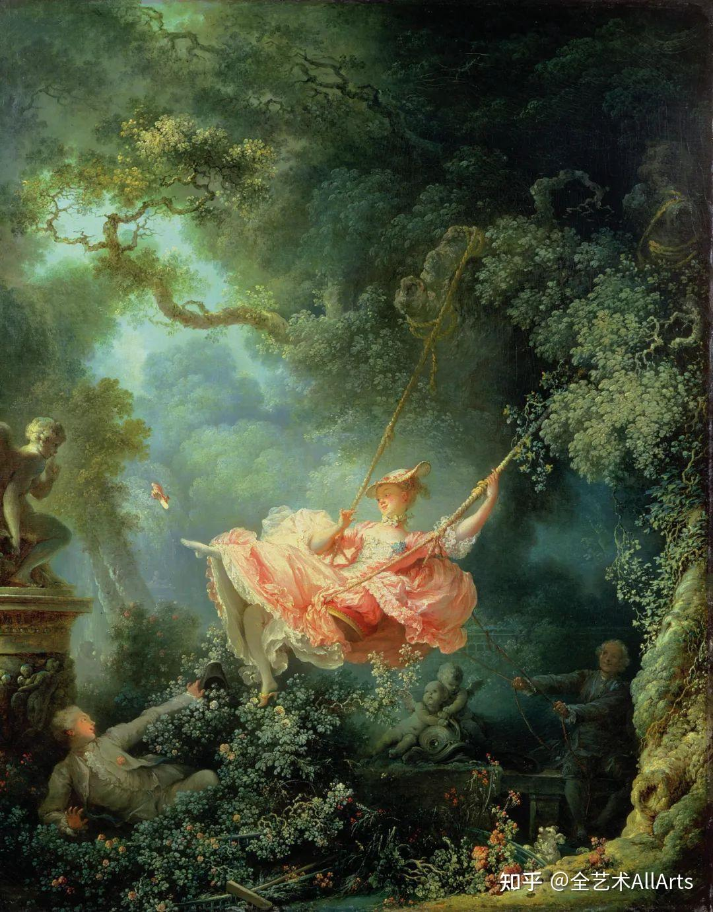

读书少女

    这是一个做奴仆的少女，在劳动间隙中忙里偷闲地读书。少女因劳动而疲惫，但并未能阻挡她求知的欲望。室内道具说明，这是在厨房之内，
    猫儿闲适的陪伴着她。这是画家面向生活、关注普通人命运的表现。据传，画中少女是弗拉戈纳尔妻子的妹妹，年仅十四岁的玛格丽特·热拉尔，
    因母亲去世前来巴黎投奔姐姐。此时弗拉戈纳尔与结婚六年妻子感情淡漠，而天生丽质、窈窕迷人、多才多艺的小姨子的到来，
    使家中宛如增添了一朵娇艳盛开的鲜花，自然强烈地吸引着充满激情和才华的画家的创作欲望。因此，当玛格丽特到来不久，
    画家便以她为模特儿，用清新自然的写意笔调，描绘出对少女的爱意与温情。画风一改往日惯用的轻巧、华丽、琐碎的罗可可风格，构图，
    造型和色彩都表现出读书少女端庄、文静与专注，弗拉戈纳尔通常喜爱的黄色在这里不但没有轻浮之嫌，反而犹如洒在少女身上的一绺温暖而耀眼的阳光，
    使少女的美更加自然纯情，又如春天复苏萌动的生命，闪耀着青春的活力。弗拉戈纳尔以前的作品，大都具有矫情艳丽的虚饰风格，
    而《读书的少女》则一反往昔的矫饰之风，以直率挥洒的笔法、简洁概括的显露出画家的才情和艺术功力。

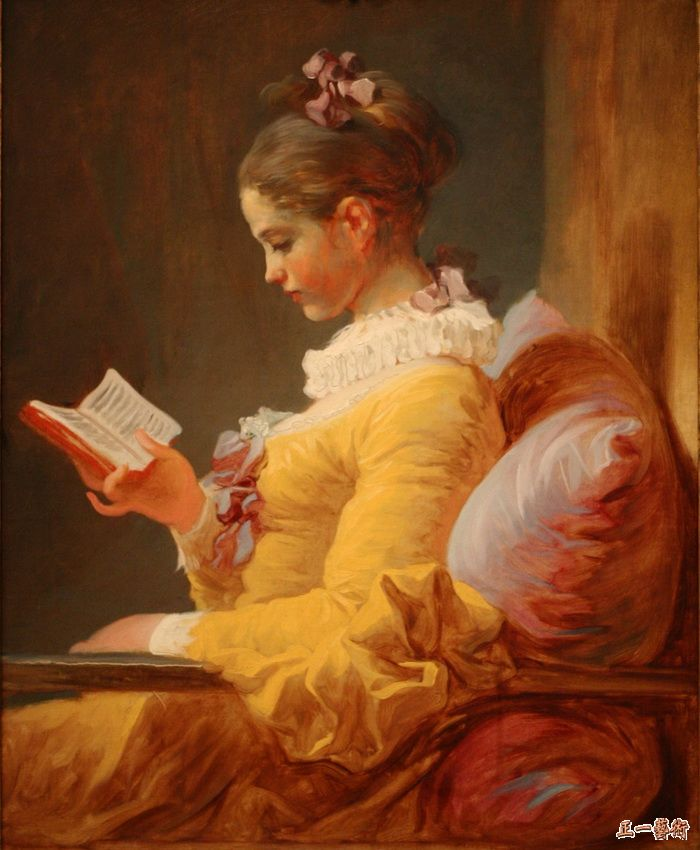

### 启蒙时期的新古典主义

新古典主义兴起于18世纪下半叶的法国，并迅速在欧美地区扩展。新古典主义，一方面起于对巴洛克和洛可可艺术繁琐的装饰的厌恶，一方面由于罗马庞贝遗址的发掘，
希望以重振古希腊、古罗马的艺术为信念。新古典主义以复兴古希腊罗马艺术为旗号，艺术家刻意从风格与题材模仿古代艺术。

    1. 热衷与向往古希腊罗马艺术，提倡典雅，反对平庸
    2. 强调理性地运用普遍法则，轻视感性的情感表现和个性化风格
    3. 提倡崇高，庄重，优雅，单纯的形式，反对轻佻和虚饰
    4. 强调素描关系而轻视色彩运用，强调线条和严谨的外形而排斥渲染和自由的笔法
    5. 与古典主义区别在于题材的改变，和法国大革命相关

什么是古典主义？

####    大卫

雅克·路易·大卫(Jacques-Louis David )又译：杰克·路易斯·达维特（1748年8月30日 - 1825年12月9日）是法国著名画家，古典主义画派的奠基人，
著名的艺术教育家，学生有新古典主义代表人安格尔，科罗等。画风严谨，技法精工

护从搬来布鲁图斯儿子的尸体

    其主题是罗马共和国的建立者卢修斯·尤尼乌斯·布鲁图斯，考虑他的儿子们的命运。他们密谋推翻共和国，恢复君主制，布鲁图斯本人被迫下令处死他们。
    这样，布鲁图斯牺牲自己的家庭，成了共和国的英雄捍卫者。这幅画是公民美德的大胆寓言，对共和主义不断发展的事业发出巨大的共鸣。这幅画的主题是公民美德、
    牺牲和对国家的奉献，在充满政治色彩的法国大革命时期揭幕时，引发了许多争议。

贺拉斯兄弟之誓

    这原本是法国国王路易十六在1784年给大卫的订件。他接到任务后没有按照统治者的意愿去画，而是加强英雄人物的刚毅决心。
    由于达维特的政治观点和路易十六的专制权格格不入，这幅画的主题思想和法国王室的要求完全背道而驰。
    荷拉斯，是古罗马时代的一个家族。古罗马共和制时期，罗马人与比邻的伊特鲁里亚的古利茨亚人发生了战争，但双方的人民却有着通婚关系。为了避免一场大规模的流血厮杀，
    双方统领达成协议，各选三名勇士来进行格斗，以胜败来判定罗马城与阿尔贝城的最高统治权属谁。在这场战争中，荷拉斯兄弟被选出来与敌人进行格斗。老荷拉斯将武器分发给三兄弟，
    三兄弟伸出右手向宝剑宣誓……格斗以罗马的荷拉斯三兄弟战胜而告终。这个题材，早在十七世纪就被法国剧作家高乃依写过，它的主题思想是个人感情要服从国家利益。
    画家运用了多侧面揭示主题的手法，使悲壮的戏剧性场面，具有无比的丰富性。男人的刚毅、悲壮与女人的哭泣形成对比，深化了题旨的思想性。画面上的气氛是明确的：
    为了民族的存亡，为了拯救祖国，只有牺牲家庭和个人的利益。画中主要人物的表情、动作激昂，后景上的古典建筑突出了这种庄重的气氛。
    当法国人民高唱着“不是获胜利，就是死亡”的革命歌曲奔向前线，和外国侵略军、贵族流亡者决战的时候，这幅画的鼓动作用是很明显的。

马拉之死

    在大革命中，大卫根据国民议会的建议创作了一些具有鲜明革命时代特征的肖像画，其中最杰出的是《马拉之死》。
    《马拉之死》描绘的是法国大革命时期遇害的雅各宾派领袖马拉被刺的情景：马拉倒在浴缸中，鲜血从他胸口流出，带血的匕首掉落在地上。
    马拉的躯体无力地垂到一边，手中还拿着刺客的信函， [4]右手还握着笔。他审批的木箱上有墨水瓶和纸。

拿破仑越过圣贝尔纳山

拿破仑加冕

    这是画家对拿破仑一世及皇后加冕礼仪式的忠实记录。身着华丽服饰的拿破仑已戴上王冠，正把小王冠给皇后带上，教皇心绪不宁地默认了这一情景。
    整个画面气势十分庄严，人物多达百人，每个人物形象都按身份进行精神描绘，构图宏大，场面壮观，是大卫的空前的巨幅制作。
    它充分发挥了画家的素描造型与色彩写生才能，不仅人物、服饰、环境的质感逼真，富丽堂皇，而且整体构思统一完整，在严谨性上达到了新古典主义绘画的最高境界。

####    安格尔 -- 唯美主义的古典主义

让-奥古斯特-多米尼克•安格尔，1780年8月29日- 1867年1月14日，他出生在蒙托邦的一个普通家庭，法国新古典主义画家。
安格尔强调绘画必须重视骨骼，而肌肉远在其次，他认为肌肉绘制得过分精确会成为造型纯真的最大障碍，甚至会造成独特构思的浪费使作品平庸化。
这是发前人所未想的重要美学理论，1814年他应卡萝琳皇后的邀请创作的《大宫女》就是这种理论的最好佐证。
安格尔崇尚自然，代表他最高成就的裸体创作往往不事雕琢，是自然形象洗练化与古典造型理性的结合。他笔下的裸女没有思想《土耳其浴室》、
没有信仰《后宫佳丽》、没有任何时代的成分《维纳斯》，实际是他夫人的画像，完全是画家纯粹的艺术创作。
《泉》是他最负盛名的作品，是他于1820年在意大利期间作为习作开始的，1856年才在巴黎完稿，据说原名是《维纳斯》，但画家经过数十年的世俗漂泊，
修改了少女脚边的小天使，把整理秀发改为倒倾水瓶，使之成为一幅具有古典主义象征意义的名作。
也许安格尔在寄托对青春的无限眷恋--少女充满活力的胴体正像她脚边的那朵含苞欲放的雏菊，散发着长久的魅力，给人以宁谧的思绪、无尽的隽永。
少女是画家衰老年岁的产儿，她的美资超过了所有的姐妹，集中了她们的美于一身。安格尔的艺术形式美是成功的，他笔下的裸体屏弃了一切非自然的成分，
因而她们的美是可供任何时代膜拜的典范。

泉

    在《泉》这幅画里，安格尔画了一个直立的全裸的女性身体，占据了全篇几乎三分之二的面积，她的双臂是向上举着的，裸体正面呈现在欣赏者眼前，
    小腹甚至微微凸出，如此舒展式的裸体给人强烈的视觉冲击，即便是在当时思想较为开放的西方，这样正面地不加掩饰地呈现女性裸体的画作也是很少见的。
    这是造型对欣赏者第一次的美感冲击。安格尔的毕生精力76岁完成。

大宫女

    这幅画是受拿破仑的妹妹，那不勒斯王国王后卡罗琳·波拿巴的委托而做。显示土耳其内宫一裸体宫女。现藏于法国巴黎卢浮宫。
    宫女的脊柱被刻意拉长，組成「两个或三个椎体」 甚至“五个椎体”之多，而使骨盆及下背部加长。这可能代表了宫女的感性阴柔美。
    此外，她的目光和她的骨盆区域之间的距离，可能是该女人的深度思考和复杂情感的一个物理性表现

土耳其浴室

    《土耳其浴室》在描写女性人体技巧方面达到了顶峰。画面上，一群在土耳其宫廷浴室里的少女，正悠闲自在地享受沐浴给她们带来的欢乐。
    安格尔用熟练的笔触，优美的线条，柔和、富有变化的色彩，画出约 1-个女人体。她们在浴室中的不同动势和情态，组成一幅统一和谐的生活画面，
    这充分显示了画家的匠心独运。他有意在浴女中安插了一个黑人侍女，更加强了画面色彩的对比效果。《土耳其浴室》不仅给人们展示了女人的曲线和青春的活力，
    它还使人们感受到一种诗意、一种旋律，让人享受到安格尔绘画艺术的甜美。通过《土耳其浴室》的创作过程，人们还可以了解安格尔对艺术尽善尽美的追求。
    画面最初的构思是方形的，后来变成圆形。此外，画中人物的变化也很大，如靠近黑人侍女的 4个坐姿人体，以及正在入水的浴女都是后来加上的。
    由此可见安格尔创作态度的严肃认真。

瓦平松的浴女

    《瓦平松浴女》反映了安格尔借助于女人体的整体感和细腻感来表现人体单纯、洁净、洗练的美感。

靜坐的墨瓦特雪夫人

##  19世纪美术

### 浪漫主义

古典主义的对立面。
    
    1. 激越的感情
    2. 极端个性化的描写

####    傑利柯

讓-路易·安德烈·泰奧多爾·傑利柯（1791年9月26日—1824年1月26日）是法國浪漫主義畫派的先驅，對浪漫主義畫派和現實主義畫派的發展有重要影響。

梅杜薩之筏

    美杜莎之筏是法國浪漫主義畫家西奥多·杰利柯（1791─1824）在1818年─1819年間畫的油畫。这幅畫是在他27歲時畫的，之後成为法國浪漫主義的標誌。
    这幅畫描绘了法國海軍的巡防艦美杜莎号沉没之后生還者的求生場面。这場海難發生于1816年7月2日毛里塔尼亞附近的海域，海難當時至少有147人生還，起先是在一隻自製的木筏上面漂流，
    但是13日后被救起时仅有15人倖存，期間他们缺少食物和饮水，甚至有人吃尸体来维持生命。導致这場海難的原因很大程度上是由于美杜莎号的船長失職無能，
    而这位船長是法國復辟王朝任命的，因此这一事件後來變成國際醜聞。不過實際上，任命貴族做船長是法國海軍內部的慣例，當時的路易十八無權任命船長，也並無直接參與入这一事件。
    在選題上，畫家之所以选择这個發生了没有几年的著名悲劇，是想引发大眾輿論關注，來發展他的绘画事業。在正式成画前，他做了大量對这次海難的調查，
    同時在绘畫前亦畫了多次草稿。他採訪了其中兩個倖存者，复制了木筏的精細模型，前往醫院、太平間，去觀察死屍的色澤、紋理和人死時的樣子。正如畫家所料，
    这幅畫在1819年在巴黎展覽第一次展出時，就引起了很大關注，褒贬不一。尽管如此，这幅畫仍搏得國際名聲，今日被认为是法國绘画史上早期浪漫主義的開路先鋒。
    雖然《美杜莎之筏》有傳統歷史畫的元素，不過其選題引人關注、畫風戲劇，这都打破了當時新古典主義的教條約束。这幅畫在第一次亮相後幾乎立即爲畫家贏得廣泛注意，
    之後这幅畫在倫敦展出。其影響可以在之後的欧仁·德拉克罗瓦、约瑟夫·玛罗德·威廉·特纳、居斯塔夫·库尔贝、爱德华·马奈等的畫作中明顯見到。在畫家32歲死后，这幅画成为卢浮宫的收藏品。

皇家衛隊的騎兵軍官

艾普森的賽馬

患嫉妒偏執狂的女精神病患者

####    戈雅  -- 绘画上的莎士比亚

弗朗西斯科·何塞·德·戈雅-卢西恩特斯（Francisco José de Goya y Lucientes，1746——1828），
出生于西班牙萨拉戈萨，西班牙浪漫主义画派画家。戈雅画风奇异多变，从早期巴洛克式画风到后期类似表现主义的作品，
他一生总在改变，虽然他从没有建立自己的门派，但对后世的现实主义画派、浪漫主义画派和印象派都有很大的影响，
是一位承前启后的过渡性人物。代表作有《裸体的玛哈》、《着衣的玛哈》、《阳伞》、《巨人》等。

1808年5月3日夜枪杀起义者

    1808年拿破仑的雇佣军入侵西班牙，腐败无能的卡洛斯王朝不战而降，不甘心做亡国奴的西班牙人民奋起反抗。5月2日，
    首都马德里附近的爱国志士在太阳门下发动了反抗侵略的武装起义，不幸起义失败，法国军队逮捕了大批革命志士。接着，法国军队无视西班牙的独立地位，
    未经过任何法律程序，于5月3日的晚间和次日凌晨，枪杀了数千名起义者。极富爱国热情的画家闻知这一惨绝人寰的事件，极为愤慨和恼怒，
    挥笔创作了《1808年5月3日夜枪杀起义者》。正如画家本人说的那样：“我要用自己的画笔，使反抗欧洲暴君的这次伟大而英勇的光荣起义永垂不朽。”

查理四世的一家

裸体的马哈和穿衣的马哈

    这两幅"玛哈"是戈雅的独辟蹊径之作，因为在西班牙绘画史上极少有裸女像，它是不为西班牙宗教裁判所容忍的。不仅在绘画上，就是工艺装饰，直到镜子和家具上面，
    都不许可有裸女形象出现。17世纪西班牙绘画大师委拉士开兹之敢于画出《镜前的维纳斯》，乃是在国王的庇护下，所以戈雅这两幅画中的裸体女性油画，也许是绝无仅有的。

农神吞噬其子

    该作是戈雅晚年所绘制的《黑色绘画》系列中最为著名的一幅，以阴暗恐怖而闻名。画中是罗马神话中的农神萨图尔努斯为了防止儿子们夺权斗争而将他们全部吃掉。

####    德拉克洛瓦 -- 浪漫主义最伟大的画家， 色彩大师

1798年4月26日，生于沙朗通·圣莫里斯。法国著名画家，浪漫主义画派的典型代表。他继承和发展了文艺复兴以来欧洲各艺术流派，包括威尼斯画派、荷兰画派、
P.P.鲁本斯和J.康斯特布尔等艺术家的成就和传统，并影响了以后的艺术家，特别是印象主义画家。

自由引导人民

    《自由引导人民》取材于1830年七月革命事件，该画又名“1830年7月27日”，是纪念1830年7月27日巴黎市民为推翻波旁王朝的一次起义。 
    1815年拿破仑下台后，逃亡国外的路易十八重返法国当国王，这就是“波旁王朝”第二次复辟，封建势力重新猖獗。1830年7月，路易十八的继承人查理十世企图进一步增强皇权，
    限制人民的选举权和出版自由并宣布解散议会。1830年7月26日，巴黎市民闻讯纷纷起义。他们拿起武器，走向街垒，为推翻这个复辟的波旁王朝浴血奋战，
    27至29日为推翻波旁王朝，与保皇党展开了战斗，最后占领了王宫，查理十世逃亡英国。在历史上称为“光荣的三天”。
    在这次战斗中，一位名叫克拉拉·莱辛的姑娘首先在街垒上举起了象征法兰西共和制的三色旗；少年阿莱尔把这面旗帜插到巴黎圣母院旁的一座桥头时，
    中弹倒下。画家德拉克洛瓦目击了这一悲壮激烈景象，又义愤填膺，决心为之画一幅画作为永久的纪念。

希阿岛的屠杀

    1822年，土耳其人占领了属于希腊版图的希奥岛，并血洗掠夺了这个小岛。据说被杀平民有二万三千人，被卖为奴隶的有四万七千人。侵略者的暴行激怒了全欧洲的进步人士，
    也深深地激怒了画家德拉克洛瓦，他怀着巨大的同情，以鲜明有力的构思、动人心魄的形象和雄劲奔放的构图揭露了土耳其人的残暴罪行。
    1821～1828年，希腊人民举行的争取民族独立起义遭到血腥镇压，他以极大的同情创作了《希阿岛的屠杀》和《迈索隆其翁废墟上的希腊》，
    表现了希腊人所受灾难和不屈以及土耳其人的残暴。这两幅使浪漫主义与古典主义斗争进一步尖锐化的作品，当即遭到学院派所谓“绘画的屠杀”的非难，
    却受到进步人士的爱戴，并使德拉克洛瓦一跃而成为当时的第一流画家，从此也确立了他作为浪漫派旗手的地位。《希阿岛的屠杀》曾被古典主义画家让-巴蒂斯-卡米尔·柯罗惊呼为是：色彩的屠杀！

但丁之舟

    这幅画取材于但丁的《神曲》，描绘了诗人但丁在维吉尔的带领下参观地狱的场景。画面强烈的律动感和浪漫式的激情另观众激动不已，
    周围地狱中人的恐惧与诗人的冷静和道德力量更是形成鲜明对比。

萨达纳帕拉之死

    这幅画体现了德拉克洛瓦对色彩的狂热，一片红色以对角线的形式强势穿透整个画面，被认为是浪漫主义艺术的巅峰之作。
    画家描绘的是亚述第一王朝的最后一位暴君，在皇宫陷落之际，将自己和所有的后妃、宫女一起焚死的怵目惊心的故事。整个画面表现的正是这个暴君歇斯底里发作的瞬间。
    画面运用大量的红色，喻示着血腥，又运用了动荡扭曲的线条，给人以不安之感。

### 色彩理论

色轮（color wheel）

    三原色
    对比色 -- 120度
    补色-- 180度, 两个补色调在一起是灰色 (德拉克洛瓦)
    无色: 黑，白，灰，金，银
    物体的固有色在中间色调表现的最充分(德拉克洛瓦)
    高光部位固有色消失，高光部位反射天空的颜色(德拉克洛瓦)

    1、色相: 就是颜色
    3、明度: 颜色去掉之后的黑白灰明度，就是加白
    2、纯度/饱和度: 是否和其他颜色调和ß

####    单色系法则（monochromatic），只取一个颜色（hue），再调对比度（saturation）和亮度（value），最和谐；

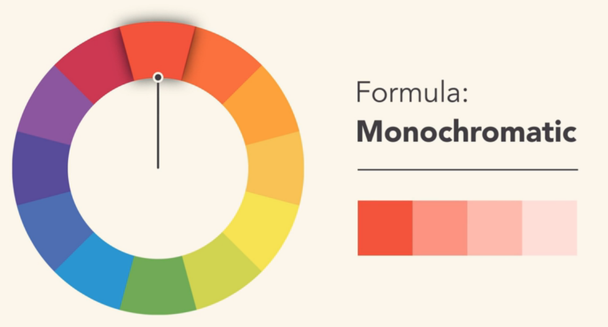
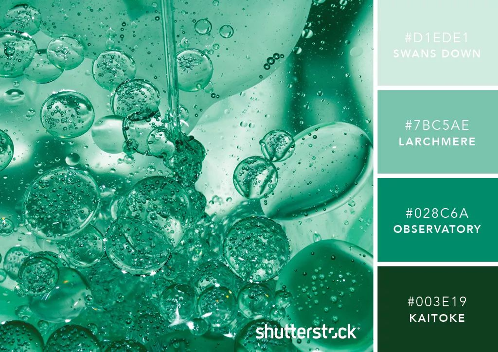

####    同色系法则（analogous），取色轮上相邻的颜色，同色系的配色特点是整体页面统一而富有层次，
从而传递出一种稳定、一种令人悦目、低对比度的和谐美感，专业的形象，适合绝大多数的场景使用，是最为简单和有效的配色方式。

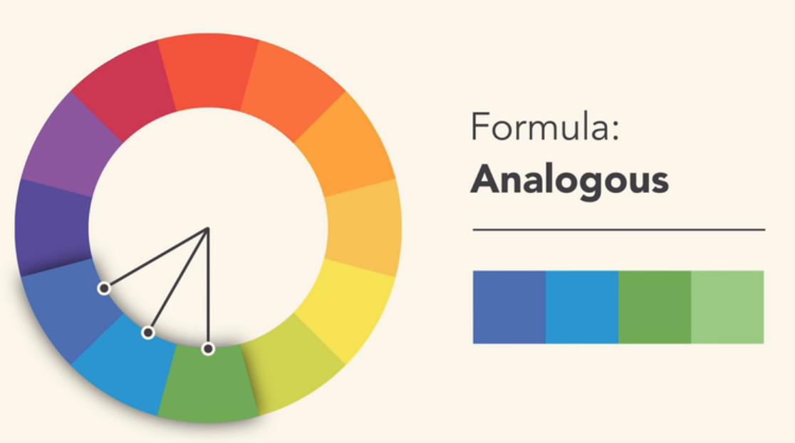

####    互补色法则（complementary），取色轮上正对的两个颜色，补色形成强烈的对比效果。

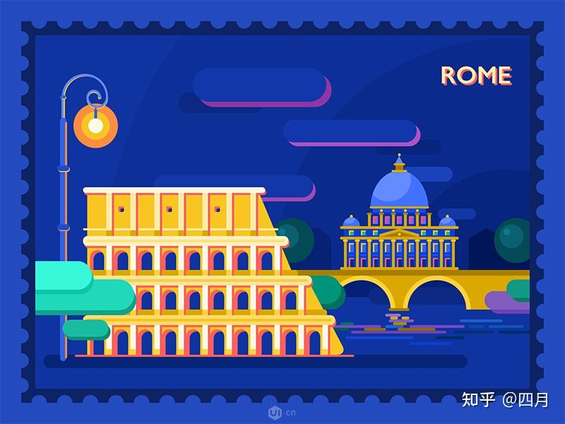

####    对比色分割法则（split complementary），多个颜色多种选择；

既具有类比色的低对比度的美感,又具有补色的力量感形成了一种既和谐又有重点的颜色关系。
这种配色具有类似互补色的视觉魅力,但少了强度带入相似色可以使得互补色的鲜明对比更柔和。

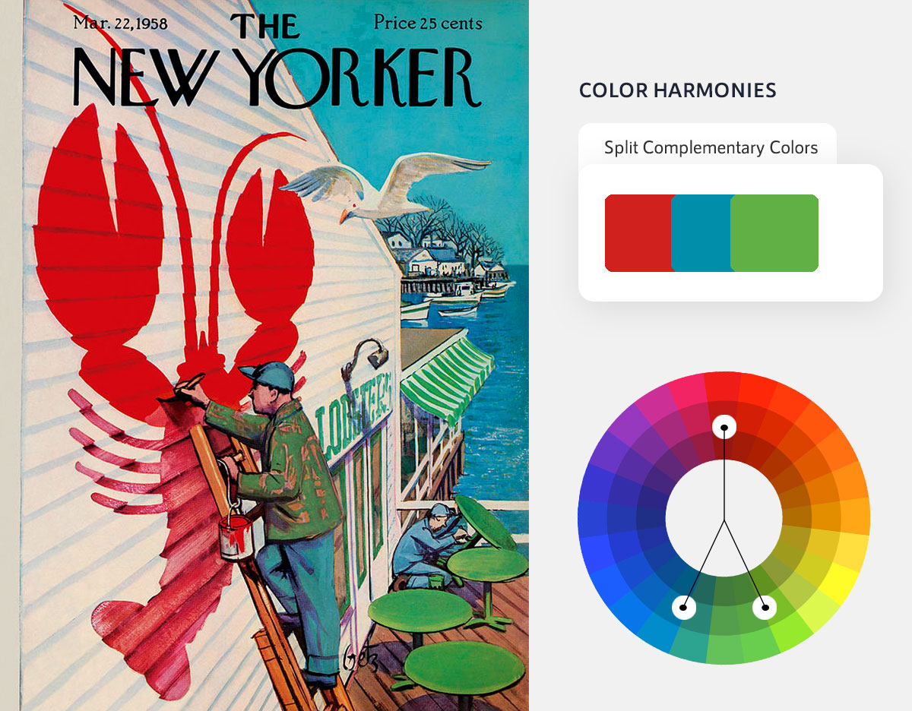

####    三角色法则（triadic），最冲击，慎用；

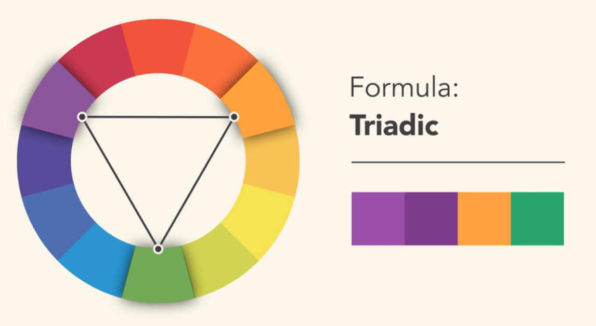
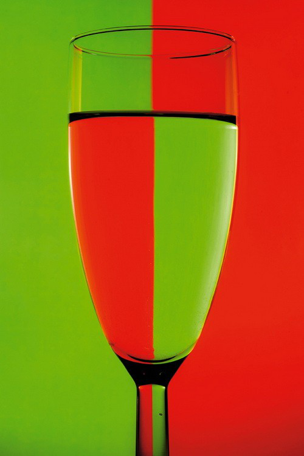

####    四色/双互补色Tetradic（tetradic），最适合其中一种颜色为大面积主色，另外三种颜色作为点缀的情况。

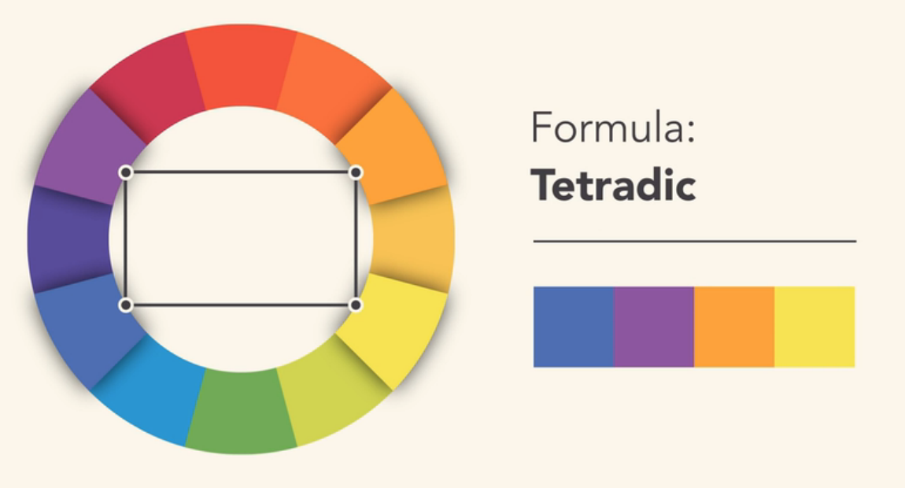

####    康斯特布尔

约翰·康斯特布尔（John Constable，1776年6月11日~1837年3月31日），英国皇家美术学院院士，19世纪英国最伟大的风景画家。
1776年6月11日出生于英国萨福克郡一个优美的小山村，长大后，开始在皇家美术学院学画，后认为临摹古典风景画不如向大自然学习。
作品真实生动地表现瞬息万变的大自然景色，其画风对后来法国风景画的革新和浪漫主义的绘画有着很大的启发作用。

干草车

麦田

从主教花园望见的索尔兹伯里大教堂

####    透纳

约瑟夫·马洛德·威廉·透纳（Joseph Mallord William Turner，1775年4月23日－1851年12月19日），男，是英国著名艺术家之一，19世纪上半叶英国学院派画家的代表，
在透纳以善于描绘光与空气的微妙关系而闻名于世，尤其对水气弥漫的掌握有独到之处。他在艺术史上的特殊贡献是把风景画与历史画、肖像画摆到了同等的地位。
在18世纪歷史畫為主流的畫壇上，其作品並不受重視，但在現代則公認他是非常偉大的風景畫家。

被拖去解体的战舰鲁莽号

《暴风雪—汽船驶离港口》

    为了搞清楚海上的其实景象,已经67岁的透纳不顾危险,请一位水手把他绑到桅杆上,以便体验和观察大海中的恶浪。船长发现后赶紧劝说他下来:
    "喂,老头子你疯了!为什么要把自己绑到桅杆上去?快下来,危险呀。”但透纳仍然坚持自己的想法:“放心船长先生,只要绑紧一些就没什么问题了。
    ”突然海洋上刮起了撰风雪,海面上掀起了万丈巨浪,气温变得非常低,甲板上的水手乱作一团,人们议论纷纷:“上帝,他是个疯子吗?”“难以里信!”`.愿主保佑你,透纳先生。
    ”可桅杆上的透纳却班无俱色,透纳心想:“哈哈,我终于看到真正的大海啦!”几个月后,透纳的杰作《暴风雪—汽船驶离港口》在英国展出,人们被深深地感动了。
    有人问道:“喂,水手,这些不会是他亲眼所见吧?”“傻瓜!那还有假吗?这可是透纳先生用生命换来的杰作呀!”

雨，蒸汽和速度—西部大铁路

遇难船

    透纳热衷于以浪漫派的手法，呈现自然界的各种力量，为了忠实呈现如狂风、洪水、暴雨等惊人且无法掌控的状况，
    他发展出一种漩涡型的构图手法，利用涡漩似的旋转效果，引导观者进入画面的核心，绘制出如这幅《运输船遇难》作品。
    他认为如此一来，观赏者将不只是在一旁观看暴风雨，而是在某种程度上还能实际体验到被卷入暴风中的感觉。

议会大厦的大火

奴隶船

### 现实主义

反对不切实际的浪漫主义，画身边的生活，

巴比松画派：巴比松画派（Barbizon School）是指一群活动于1830至1880年间，在邻近枫丹白露森林的巴比松村的法国风景画家们形成的一个非正式的流派。 
他们不是在画室中创作风景画，而是第一批直接对照自然写生的画家，并以“面向自然，对景写生”为创作原则。
巴比松画派以当地风景作为绘画的主要内容,注重客观性,对后来的印象派产生了极大的影响,起到了承上启下的作用。

####    米勒

让·弗朗索瓦·米勒Jean-Francois Millet (1814-1875年) 是19世纪法国杰出现实主义画家，以描绘农村主题见长，他创作的作品以描绘农民的劳动和生活为主，
具有浓郁的农村生活气息。

拾穗者 -- 法国的三女神

播种者

母亲的关怀

晚禱

####    杜米埃

奥诺雷·杜米埃(Honoré Daumier)(1808年2月26日-1879年2月10日)是法国著名画家、讽刺漫画家、雕塑家和版画家。是当时最多产的艺术家，
也是法国19世纪最伟大的现实主义讽刺画大师。

三等车厢

####    柯罗 -- 风景大师：与诗意自然相拥的一生  我的最爱啊！

让·巴蒂斯特·卡米耶·柯罗（Jean baptiste camille corot，1796-1875）法国19世纪最杰出的风景画家。

阿夫赖城

戴珍珠的女人

Souvenir of Riva

塞纳河港湾

The Evening Star

####    库尔贝

19世纪中叶之前，西方绘画的主流是历史与虚构的主题。创作古典神话和圣经题材的画作，是延续了几百年的传统。但一批艺术家们开始对此感到不满，想要推翻陈规，
他们声称 ：“只有当下的东西，人们亲眼看见的东西才是真实的”，他们更关心人们的亲身经历和日常生活。这一艺术运动的发起者，就是有着“画坛叛逆”之名的，
写实主义画派先驱，法国画家居斯塔夫 · 库尔贝。

你好，库尔贝先生

采石工

    来自库尔贝的亲身观察，他在城外遇到敲打石头铺筑道路的工人，将他们记录下来。画中的形象与真人等大，库尔贝直白地刻画了人物从褴褛的衣衫到指缝间的污垢，
    年长采石工的跪姿暗示着工作的机械单调，人物所处的空间都很浅，景物处理得相当扁平，如同一块幕布，迫使观众的视线停留在前景，
    直面这些艰辛贫穷的底层劳动者。因题材罕有，当时有人就认为《碎石工》表达了社会主义的观点，有危险的政治倾向。

画家的画室，真实的隐喻

    库尔贝曾在信中解释这幅画的意义 ：“我希望能让大家知道我的画室其实是个自然而又有道德的地方，画室中的人物都是现代活生生的。在社会的梯形中，
    他们有的属于高阶层，有的被放在最下层，有的则属于中间部分。”“……画作里有的人活得很好，有的却已残喘 ；他们生在一个最好的社会，也是最坏的社会，
    亦是那个司空见惯的社会。”

####    列宾

伊里亚·叶菲莫维奇·列宾（1844年08月05日—1930年09月29日），出生于丘古耶夫，在彼得堡美术学院学习。俄国杰出的批判现实主义画家，
巡回展览画派重要代表人物。

伏尔加河的纤夫 -- 于1870～1873年创作的一幅油画作品，描绘了11名纤夫在伏尔加河畔拉纤的情景

圣尼古拉拯救三个要被处死的无辜者

沙皇尼古拉二世草稿

萨特阔在水晶宫

### 印象主义

浪漫主义的步伐还太小， 印象派是十九世纪下半期著名画派，1874年的“无名画家展览”的举办，标志着印象派的产生，这个画派的名字来源于《喧嚣》杂志的批评家路易·勒鲁瓦对莫奈《印象·日出》的嘲讽性称谓。

    1. 自然光线而非室内天光
    2. 提倡写生，注重光和色彩， 色彩取决于光线
    3. 由于光线变化很快，所以需要快速作画
    4. 颜色少所以很纯很明亮
    5. 白色由七种颜色构成

####    马奈-印象派之父

马奈早年受过学院派的六年教育，后又研究许多历代大师的作品。他的画既有传统绘画坚实的造型，又有印象主义画派明亮、鲜艳、充满光感的色彩，可以说他是一个承上启下的重要画家。
马奈的画风乍看之下应该属于古典的写实派画风，其人物细节都相当有真实感。但马奈之所以也被归为印象派画家的原因，在于他所画的主题，颠覆了写实派的保守思考。
要画战争，就画冲突性高的，被处决的画面。要画野餐，就画争议性高的对比，裸女自然的坐在穿西服的绅士当中。马奈很明显的表示出，印象派并不仅仅靠绘画技巧来与众不同，
主题也可以重新思考的一个概念。

爱德华·马奈的艺术门类主要是油画，他从未参加过印象派的展览，但他深具革新精神的艺术创作态度，却深深影响了莫奈、塞尚、梵高等新兴画家，进而将绘画带入现代主义的道路上。
受到日本浮世绘及西班牙画风的影响，马奈大胆采用鲜明色彩，舍弃传统绘画的中间色调，将绘画从追求立体空间的传统束缚中解放出来，朝二维的平面创作迈出革命性的一大步。

草地上的午餐

    《草地上的午餐》描绘的是一个愉快的午后，几个年轻人在草地共进午餐后的情景。画面的背景是茂密的树林，树木枝叶繁密茂盛。画上拉斐尔的女神和乔尔乔内的仙女成了女模特儿，
    其中一个裸体，另一个半穿着衣服。她们和两个衣冠楚楚但显然又“放荡不羁”的波希米亚艺术家在树林中消遣娱乐。与此形成鲜明对比的是她身边两个衣冠楚楚的绅士模样的人，
    他们两两相对，正半坐半卧地谈论着，一个还伸出手比划着什么。他们的前方堆满了女人的衣服、帽子等东西，一个盛放野营食物的篮子翻倒在地，面包、水果等食物散落了一地。
    整个画面描绘得清新、淡雅、愉悦和自然。这幅画抛弃了人们所习惯的光滑用笔，而且不借助线条而是用色彩造型；运用恰到好处的技巧方法，把古典主义绘画通过透视、空间，
    让观者在欣赏时通常能感觉画面所营造出的景深感。画面中，马奈将赤身的女子和两个衣冠楚楚的男子安排在一起，并置于巴黎最普通、最常见的场景——草地午餐之中。
    这一反常态的表达方式是对当时古典绘画常见的教化和情感主题的讥讽与挑战。

    因此，这幅画在1863年的巴黎沙龙展出时以“有伤风化”而遭到拒绝，后来在“落选者沙龙”中展出。 1863年在落选者沙龙中展出的《草地上的午餐》一画非但没有受到冷落，
    相反还在欧洲整个画坛引起了罕见的轰动，不论是题材还是表现方法都与当时占统治地位的学院派原则相悖。马奈无形中成为这些印象派画家的领袖。
    马奈以其强烈的绘画敏感性和其典范性的作品，使他所处时代的绘画发生了天翻地覆的变化。 由此以来革新派画家对他情有独钟，他的画具有印象主义的特色，
    对19世纪后期绘画风格的改革起到了极大的推动作用。

奥林匹亚

    奥林匹亚成名的主要原因之一是其中心大胆描绘了裸体女性形象。 在艺术中理想化的女性形象占主导地位的时代，
    马奈决定描绘一名毫无歉意地赤身裸体躺在床上的妓女，这引起了震惊和愤怒。 非常规的题材选择挑战了社会规范，
    并使观众面对卖淫的严酷现实。 这种大胆的描绘使《奥林匹亚》一炮而红，引发了激烈的争论，并突破了传统艺术的界限。

吹笛子的少年

女神游乐厅的吧台 -- 它刻画了巴黎的著名剧院夜总会女神游乐厅的场景。

咖啡廳演唱會

隆尚赛马

####    莫奈

奥斯卡-克劳德·莫奈（法语：Oscar-Claude Monet，发音：[klod mɔnɛ]；1840年11月14日－1926年12月5日），法国画家，印象派代表人物及创始人之一，
“印象”一词即是源自其名作《印象·日出》，印象派的理论和实践大都有其推广。莫奈擅长光与影的实验与表现技法，最重要的风格是改变了阴影和轮廓线的画法，
在其画作中没有非常明确的阴影，亦无突显或平涂式的轮廓线。此外，他对于色彩的运用相当细腻，曾长期探索实验色彩与光的完美表达，常在不同的时间和光线下，
对同一对象作多幅描绘。

日出·印象
    
    是法国印象派画家克劳德·莫奈于1872年在勒阿弗尔港口创作的一幅油画。该画描绘了晨雾笼罩中的日出港口景象，用美妙的光的变幻与运动展现了迷人景色，
    以及画家用轻快跳跃的笔触刻画了光在宽阔的海面上反射与颤动的生动景象。现藏于巴黎马尔莫丹艺术馆。 
    该幅作品突破了传统题材和构图的限制，完全以视觉经验的感知为出发点，侧重表现光线氛围中变幻无穷的外观，是莫奈画作中最典型的一幅，
    也是日后最具声誉的经典画作，是印象画派的开山之作。却被艺术评论家路易·乐华以“‘印象’派”揶揄他的“离经背道”。

草垛

鲁昂大教堂

睡莲

撑阳伞的女子

    《撑阳伞的女子》是莫奈画于1886 年悼念亡妻卡美伊的作品。人物形象很模糊，连五官和表情都看不见，但随着笔触堆叠的方向，
    可以感受到草原上吹拂的微风和女子丝巾上跃动的阳光。卡美伊因病死于1879 年，时年37 岁，莫奈在同年画下了《临终的卡美伊》，画中以忧郁的色调、
    纷乱的笔法，传达出失去爱妻的悲伤。

海滨公园打伞的女子

    1875年，这一幅画作，实际上是莫奈所有关于卡美伊的画作中最广为人知的一幅。当时的莫奈，大概也处在人生最“惬意”的时候，娇妻幼子，年富力强，
    事业虽算不上成功，但一直在朝着非常有希望的方向前行，生活虽然不富足，但是压力也没有很大，所以这一时期莫奈的画作无一例外都满是阳光、鲜花，
    生气和活力。

日本桥

####    罗丹

奥古斯特·罗丹（1840年11月12日—1917年11月17日），全名为弗朗索瓦-奥古斯特-雷尼·罗丹（François-Auguste-René Rodin），是一位法國雕塑家，通常被認為是現代雕塑的奠基者。
他在過去接受過傳統教育，對創作採取類似工匠的方法進行承傳，羅丹擁有獨特的能力，可以在粘土中模擬複雜、湍流和深度凹陷的表面。
並以《沉思者》、《巴爾扎克紀念碑》、《吻》、《加萊義民》和《地獄之門》等雕塑而聞名於世。

沉思者

加萊義民

    該雕塑旨在紀念百年戰爭期間的一次事件，當時法國加萊在英吉利海峡上經歷了長達十一個月的圍城後向英軍投降，該城市於1884年委託羅丹創作這座雕塑，最終於1889年完成。

青铜时代

####    德加

埃德加·伊莱尔·日耳曼·德加（法语：Edgar Hilaire Germain de Gas，1834年7月19日-1917年9月27日），昵称为埃德加·德加（Edgar Degas），
生于法国巴黎，印象派画家、雕塑家。他曾在巴黎艺术学院学习绘画，受到安格尔的很大影响。借着1855年万国博览会举办安格尔回顾展的机会，
德加与安格尔相见并临摹了许多他的作品。德加富于创新的构图、细致的描绘和对动作的透彻表达使他成为19世纪晚期现代艺术的大师之一。
他最著名的绘画题材包括芭蕾舞演员和其他女性、以及赛马。他通常被认为是属于印象派，但他的有些作品更具古典、现实主义或者浪漫主义画派风格。

舞女

年轻女人像

苦艾酒

    画中右侧男子是画家朋友台斯色丹，左侧女子是演员爱伦·安德雷，出于偶然原因，德加为穷困潦倒的朋友画了这幅富有性格特征的肖像。
    画面笔触粗犷阔大，生动而简练地刻画了两人的精神状态，一杯苦艾酒，反衬出两个失意人的苦楚。构图有些奇特，人物被挤到右上角，
    大部分空间用来描绘酒吧陈设，这种空旷感与人物的失落感相映成趣，被人誉为是一幅有思想性的叙事画。

####    雷诺阿

皮耶-奥古斯特·雷諾瓦（法語：Pierre-Auguste Renoir，法语：[pjɛʁ oɡyst ʁənwaʁ]，1841年2月25日—1919年12月3日）是一位著名的法國畫家，
也是印象派發展史上的領導人物之一。其畫風承襲彼得·保罗·吕本斯與尚-安托万·华托的傳統，對於女性形體的描繪最為著名

包厢

    画家依据在剧院里得到的印象，创作了包厢中的盛装女性。有趣的是，这是在室内完成的印象派绘画。画家成功地表现了剧院中包厢里的气氛，
    虽然只画了两个人，但画家明显地突出了那个贵妇人的形象，化了妆的贵妇人与身后的绅士形成鲜明对比。《包厢》的色调是温馨的，它由玫瑰、黑、白三色组成，
    贵妇人身上黑条纹衣服非常醒目，粗阔的黑条与白色相间的浅色，使她显得光彩照人。以细小的笔触体现黑色，产生了一种丰富、浑厚的层次，
    使画面增加了视觉美感。

煎餅磨坊的舞會

    这幅作品描绘出众多的人物，给人拥挤的感觉，人头攒动，色斑跳跃，热闹非凡，给人以愉快欢乐的强烈印象。画面用蓝紫为主色调，使人物由近及远，
    产生一种多层次的节奏感。画家把主要精力放在对近景一组人物的描绘上，生动地表现出人物脸上的光色效果及光影造成的迷离感，渲染了舞会的气氛。
    就总体看，他保留着印象派对外光与色斑的留恋，使画面的总体色调、气氛有一种颤动、闪烁的强烈效果。

划船人的午宴

On the Terrace

####    毕沙罗

卡米耶·畢沙羅（Camille Pissarro 法语：[kamij pisaʁo]，1830年7月10日—1903年11月13日），是一位丹麦裔法國的印象派、新印象派畫家。畢沙羅喜好寫生，
畫了相當多的風景畫，他的後期作品是印象派中點彩畫派的佳作，此外，畢沙羅的人像畫也有他特殊的風格。

蒙马特春天早晨的林荫大道

蒙马特尔林荫大道的日落

折断枯枝的妇人

通往卢弗西埃恩之路

### 新印象主义 -- 点彩派

不调色，直接纯色点，两个互补色即为灰色。与其在调色盘里混合颜色，不如直接让看画的人自己在眼睛中混合。

    一．加色混合: 光源色的光的三原色(RGB)
        加色混合其实就是色光的混合。属于照光的混合。将光源体辐射的光合照一处，可以产牛出新的色光。
        加色混合规律：红光+绿光+蓝光=白光；红光+绿光=黄光；红光+蓝光=品红光；绿光+蓝光=青光
    二．减色混合: 红M、黄色Y、青色C
        减色混合就是色料的混合。当两种或者两种以上色料混合在一起，部分光谱色会被色料吸收，因此纯度和明度会降低。
    三．中性混合
        中性混合其实就是利用视觉错觉的混合。它又分为两种形式，一种是旋转混合，就是两种或者两种以上颜色并置在一个圆盘上，然后旋转，
        眼睛会看到新的颜色。还有一种是空间混合，就是将两种或者两种以上颜色穿插、并置一起，在一定空间距离观看得到不同颜色感受。

空间混合-- 把红点和绿点放在一起，再站远一点，眼睛眯起来看，就成了黄色。

####    修拉

喬治·皮埃尔·秀拉（法語：Georges Pierre Seurat，1859年12月2日—1891年3月29日），是法國後印象派及新印象派畫家。他以其運用色彩理論之分色主義
（英語：chromoluminarism 或 divisionism）與點彩畫作品為人所知；同時，他的conté蠟筆（英語：conté crayons、conté sticks 或 conté）粉彩作品也廣受讚譽。

大碗岛星期天的午后

    在这件作品中，他展现了自己炉火纯青的点彩派的手法，纯熟地使用中性混色理念描绘出一隅绚丽的午后景观

大碗岛的阴天

春天，塞纳河上的大碗岛

阿尼埃尔浴场

擦粉的女人

####    西涅克

    他和修拉的区别是，修拉用小圆点来点彩，西涅克用稍粗的马赛克方块来点彩。保罗·西涅克（Paul Signac，法语发音：[pɔl siɲak]；1863年11月11日—1935年8月15日），
    法国新印象主义画派的画家，和修拉一起都是点彩画派的代表人物。

圣特罗佩港口

The Papal Palace, Avignon 阿维尼翁教皇宫

马赛港的入口处

威尼斯大运河的入口

##  现代美术

1880年开始，人们逐渐从农村移居大城市。科学技术迅猛发展。 照相机，白炽灯泡，飞机，柴油机... 到1905年， 现代科技所有的技术都发明了。

### 后印象主义 -- 塞尚，梵高，高更

    后印象主义的特征:
    ①不满于客观主义的表现和片面地追求外光与色彩;
    ②强调抒发自我感受,表现主观感情和情绪:
    ③重视形和构成形的线条、色块、体、面:注重画面结构的立体主义。
    ④创作特色表现为强烈的内心化和个性化。后影响主义代表画家的艺术特色

    后印象主义直接影响了20世纪初法国画坛的两大新思潮:
    a.注重画面结构的立体主义
    b.注重色彩、线条动力与节奏的野兽主义

####    塞尚 -- 现代绘画之父， 比较理性

    塞尚是19世纪法国著名画家，后期印象派的主将，现代绘画之父、立体主义的先驱，他在吸收印象主义外光与色彩的成就基础上，更专注于物质的具体性、
    稳定性和内在结构的表现。塞尚认为“自然中的每件东西都与球体、西锥体、圆柱体极为相似”，因此他采用色的团块表现法来描绘物象的体积和深度，
    用色彩的冷暖关系来造型。塞尚的艺术探索对立体主义和抽象主义影响深远。他的作品和理念影响了20世纪许多艺术家和艺术运动，尤其是立体派。在他生前的大多数时间里，
    他的艺术不为公众所理解和接受。通过他的坚持，最后对19世纪所有常规绘画价值提出了挑战。塞尚的最大成就是对色彩与明暗具有前所未有的精辟分析，颠覆了以往的视觉透视点，
    空间的构造被从混色彩的印象里抽掉了，使绘画领域正式出现纯粹的艺术，这是以往任何绘画流派都无法做到的。因此，他被誉为“现代艺术之父”。他认为形状和色彩是不可分离的。
    用几何的笔触在平面上涂色，逐渐形成画的表面。他主张不要用线条、明暗来表现物体，而是用色彩对比。他采用色的团块表现物象的立体和深度，利用色彩的冷暖变化造型，
    用几何元素构造形象。

    主要艺术特色:
    a.强调画中物象的明晰性和坚实感。塞尚认为倘若画中物象模糊不清，那么便无法寻求画面的构成意味。因此，他反对印象主义那种忽视素描、
    把物象弄得朦胧不清的绘画语言，极力追求一种能塑造出鲜明、结实的形体绘画语言。
    b.在创作中排除了繁琐的细节描绘，而着力于对物象的简化、概括的处理。
    c.为了画面形式结构,塞尚不惜牺牲客观真实,最早摆脱了千百年来西方艺术传统的再现法则对画家的限制。
    d.在他的画中经常出现对客观造型的有意歪曲,塞尚无意再现自然，他对自然物象的描绘，根本上是为了创种形与色的构成的韵律。
    对色彩与明暗作沉着而深入的分析，重视色彩视觉的真实性。

    我们看物体除了透视，漏掉了时间！

苹果 

圣维克多山

卡牌玩家

靜物與窗簾

####    高更

    保罗·高更，法国后印象派画家、雕塑家、陶艺家及版画家，法国绘画中象征主义的首领，与塞尚、梵高合称印象派三杰。他吸收了东方绘画、黑人雕刻、
    中世纪宗教艺术和民间版画的一些手法，创造了一种有内在力量的装饰性画风。画作充满大胆的色彩，在技法上采用色彩平涂，注重和谐而不强调对比。
    高更的艺术活动反映了当时欧洲艺术回归原始、追求表现生命本源、追求野犷、奇异的倾向。

    主要艺术特色:
    a.在艺术中追求原始主义装饰和装饰性，厌恶现代文明，
    b.擅长运用大面积色彩平涂，色彩有主观倾向:注重和谐而不强调对比;
    c.作品主要都是描写海岛上的土著人的生活场景。

我们从何处来？我们是谁？我们向何处去？

黄色的基督

与黄色的基督在一起的高更自画像

不列塔尼牧人

你什么时候结婚呀？

蓝色的驳船

导致女仆被妻子赶走的高更作品《裸体习作》

布道后的幻象

####    梵高

    文森特·威廉·梵高，荷兰后印象派画家，后印象主义的先驱和表现主义绘画的先驱。梵高早期画风写实，兰传统绘画及法国写实主义画派的影响，
    结识印象派和新印象派画家，并接触到日本浮世绘的作品之后，画风巨变，由早期的沉闷、昏暗，变得简洁、笔法道劲，色彩对比鲜明，画面简洁明亮，
    喜用夸张或简化的手法，削弱传统的光影手法，有意识的强化色彩价值，利用色彩对比取得和谐。他对二十世纪艺术，尤其是野兽派与表现主义产生了深远的影响。
    梵高一生中创作近2000幅作品，保留下来的并不多，收藏在世界各地博物馆。

    主要艺术特色:
    a.梵高是继伦勃朗之后,荷兰最伟大的画家;
    b.他以极大的情感力量画风景和肖像，冲动又充满热情;
    c.用笔粗犷奔放，色调明亮，富于幻想;
    d.梵高的画风直接影响了表现主义艺术的风格。

向日葵

星空

夜间室内咖啡座

吃土豆的人

花魁

采石场山丘

麦田群鸦

嘉舍醫師的畫像

羅納河上的星夜

夜晚露天咖啡座

### 野兽派 -- 彻底改变色彩的艺术家， 随心所欲的使用颜色

亨利·埃米尔·伯努瓦·马蒂斯（法語：Henri Émile Benoît Matisse，法语：[ɑ̃ʁi emil bənwɑ matis]；1869年12月31日—1954年11月3日）是一位法国画家，
野兽派的创始人及主要代表人物，也是一位雕塑家及版画家。馬蒂斯與畢卡索、馬歇爾·杜尚一起為20世紀初的造型藝術帶來巨大變革。 他也是野獸派的領袖。
野獸派主張印象主義的理論，促成了20世紀第一次的藝術運動。使用大膽及平面的色彩、不拘的線條就是馬蒂斯的風格。風趣的結構、鮮明的色彩及輕鬆的主題就是令他成名的特點，
也使得其成為現代藝術中最重要的人物之一。

红色的和谐

打开的窗户

舞蹈

马蒂斯夫人

剪纸

长尾鹦鹉和美人鱼

### 立体主义

####    毕加索 -- 现代艺术的创始人

毕加索全名巴勃罗·毕加索，他一生富裕，创造力惊人，共创作油画1800多幅油画，素描多达2万多件，还有版画、雕塑、陶器等等，涉猎广泛。
曾有人说毕加索是富死的，梵高是穷死的，毕竟毕加索是艺术史上唯一一个活着亲眼看到自己的作品收藏进罗浮宫的画家，毕加索一直在不断变化艺术表现手法，
印象派、后印象派、野兽派的艺术风格都被他汲取改造成为自己的标志，在20世纪活跃过的画家，没人能绕过毕加索开拓的道路而前进。

亚威农少女

    在1907年春天，这幅作品终于产生，毕加索把他的绘画、雕刻的所有观念结合，这是关于空间、体积、质量、颜色平面及线条的概念，这幅作品备受争议，
    这是一种全新的审美观，如同一颗无政府主义的炸弹投入了西欧的绘画界。在漫长的历史长河中，这幅令人摇头叹息的画被证明是这个时代最有力量、
    最有冲击力的画。

格尔尼卡

    1937年4月26日，德国飞机袭击格尔尼卡，整个城市完全被破坏，血流成河。毕加索满腔热血投入到创造中，用绘画来抗议，《格尔尼卡》并非一日完成，
    近7米长，4米高，整个画面死寂又充满了哀嚎，绝望而孤独统治着整个画面。
    这幅画仅使用了黑色和白色，和广泛的灰色油漆。画的中央是一只死去的马和一位拿着灯的妇女，中央下方是一位死去的战士，手里握着断剑和一支鲜花。
    左边是着火的房子和尖叫的女人。右边是一只公牛，一位仰天嚎啕大哭的妇女还有她死去的儿子。

哭泣的女人

沙滩上奔跑的两女人

科学与慈悲

弹吉他的失明老人 -- 毕加索的蓝色时期

梦

    1927年，Picasso遇到了一个17岁的姑凉叫Marie-Thérèse。

L'Aficionado

吉他和小提琴

熟睡的农民

####    综合立体主义

吉他、乐谱和玻璃酒杯

手里拿着烟斗的男子

### 未来主义

未来主义[Futurism]，是20世纪初由意大利诗人菲利波·托马索·马里内蒂[Filippo Tommaso Marinetti]发起一场短暂的艺术运动。
未来主义者的目标是摒弃传统，打破艺术旧秩序，在文化和社会领域开启一个提倡改变、原创和创新的新时代。
未来主义迅速席卷了整个意大利文化界，包括绘画、雕塑、建筑、设计、电影、服装、文学、戏剧、音乐，甚至是烹饪。

未来主义者信奉绝对技术权威，崇尚机器、速度、力量和运动，拥护一切革命性的变革，甚至美化暴力和冲突，呼吁摧毁博物馆、图书馆等文化机构。
他们认为，20世纪初意大利和欧洲已经走上了资本主义工业化的道路，机器成为艺术的表现主题，与工业社会相联系的速度美、机械美、运动美都是值得歌颂的。
他们常采用不稳定的构图、点彩主义绘画的用色手法，以及空间与形式破碎重组的技巧来表现运动的机械感、速度感和动态过程。

####    巴拉

贾科莫· 巴拉1871年生于都灵，是意大利画家，未来派最杰出的人物。

被拴住的狗

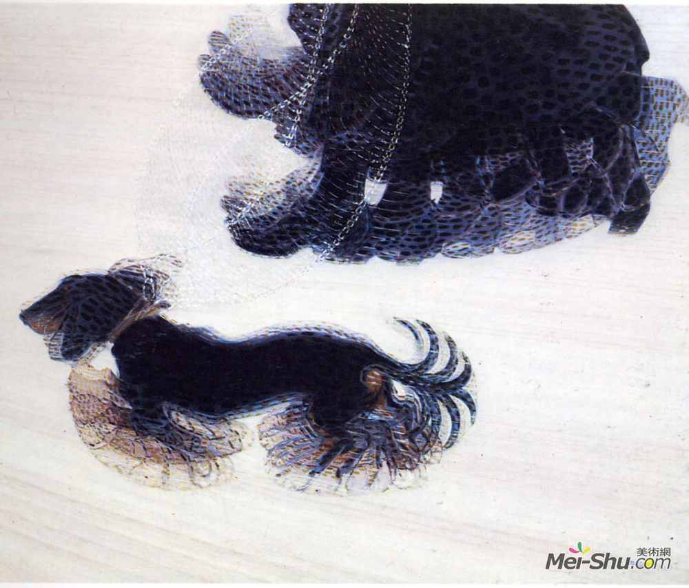

光的习作

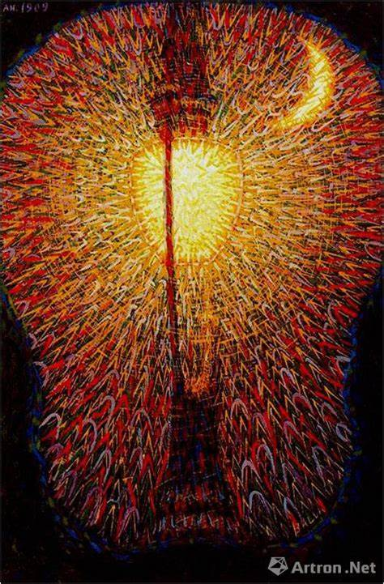 

####    波丘尼

翁贝托·波丘尼，意大利未来派画家和雕塑家。曾师从巴拉。

城市的崛起

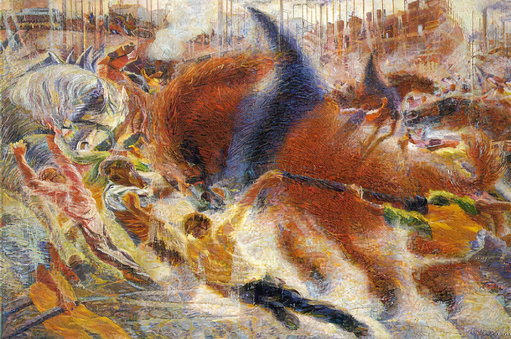

空间连续的唯一形体

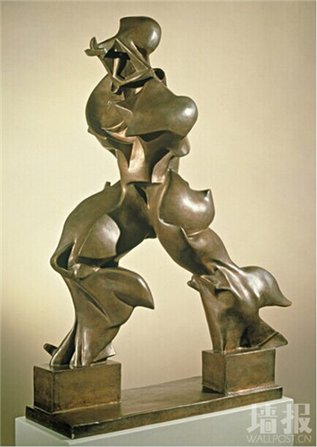

### 表现主义

表现主义（法语：Expressionnisme）是20世纪初流行于法国、德国、奥地利、北欧和俄罗斯的文学和艺术流派。
1901年法国画家朱利安·奥古斯特·埃尔韦为表明自己绘画有别于印象派而首次使用此词。
后德国画家也在章法、技巧、线条、色彩等诸多方面进行了大胆地“创新”，逐渐形成了派别。后来发展到音乐、电影、建筑、诗歌、小说、戏剧等领域。

表现主义是艺术家通过作品着重表现内心的情感，而忽视对描写对象形式的摹写，因此往往表现为对现实扭曲和抽象化。
这个做法尤其用来表达恐惧的情感——欢快的表现主义作品很少见。

####    蒙克

爱德华·蒙克（Edvard Munch，1863年12月12日—1944年1月23日），挪威表现主义画家、版画复制匠，现代表现主义绘画的先驱。
爱德华·蒙克绘画带有强烈的主观性和悲伤压抑的情调。他对心理苦闷的强烈的，呼唤式的处理手法对20世纪初德国表现主义的成长起了主要的影响，
其主要作品有《呐喊》《生命之舞》《卡尔约翰街的夜晚》。

呐喊

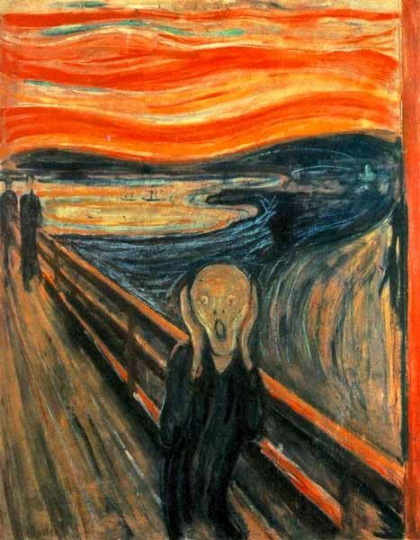

青春期

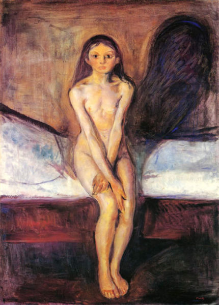

生命的舞蹈

####    莫迪里阿尼

坐在椅子上的珍妮

夫妇

女人

### 达达主义

达达是兴起于“一战”期间的艺术运动。它首先出现于瑞士的苏黎世，继而在纽约、巴黎、柏林、科隆等许多城市涌现。
达达主义更多地表现为思想态度的共识，而不是统一的风格，在诗歌、音乐与绘画中都有表现。在达达主义者眼里，战争是一场疯狂的集体屠杀。他们认为，
这场巨大的灾难与崇尚强权的理性主义思维逻辑有关，只有通过反理性的、无政府的策略和唤醒人们内心直觉的方式才能拯救社会。因此，
达达用虚无主义的态度表达对荒谬的感受。马塞尔·杜尚是达达主义最知名的艺术家，被誉为“现代艺术之父”。

    1. 无意义的符号
    2. 现成品

####    杜尚

泉

为蒙娜丽莎画胡子 -- 印刷品

下楼梯的裸女

大玻璃

    杜尚所创作的《大玻璃》（图3.2）是他的艺术理念与现实作品的一种结合的产物，他将一块大玻璃、一些细铁丝、线和清漆和金属薄片这些现成的物品组合在一起，
    通过这种特殊的艺术的表现形式，创作出前所未有的艺术效果。这幅作品没有使用传统的画框装裱，而是直接赤裸裸的呈现在观众面前。
    传统的艺术表现形式被一一打破，杜尚此次成功的举动充分证明了，美术作品可以脱离画布呈现在人们的面前。
    杜尚的《大玻璃》比起传统艺术能够带给观众更为深刻的印象，拉近观众与作品之间的距离，通过审美再创造活动，丰富了作品的内容，完善了艺术作品的深层意蕴。

### 超现实主义 -- 梦境或精神病

超现实主义，第一次世界大战后在法国文化领域兴起的对资本主义传统文化思想的反叛运动。
超现实主义深受西格蒙德·弗洛伊德（Sigmund Freud）潜意识理论的影响，致力于探讨人类经验的先验局面，试图突破符合逻辑与实际的现实观念。
把现实观念与本能、潜意识和梦的经验相糅合，以达到绝对的和超现实的情境。这种不受理性和道德观念束缚的美学观念，促使艺术家们用不同手法来表现原始的冲动和自由意象的释放。
超现实主义的文学强调“自动性书写”，美术则强调偶然的结合，无意识的发现，梦境的真实再现，常常运用“拓印”的技巧。在手法上自由地使用写实、象征和抽象。

####    基里科

乔治·德·基里科于1888年7月10日出生于希腊沃洛斯，他的父亲从小就鼓励培养他对艺术的热爱，1906年去慕尼黑美术学院学习。他一搬到德国，就接触到了最新的哲学、文学和艺术文化。

一条街上的忧郁和神秘

Piazza Ditalia

    表现出他对古典主义和拉斐尔（意大利，1483-1520）等早期绘画大师风格的热爱。在他的著作中，德·基里科支持回归传统的绘画和技法，反映了当时回归欧洲古典主义的意向。

####    恩斯特

被夜莺吓着了的两个孩子

The Elephant Celebes 1921

    他的梦幻般想象的作品同时具有打破和激发的力量，像作品《The Elephant Celebes(1921)》里面对的机械威胁和作品《Oedipus Rex(1922)》里心理固有恐惧一样都是最好的证明。

雨后的欧洲

####    达利

他与马蒂斯【 Henri Matisse 野兽派创始人 】、毕加索【 Pablo Picasso 立体派创始人 】，被后人称为是20世纪最具代表性的三位艺术大师。
萨尔瓦多·达利，普波尔侯爵（西班牙语：Salvador Domingo Felipe Jacinto Dali i Domenech, Marqués de Púbol，1904年5月11日－1989年1月23日），
一般简称萨尔瓦多·达利（Salvador Dalí），是著名的西班牙加泰罗尼亚画家，因为其超现实主义作品而闻名。
达利是一位具有非凡才能和想象力的艺术家，他的作品把怪异梦境般的形象与卓越的绘图技术和受文艺复兴大师影响的绘画技巧令人惊奇地混合在一起。

记忆的永恒

Young Virgin Auto-Sodomized by the Horns of Her Own Chastity

伟大的自慰者

Dream Caused by the Flight of a Bee around a Pomegranate a Second before Awakening

达利

sofa

####    米罗

月光下的女人

美丽的鸟儿揭示未知的一对恋人

哈里昆的狂欢

### 抽象主义

####    康定斯基

瓦西里·康定斯基（Василий Кандинский Wassily Kandinsky ，1866年12月16日－1944年12月13日），出生于俄罗斯莫斯科，是俄罗斯画家和美术理论家。
康定斯基与彼埃·蒙德里安和马列维奇一起，被认为是抽象艺术的先驱，但毫无疑问，康定斯基是最著名的。是现代抽象艺术在理论和实践上的奠基人。
他在1911年所写的《论艺术的精神》、1912年的《关于形式问题》、1923年的《点、线到面》、1938年的《论具体艺术》等论文，都是抽象艺术的经典著作，是现代抽象艺术的启示录。 

作为抽象艺术的先驱，康定斯基绘画时并不以实物为原型，因此，想要看懂他的作品，必须要理解康定斯基的绘画语言，进入他的语境中。正如想和不说中文的外国人交流一样，
必须要先学会他们的语言，才能建立双方沟通的桥梁。对于康定斯基而言，绘画追求的是内心的展现、精神的震荡。因此，为了减少具体对象对观者的干扰，
他选择以抽象的几何符号和丰富的色彩来表现画作主题。同时，康定斯基认为，如果将精神世界分为一个三角形，那么音乐便位于三角形的顶端，也成为精神世界的代名词，绘画虽然是视觉艺术，
但可以通过思维变成听觉艺术。他把绘画作品看作一种视觉音响，是一种内心情感的扩容器，在观看康定斯基作品时，观者需发挥通感，聆听绘画。

    黄色具有轻狂的感染力，如果人们持久注视着任何黄色的几何形状，便会感到心烦意乱，犹如刺耳的喇叭声。
    蓝色唤起人们对纯净和超脱的渴望，当蓝色接近于黑色时，表现出超脱人世的悲伤……蓝色越浅，也就越淡漠，给人以遥远和淡雅的印象，宛如高高的蓝天。
    在音乐中，淡蓝色像一只长笛，蓝色犹如一把大提琴，深蓝色好似低音提琴，最深的蓝色可谓是一架教堂里的风情。
    红色给人以力量、活力、决心和胜利的印象，像是乐队中小号的音响，嘹亮且高昂。
    朱红像是炽热奔腾的钢水，冷水一浇就会凝固，如果经过很好的配置，便会发出长号般的声音，或是鼓声那样的轰响。
    绿色是黄色和蓝色的等量调和，两者互相抵消，维持着它特有的镇定和祥和，纯粹的绿色是平静的中音提琴。
    紫色是由于掺入了蓝色而与人疏远的红，带有病态和衰败的性质，在音乐中，相当于一只英国管或是一组木管乐器的低沉音调。
    暖红被黄色增强后就成了橙色，彷佛一位对自己力量深信不疑的人，在音乐中，橙色宛如教堂的钟声，或是浓厚的女低音，或是一把古老的小提琴所奏出的舒缓、宽广的声音。
    白色像是一片毫无声息的静谧，在音乐中，是倏然打断旋律的停顿，但白色并不是死亡的沉寂，而是一种孕育着希望的平静，犹如生命诞生之前的虚无。
    黑色的基调是毫无希望的沉寂，在音乐中，它被表现为深沉的结束性的停顿，在这以后继续的旋律，彷佛是另一个世界的诞生。

    抽象绘画是点、线、面的有机结合，每一个点都会产生两种音律变化，一种是点本身，一种是点的位置。点又构成了线，直线是低声的喃喃细语，而随着线角度的变化，音律也会产生变换。
    线的宽度可以表示乐器的高低音，线的锐度可以表示声音的强弱，线的组合方式可以表现音调的变化。
    线的运动轨迹又组成了面，面的声响可以比喻为一个音乐片段，点和线的结合构成了面的回响。

第一幅水彩抽象画

    第一张抽象画的诞生非常戏剧性，那是某一天康定斯基出门画风景，回来后很累了，就把画往墙上一靠就去睡觉了。早上起来看见墙上靠着一张非常美丽的画，完全看不出上面画的是什么，
    可是非常吸引他，觉得色彩很震撼，视觉上很享受。等他再靠近了细看才发现，那是自己昨天画的一张风景画，因为在匆忙中放倒了，才一时无法辨认所画的东西。他后来说，
    “第二天我试图在日光下重新创作一幅这样美丽的画，但是我只成功了一半，无论怎么看，我总是能认出物象，以至于那黄昏时刻的美丽无法重现。我现在能够清楚地明白，
    是画面上的物象在破坏我的图画。” 康定斯基于是决定，他要将物象从他的画中驱逐出去！他看出来了，其实不需要知道一幅画画了什么，不用依靠物象，就单纯的色彩和线条，
    一样也能产生美感。他于是动手画出了第一张实验性的抽象画，后来起名为《构图一号》。对他来说，抽象的表达不是一种趣味上的选择，更像是一系列实验论证后的结果。

构图八号

蓝骑士 -- 早期代表作

红黄蓝

####    蒙德里安

皮特·科内利斯·蒙德里安（英文：Piet Cornelies Mondrian，1872年3月7日－1944年2月1日），荷兰画家，风格派运动幕后艺术家和非具象绘画的创始者之一，对后世的建筑、设计等影响很大。
蒙德里安是几何抽象画派的先驱，以几何图形为绘画的基本元素，与杜斯堡等创立了“风格派”，提倡自己的艺术“新造型主义”。他还认为艺术应根本脱离自然的外在形式，
以表现抽象精神为目的，追求人与神统一的绝对境界，也就是现在我们熟知的“纯粹抽象”

构图第II号

    蒙德里安的经典作品《构图第II号》就以5100万美元的价格成为全场最高价，也刷新了蒙德里安拍卖的最高记录。这幅作品是蒙德里安极为罕见的以红色为主的画作，
    左下方的蓝色对应着右上方没有边界的红，线条的粗细变化也在控制着平衡。具有画家标志性的平衡与和谐，代表了艺术家的事业顶峰。

百老汇爵士乐

灰色的树 -- 早期作品

####    波洛克

美国抽象表现主义的先驱， 用“滴洒法”（drip）创作

整整五寻

    1947年波洛克的这一幅《整整五寻》成名之作是用油彩和铅在画布上创作的.（寻--长度单位，合6英尺或1.829米，用于测量水深），仅就这个题目的含义，除了意指海水的深度以外，
    还意味着滴色的层次，语意双关。

Number 1

薰衣草之雾

### 波普艺术

####    汉密尔顿

究竟是什么使今日家庭如此不同、如此吸引人呢？

Just what is it that makes today’s homes so different?

####    安迪·沃霍尔（Andy Warhol）

安迪·沃霍尔（Andy Warhol，1928年8月6日—1987年2月22日），港台地区译为安迪‧沃荷，被誉为20世纪艺术界最有名的人物之一，是波普艺术的倡导者和领袖，
也是对波普艺术影响最大的艺术家。他大胆尝试凸版印刷、橡皮或木料拓印、金箔技术、照片投影等各种复制技法。沃霍尔除了是波普艺术的领袖人物，
他还是电影制片人、作家、摇滚乐作曲者、出版商，是纽约社交界、艺术界大红大紫的明星式艺术家。2014年，作品毛泽东画像在英国以760万英镑（约合人民币7663万元）的高价被拍卖。

伟大的美国裸体48号

### 超级写实主义

    而70年代兴起的超级写实主义（或称照相写实主义）运动，其主要特征是利用摄影成果，进行客观的复制和逼真的描绘。代表画家有克洛斯、佩尔斯坦，雕塑家中，安德烈、汉森最为著名。

####    冷军

小姜

