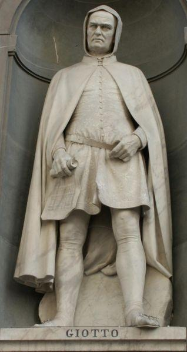
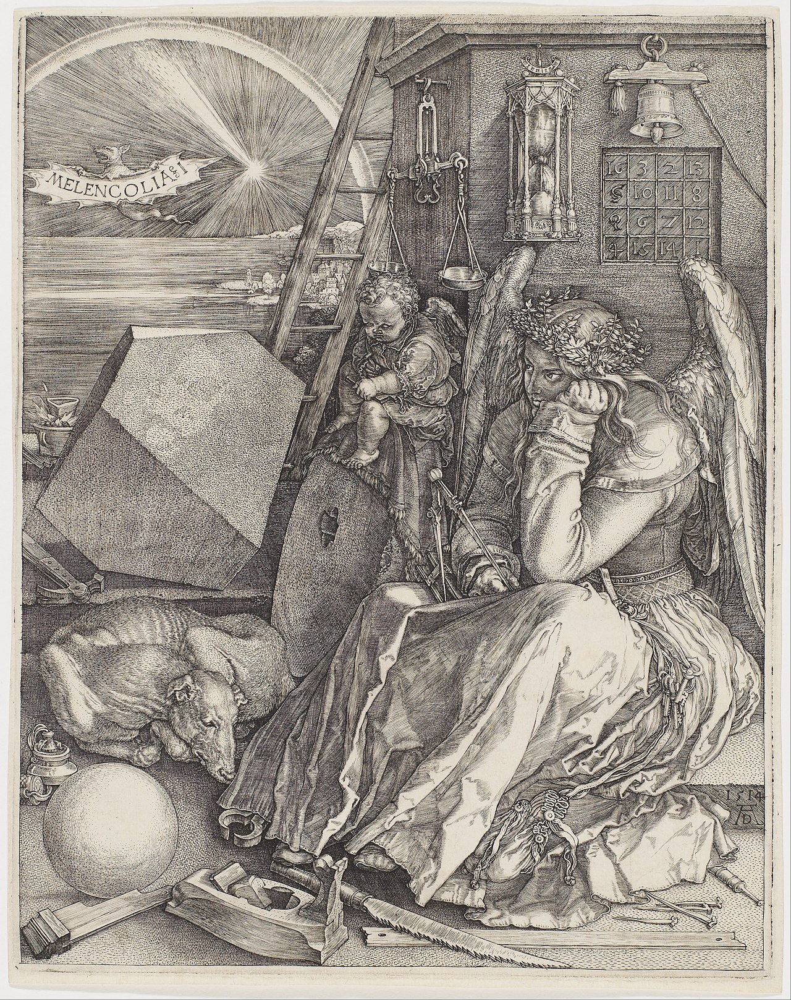

#   西方美术史

##  中西美术对比

中国：

    山水，花鸟，人物
    线条，墨色
    笔墨纸砚：圆笔，用水调和，宣纸，砚台
    审美出发点：儒道释，凡人的神化，神似，写意

西方：

    人物为主
    明暗，色彩
    笔墨纸砚：扁笔，用油调和，布，调色板    
    审美出发点：古希腊哲学思想，神的凡人化，型似，写实

##  阶段：

    一、史前美术（旧石器时代晚期-新石器时代，距今3万到1万多年之间）
    二、古代美术（公元前4000年-公元476年）： 新石器末期到中世纪 文字的出现--西罗马帝国灭亡
    三、中世纪（公元476年-15世纪）：始于西罗马帝国
    四、文艺复兴（14-16世纪）
    五、17世纪美术
    六、18世纪美术
    七、19世纪美术
    八、现代美术

##  史前美术：

人类迄今为止发现的最早的美术作品源自旧石器时代晚期-新石器时代，证明人类的艺术至少也有三万年的历史。
这一时期的美术主要的表现形式为洞穴中的壁画和雕塑，内容皆以动物为主，手法写实，造型生动。

### 洞窟壁画：

法国的**拉斯科洞窟**壁画：距今15517±800年，约有100多幅，其中以马最多，还有牛、驯鹿、洞熊、狼、鸟等，也有一些想像的动物和人像。
使用的颜料是木炭及各种矿砂，工具则是蕨草和羽毛等。

西班牙的**阿尔塔米拉洞窟**壁画：150多幅壁画，为公元前3万～前1万年左右旧石器时代晚期的古人绘画遗迹

### 岩画：

### 雕像：

**维伦多夫的维纳斯**：出土于奥地利维也纳附近的维伦多夫，最古老的艺术品之一，约制作于24000年前。被人们称为“原始的维纳斯”，又叫“母神雕像”。

### 巨石阵

英国威尔特郡斯通亨治，梁柱结构。

##  古代美术：

西方习惯把新石器末期到中世纪称为古代，具体来说就是指公元前4000年（文字的出现）到公元476年（西罗马帝国灭亡）。
这一时期的美术主要包括了两河流域（美索不达米亚）、古埃及、古希腊、古罗马的艺术。

### 两河流域

 石柱上端是汉谟拉比王站在太阳和正义之神沙马什面前接受象征王权的权标的浮雕，以象征君权神授，
王权不可侵犯；下端是用阿卡德楔形文字刻写的法典铭文。

### 埃及

####    正面律

就是指表现人物时，头侧面，眼睛正面，肩及身体正面，腰部以下又是侧面。
画面用水平横线来分割结构，人物排列井然有序，甚至动物都是成排出现。
运用以上的表现手法对人物的形象进行处理，是为了使人的形象特征更加突出和完整，这也是埃及绘画追求完整性的体现。

####    金字塔

石棺画

### 古希腊

古希腊主要的艺术形式有雕塑、建筑和绘画，绘画主要是花瓶的瓶绘，能流传下来的非常少，流传得更广的主要是雕塑和建筑。
雕塑中最为出名的有《掷铁饼者》、《米洛斯的维纳斯》，建筑帕特农神庙是希腊艺术王冠上最璀璨的宝石。

**掷铁饼者**-希腊雕刻家米隆约公元前450年雕刻的青铜雕塑，原作丢失

**米洛斯的维纳斯**，又称《米洛斯的阿芙洛蒂忒》，古希腊雕刻家阿历山德罗斯于公元前150年左右创作的大理石雕塑，是卢浮宫的三大镇馆之宝之一。

    1820年2月，在爱琴海的米洛斯岛上，一个农夫在一座古墓旁整地时挖掘到一尊女性雕像。她分成上、下两截，并与刻着名字的台座、
    拿着苹果的手腕以及其它碎片等等一道散落在附近的田地下。已懂得这是值钱的东西的农夫，立刻将它们埋于原地，并报告了在岛上的法国领事。
    领事稍付定金，即通知当时设在君士坦丁堡的法国大使。几乎与此同时，在爱琴海搞测量的一位法国海军士官，名叫鸠尔·丢孟·都尔维尔对此表示了更大的关注。
    这是一位希腊艺术的爱好者，当他看过这些雕像的部分碎片以后，认为它们是一个整体，并第一个断定这就是维纳斯的雕像。于是立刻告诉农夫，法国决定把她买下，
    要他不必再到处声张了。随即赶到君士坦丁堡，向大使陈述详情，促使大使下了决心并派专人前去交易。不料岛上的长老出于本岛的利益而中途插手，
    开会决议命农夫将雕像卖给在土耳其任职的一位希腊大官，当法国人赶到岛上时已经是雕像装船的关头了。见此情景，他们几乎要动武，命令法国船舰随时准备行动。
    顿时，爱琴海上战云密布。恰巧，一场暴风雨解了围。它推迟了土耳其船只的起航，为法国使者争得了斡旋的时机，他们软硬兼施，把雕像终于转到了法国船上。
    后来又给岛上赠送金钱，从而取得了岛上放弃雕像的誓约书。雕像顺利运抵巴黎，由于种种政治、人事方面的原因，一直推至 1821年3月2日，
    国王路易十八才正式接受献礼。从这一天开始，她便成为法国国家财产。当时的登记名称是“在希腊群岛中的米罗斯所发现的维纳斯像”，
    并被陈列于卢浮宫特辟的专门展室中,与蒙娜丽莎的微笑、胜利女神的雕像并称为卢浮宫三大镇馆之宝。

**帕特农神庙**，帕特农神庙是雅典卫城主体建筑，为歌颂雅典战胜波斯侵略者的胜利而建。神庙始建于公元前447年，正式启用是在公元前438年，
借着盛大的帕那太耐节奉献给雅典娜。

**胜利女神像**:在萨莫色雷斯岛上发现破碎成200多块碎片的雕像残片，并运回法国巴黎卢浮宫。经过4年的细心修复，才使该雕塑初见规模，只是头和双臂仍未被发现。
大多数意见认为是创作于公元前200年左右，马其顿王国安提柯王朝国王德米特里一世在海战中打败托勒密王国的舰队而创作

    尼刻（尼克）（希腊语：Νίκη，“胜利”；拉丁字母转写：Nike）是希腊神话中的胜利女神，她在罗马神话中对应的是维多利亚（Victoria）。
    《萨莫特拉斯胜利女神》在传统的描述中，尼克常带有翅膀，拥有惊人的速度，但是除此之外并不具有其他特殊力量。她并不仅仅象征战争的胜利，
    而是代表着希腊人日常生活中的许多领域，尤其是竞技体育领域中的成功。因此她被认为是带来好运的神祇，经常作为艺术作品所表现的对象。
    在艺术作品中，她通常同化于其他的神，比如古希腊的雕塑家通常将她塑造为娇小的带有翅膀的形象，栖停于另一个神的手臂，或是从同伴神的衣裳中探出，
    或者像仙女一样高飞于天空。据说是公元前190年左右的作品，大约是罗得斯岛的军队战胜叙利亚的安提欧克斯三世，为了谢神，
    在萨摩色雷斯岛的卡比利神殿树立了这尊雕像。雕像高275厘米，1863年发现于萨摩色雷斯岛。也许雕像过于庞大，博物馆里似乎找不到她合适的安身之处，
    于是人们把她安放在一条宏伟宽敞的阶梯的高处，让她在那里迎接来自四方的艺术爱好者。雕像的头部和手臂残缺，我们已看不到她的容貌，这是一个大遗憾。
    但也正是如此，人们才可以毫无禁忌地想象她是花容月貌抑或是威武豪迈。女神全身充满了生命力和雄壮的感觉。包裹身体的薄衣被大海的飞沫打湿，随风飘扬，
    紧贴在女神丰满胴体上，细密而又富于变化的衣褶勾勒出女神优美的曲线，给人以华丽优雅的美感，被人称为是“崇高样式”的理想化人体。
    这座雕像完美而健全地体现了女性肉体所包含的蓬勃的生命力，并赋予其高贵优雅雄壮的美。这是古希腊时期的典型作品，在动态和静态的平衡上发展到了顶峰。

拉奥孔(The Laocoon and his Sons)

    大理石群雕，高约184厘米，是希腊化时期的雕塑名作。阿格桑德罗斯等创作于约公元前一世纪，现收藏于罗马梵帝冈美术馆。这几乎代表了传统雕塑艺术的最高成就。
    在特洛伊战争中警告特洛伊人不要接受希腊人留下的木马，但没有成功。随后他就被两条从希腊人临时驻扎的Tenedos岛上跨海而来的大蛇夺去了性命。

####    瓶绘

古希腊瓶画，是希腊陶器上的装饰画，依附于陶器而得以流传下来，代表了希腊绘画风貌。

### 古罗马

古罗马艺术是希腊艺术的直接继承和发展，它们共同奠定了西方文明的基础，成为西方文明的摇篮。罗马人的美术更倾向于实用主义。
规模巨大的罗马斗兽场和万神庙是古罗马建筑的杰出代表。而曾被维苏威火山灰掩埋达1700多年的庞贝壁画，则给我们展示了古罗马绘画的独特面貌。

####    古罗马斗兽场
罗马斗兽场建于72-80年间，古罗马文明的象征，是古罗马帝国专供奴隶主、贵族和自由民观看斗兽或奴隶角斗的地方。

####    柱头

**多立克**

**爱奥尼亚**

**柯林斯**

**万神庙**，万神庙位于意大利首都罗马圆形广场的北部，是罗马最古老的建筑之一，也是古罗马建筑的代表作。此庙始建于公元前27年，后遭毁，约公元118年在哈德良皇帝时期重建。

**庞贝壁画**，庞贝古城从公元前82年起成为罗马的领地，公元79年因维苏威火山爆发而埋没，18世纪40年代开始发掘。
其中大量壁画的出土，不仅充分说明庞贝曾经是一个经济繁荣的城市，而且也反映出罗马绘画的概况，甚至由此可以推想希腊壁画的一般面貌。

人体雕像

##  中世纪 -- 基督教艺术

公元313年，君士坦丁大帝颁布米兰敕令，承认基督教为合法且自由的宗教。之后罗马分为东西罗马帝国。
中世纪是指公元5世纪（以公元476年西罗马帝国灭亡作为标志）到15世纪（意大利文艺复兴的黎明），它标志着西方进入了基督教时代。
受基督教制约，中世纪美术不注重客观世界的真实描写，而强调所谓精神世界的表现。古希腊罗马艺术被焚毁。被成为黑暗的时代。
中世纪艺术大致分为三个阶段：拜占庭艺术、罗马式艺术、哥特式艺术，都是表达基督教思想观念，本质上远离了现实生活。但强调精神表现。

### 早期基督教（2-5世纪）

**巴雪利卡**

    古典时代罗马的巴西利卡（Basilica），最早指的仅仅是常用作法庭或交易所使用的一类大型公共建筑，在功能上与宗教仪式毫无关联。

**罗马圣母大殿**

### 拜占庭式 （5-15世纪）

    拜占庭艺术，5世纪-15世纪，典型的宗教艺术，拜占庭建筑是基督教教会的建筑，绘画作品多取材于《圣经》，其形式和人物表情处理都须遵循具有神学意义的传统模式。
    同时拜占庭艺术又是服务封建帝国的艺术，它炫耀帝国的强大和帝王的威严，把帝王表现为基督在尘世的代理人，为巩固帝王和贵族阶级的统治服务，
    是拜占庭帝国（即东罗马帝国）和基督教会相结合的官方艺术。拜占庭艺术主要表现在建筑和绘画上，建筑集中体现在教堂上，主要特色是对中央圆顶的强调；
    绘画主要有教堂内的壁画、镶嵌画等。圣索菲亚大教堂是拜占庭建筑最杰出的代表，拜占庭帝国极盛时代的纪念碑。
    东罗马帝国教堂，更世俗，可作为市场

####    教堂

**圣索菲亚大教堂** - 圣索菲亚大教堂，是拜占庭帝国的主教堂，位于伊斯坦布尔(君士坦丁堡)，有近一千五百年的历史，因巨大的圆顶而闻名于世，乃拜占庭建筑最光辉的代表。

圣马可教堂

####    镶嵌画

基督教不允许制造偶像。所以图像只能用于基督像，并且呆板僵硬。但强调表现人的精神和情感。
镶嵌画--镶嵌画在拜占庭艺术中占有特殊的地位，这种以小彩色玻璃和石子镶嵌而成的建筑装饰画，成为教堂内部的主要形式。拜占庭镶嵌画以玻璃为主要材料，
它能反射出强烈的光彩，好像是小型的反射镜一样排列在一起形成非物质的闪光幕帘，达到一种虚无缥缈的效果。

查士丁尼大帝和他的随从

皇后西奥多拉和她的随从

####    手抄本插图 -- 细密画

圣三位一体

马太福音扉页： 带有表现的意识

### 罗马式 （10-12世纪）

    诺曼底人入侵英国带了的诺曼底风格 -- 罗马式艺术，10世纪-12世纪流行的一种以建筑为主体的艺术形式。建筑多为教堂和修道院，以厚重坚实的墙壁、小窗、
    高大雄伟的塔楼和半圆形拱穹(筒状拱)结构为主要特征。著名的建筑有意大利的比萨大教堂、德国的沃尔姆斯大教堂等。出现在教堂外部墙壁上的雕刻多取材于《圣经》故事，
    并以非写实性和框架法为特点。

**比萨大教堂**

**沃尔姆斯大教堂**

法国欧坦大教堂的拱角板上雕刻的**最后的审判**

### 哥特式 （12-15世纪）

    哥特式艺术起源于法国，是十二至十六世纪初期欧洲出现的一种以新型建筑为主的艺术，包括雕塑、绘画和工艺美术。这种建筑风格，
    一反罗马式厚重的半圆形拱门的教堂式样，而广泛地运用线条轻快的尖拱券，肋状拱，造型挺秀的小尖塔，轻盈通透的飞扶壁，修长的立柱或簇柱，以及彩色玻璃镶嵌大花窗，
    造成一种向上升华、天国神秘的幻觉。代表作品有法国的巴黎圣母院、德国的科隆大教堂、英国的林肯大教堂、意大利的米兰教堂等。

**巴黎圣母院**

**科隆大教堂**

**林肯大教堂**

**米兰大教堂**

哥特式绘画-哥特式绘画伴随哥特式建筑的发展而产生,主要包括玻璃镶嵌画、插图画、壁画和镶板画。由于典型的哥特式建筑采用了石头骨架结构和宽大的窗子，
壁面被减少到最低限度，因此，壁画发展受到了限制。

##  文艺复兴 （the Renaissance）

文艺复兴的概念在14-16世纪时被意大利的人文主义作家和学者所使用。当时的人们认为，文艺在希腊、罗马古典时代曾高度繁荣，但在中世纪“黑暗时代”却衰败湮没，
直到14世纪后才获得再生与复兴，因此称为文艺复兴。文艺复兴的核心思想是以人为本的世界观,将人从中世纪的神权中解放出来,绘画作品更多的开始反应人性而非神性。

    1.  从封建社会向资本主义的过渡，高举人文主义，探索人的奥秘，反对禁欲主义，摆脱了宗教的束缚。第一本书籍<<十日谈>> 对基督教的批判。
    2.  透视学，解剖学，比例学
    3.  写实

### 文艺复兴早期

佛罗伦萨画派是意大利文艺复兴早期时代形成的美术流派，15世纪时，佛罗伦萨为新兴崛起的巨商美第奇家族所统治，掌握了当时的政治与经济权利，之后的三百年中，
佛罗伦萨的历史与美第奇家族的兴衰紧密的结合在一起。美第奇家族酷爱艺术，在其保护和资助下，使得佛罗伦萨聚集了众多文艺人才，
这些卓越的艺术家们为其创造了大量的建筑、雕塑和绘画作品，使得佛罗伦萨一时成为欧洲文艺复兴时，艺术文化和思想的中心。
这一时期的绘画领域也出现了不同于中世纪装饰画风格的美术倾向，而佛罗伦萨画派则成为了这一倾向的主流画派，其代表人物有乔托、马萨乔、波提切利等。

#### 乔托
    
    宗教世俗化，和但丁齐名。老师--奇马布埃。 真正的“湿壁画”是从意大利奇马布埃（Cimabue）时期开始的，十四世纪伟大的艺术家乔托（Giotto）,
    第一次以传统正规规则使用湿壁画技法制作画面，并在材料和绘画技巧上加以更正，使之完美。

**哀悼基督**：自然的表情，立体感，明暗关系，透视感，自然风景

**逃亡埃及**：宗教世俗化

**湿壁画**

    是指一种优秀的壁画画法，先用耐久的熟石灰颜料溶解于水，然后绘制在新粉刷的熟石灰（LIME PLASTER）泥壁上，也指如此绘制的整幅壁画。
    Fresco是意大利语新鲜的意思，有时也称作buon fresco或true fresco以区分干壁画（SECCO）或半湿壁画（MEZZO FRESCO），
    因为后者在效果上与前者近似。在湿画法中，颜料由于湿墙壁的极细缝隙产生毛细管虹吸作用而被吸收，并且成为墙壁表面不可分割的一部分。

#### 马萨乔 （透视）

逐出伊甸园

    《逐出伊甸园》描绘了亚当和夏娃因为偷吃了上帝种的苹果而被驱逐出伊甸园时的悲惨情景。据说这种苹果功效很强大，两个人吃完立刻就能明辨善恶是非，
    这让上帝感到很生气。画面中大胆地展现了两个人裸露的身体，亚当痛苦地垂着头并用手捂着自己的面孔，夏娃则因为感到羞耻而遮住了自己的隐私部位，绝望地仰面哭喊。
    在他们头顶，天使手执利剑，代表上帝的意志执行惩罚。

**圣三位一体**

#### 透视法

    1.近大远小。两个体积相同的物体一个在你眼前一个在50米外,是不是近处的看上去大呢?
    2.近宽远窄(空间纵深)。物体在空间距离下，产生的视觉焦点，并导致所有物体围绕这个焦点聚拢的聚焦方式，即为纵深。
    3.近实远虚。距离你近的物体相信你会看到更清晰,远处的就比较模糊。

布鲁内莱斯基

####    多纳泰罗

大卫 -- 多纳泰罗制作，1430年代，青铜，158厘米，佛罗伦萨国立巴杰罗博物馆。

    大卫的故事，来自《圣经·旧约》中的撒母耳记，是以色列的第二个国王。在他幼年时，以色列人被强敌腓力士人大举进攻。腓力士人挑战以色列人，
    希望以色列人出一名最强的战士，一战定胜负，只要能战胜腓力士人的战士——巨人歌利亚，就算以色列获胜，否则腓力士人就取得胜利。
    但是以色列的士兵们没有人敢去迎战歌利亚。少年大卫当时还是一个牧羊人，他主动请缨出战。以色列的第一个国王扫罗给他盔甲和武器，大卫都没有接受。
    在与歌利亚作战时，他用用来打狼的投石皮带射出一块石头，击中歌利亚的头，将其击昏，然后用歌利亚的剑砍下了歌利亚的头颅，以色列因之得救。

圣乔治 -- 多纳泰罗制作，1416年，大理石，高214厘米，原作现收藏于佛罗伦萨巴杰罗博物馆。圣乔治雕像由兵器制造匠行会出资，因为圣乔治是他们行业的保护神。

加塔梅拉塔的骑马雕像

    1443年，雇佣兵队长 Erasmo of Narni（1370-1443，昵称Gattamelata）去世。他生前曾效命于威尼斯共和国（那个年代统治着帕多瓦）。
    多纳泰罗被他的后人召至帕多瓦（Padua）为将领制作雕像。雕像于1450年完工，多纳泰罗获得了1650金杜卡特的酬金。
    骑马像被安放在圣安东尼教堂（Basilica of St. Anthony）对面的广场上。是文艺复兴时期以来首次依古罗马英雄骑马造型创作的作品，
    是接下来几个世纪内的青铜骑马雕像的始祖。

圣抹大拉的玛丽亚 -- 多纳泰罗制作，1457年，彩色木材，高188厘米，佛罗伦萨主座大教堂博物馆

    以深刻表现人物心理为特色，虽然较于严厉、复杂艰涩且深沉自省，但其豪放的表现力曾震惊佛罗伦斯。
    面对她的深切信仰，耶稣原谅了抹大拉的玛利亚的曾经的妓女生活，当时他们在法利赛人西蒙家中。这位忏悔者的后继命运在《金色传奇》（Legenda Aurea）中有叙述。
    她禁食三十年，在法国南部的荒野中隐居生活。曾经以她的美丽着称，最后她只被包裹在长发中。她是放弃有罪生活的典范，将其改变为虔诚的悔改和坚贞的祈祷生活。

曼特尼亚

哀悼死去的基督 -- 1490年，蛋彩画布，68x81厘米，米兰布雷拉美术馆

    这是画家以典型的古典技法绘制的作品。盛行的蛋彩画法细致却未免有些僵化地刻划了死去的基督。显然，基督刚刚被他的信徒们从十字架上卸下来，安放在床上，
    左侧两信徒悲痛之极。冷灰的色调、死去基督“十字架”式的姿态，简洁方正，舍去细节，使主题鲜明。画家以情绪刻划来渲染这个惨烈的场面，给人以深刻的印象。
    正面透视的画法，无疑增加了处理的难度，画家却执意选择这个角度，以造成现场感。此画为画家的代表作，是一幅祭坛画。他在此画中运用了前人未曾用过的透视角度，
    力求准确而真实地去表现死去基督的遗体，线条十分锐利和坚硬。画面上人物的表情冷静肃穆，令人望而生畏。画家的高超艺术，体现了当时意大利北部艺术的主要倾向：
    强调人的尊严和豪迈气魄，重视艺术与科学相结合的求实精神，提倡艺术的描写对象应以实物为依据。这种完全准确地再现自然的写实倾向，
    对意大利现实主义美术的成长起了一定的积极作用。

### 文艺复兴全盛期

15世纪后期至16世纪前半期，意大利文艺复兴运动达到鼎盛，出现了“文艺复兴美术三杰”，他们是达芬奇、米开朗基罗、拉斐尔。

#### 波提切利

维纳斯的诞生

春

####    达芬奇 （Leonardo da Vinci）

    他很早就意识到“画家必须是好的解剖学家”，在米兰，他亲自解剖了三十多具尸体，而且他会在尸体旁边研究很久，仔细记录他观察到的一切：肌肉、骨骼、关节、神经……
    达芬奇几乎没有受过正规教育，但是凭借自学，能够在光学、力学、解剖学等方面取得极高的成就。

蒙娜丽莎 -- 颜色的过渡！

最后的晚餐 -- 构图的重要！

    《最后的晚餐》取材于《新约圣经》，《新约圣经·马可福音》记载:耶稣最后一次到耶路撒冷去过逾越节，犹太教祭司长阴谋在夜间逮捕他，但苦于无人带路。正在这时，
    耶稣的门徒犹大向犹太教祭司长告密说:"我把他交给你们，你们愿意给我多少钱?"犹太教祭司长就给了犹大30块钱。于是，犹大跟祭司长约好:他亲吻的那个人就是耶稣。
    逾越节那天，耶稣跟12个门徒坐在一起，共进最后一次晚餐，他忧郁地对12个门徒说:"我实话告诉你们，你们中有一个人要出卖我了!"12个门徒闻言后，
    或震惊、或愤怒、或激动、或紧张。《最后的晚餐》表现的就是这一时刻的紧张场面。达·芬奇却让十二门徒分坐于耶稣两边，耶稣孤寂地坐在中间，他的脸被身后明亮的窗户映照，
    显得庄严肃穆。背景强烈的对比让人们把所有的注意力全部集中于耶稣身上。耶稣旁边那些躁动的弟子们，每个人的面部表情、眼神、动作各不相同。
    尤其是慌乱的犹大，手肘碰倒了盐瓶，身体后仰，满脸的惊恐与不安。

####    米开朗基罗 -- 意大利文艺复兴时期伟大的绘画家、雕塑家、建筑师和诗人，文艺复兴时期雕塑艺术最高峰的代表

    1475年3月6日，米开朗琪罗在意大利佛罗伦萨的卡普雷塞出生。他的父亲是地方法官，脾气暴躁，母亲在他六岁时去世。米开朗琪罗幼时寄养在一个石匠家中，石匠妻子的乳汁哺育了这位未来的雕塑家。
    1496年，米开朗基罗来到罗马，创作了第一批代表作《酒神巴库斯》和《哀悼基督》等。23岁的米开朗基罗受法国红衣主教委托，
    为圣彼得教堂制作《哀悼基督》雕像。这件雕像的问世，使米开朗基罗名盖罗马，自多纳泰罗之后又一颗雕刻巨星升起。
    1501年，26岁的米开朗基罗载誉回到故乡佛罗伦萨，
    用了四年时间完成了举世闻名的《大卫》，安放在韦吉奥宫正门前，作为佛罗伦萨守护神和民主政府的象征。1505年应尤里乌斯二世邀请，
    米开朗基罗赴罗马为教皇在圣彼得教堂内建造陵墓，米开朗基罗的建造才华，使教皇的艺术总监勃拉曼特极为妒忌，他唆使教皇暂不修陵墓，
    强求雕刻家去画西斯廷教堂天顶壁画，米开朗基罗用了四年零五个月的时间以超凡的智慧和毅力完成了世界上最大的壁画西斯廷教堂天顶壁画《创世纪》。
    1513年，教皇陵墓恢复施工，米开朗基罗历尽艰辛磨难创作了著名的《摩西》、《被缚的奴隶》和《垂死的奴隶》。
    1519－1534年，41岁的大师重又回到佛罗伦萨，出生美第奇家族的教皇利奥十世又强迫米开朗基罗为其祖宗圣罗伦佐陵墓制作雕像，
    他创作了他生平最伟大的作品——圣洛伦佐教堂里的美第奇家族陵墓群雕，著名的《昼》、《夜》、《晨》、《暮》雕像就是安放在这座陵墓的石棺上。
    1562年受其门生，著名画家，艺术史家：乔治.瓦萨里之邀成为迪亚诺学院（佛罗伦萨美术学院）名誉院长.
    1536年，已经61岁的米开朗基罗被召回到罗马西斯廷教堂，用了近六年的时间在25年前完成的《创世纪》天顶画下的祭坛壁面上创作了伟大的教堂壁画《最后的审判》。
    之后他一直生活在罗马，从事雕刻、建筑和少量的绘画工作，直到1564年2月18日逝世于自己的工作室中。

素描

哀悼基督

大卫 -- 云石雕像，像高2.5米，连基座高5.5米，米开朗基罗创作于公元1501-1504年，现收藏于佛罗伦萨美术学院。

摩西

创世纪

被缚的奴隶

####    拉斐尔

    拉斐尔·桑西（Raffaello Santi，全名Raffaello Sanzio da Urbino，1483年3月28日或4月6日—1520年4月6日），常称为拉斐尔（Raphael），
    意大利著名画家，也是“文艺复兴后三杰”中最年轻的一位，代表了文艺复兴时期艺术家从事理想美的事业所能达到的巅峰。
    他的性情平和、文雅，创作了大量的圣母像，他的作品充分体现了安宁、协调、和谐、对称以及完美和恬静的秩序。
    只活了37岁的拉斐尔，留下了300多幅作品，他崇拜达芬奇的构图技法，也热爱米开朗基罗的健美风格，在认真领悟各位大师的奥妙技艺的同时，
    他并没迷失自己的方向，而是博采众长，让画面呈现出独特厚重的人文主义精神。

雅典学院

西斯廷圣母 -- 它摒弃了浮华的造作，呈现出最可贵的真诚和朴素。

草地上的圣母

椅中圣母

### 文艺复兴后期

威尼斯画派是16世纪以威尼斯画家乔尔乔内和提香为代表的绘画形式，他们吸收了文艺复兴鼎盛时期画家的精华，
但大胆在色彩上创新，认为颜色是绘画的一部分，使画作更为生动明快，同时人物背景的风景比例更大。

####    乔尔乔内

    关于画家乔尔乔内的生平我们所知甚少，他英年早逝，32岁就告别人世。乔尔乔内的传世真作大约只有5幅，一生中也仅创作了30余件作品，
    但乔尔乔内仍不失为文艺复兴盛期的绘画大师之一。乔尔乔内那田园诗般抒情的画风和对色彩、风景的开拓，以及画中流露出的人文主义思想，
    给以后绘画发展以深刻的影响。

暴风雨

沉睡的维纳斯

    在文艺复兴时期的意大利，出现了许多风格迥异的美术流派，其中佛罗伦萨画派和威尼斯画派最为有名，影响最大。但是，由于多方面的因素，
    比如气候、环境以及经济、文化等各方面的差异，形成了这两个画派不同的艺术风格。佛罗伦萨经济不是很发达，人们生活还比较古朴，古典主义传统浓厚，
    这种环境造就了佛罗伦萨画派注重素描和用线造型，严谨、精密、理性的写实主义风格。而威尼斯作为当时很繁华的自由贸易区，
    人们的生活浮华、舒适，这种生活环境造就了威尼斯画派对色彩的重视甚于素描，追求感性的轻松、舒适、享乐、抒情、诗意的浪漫主义风格。
    《沉睡的维纳斯》就很明显地体现出了威尼斯画派的这种艺术风格。

####    提香 -- 肖像画大师  艳丽、明亮、光溜溜

    提香曾应教皇保罗三世和神圣罗马帝国皇帝查理五世的邀请到罗马和皇帝的宫廷中画了许多肖像画。但他漫长的一生主要都在威尼斯度过的，
    留下了大量的作品。他主要的作品是一些宗教和古罗马神话的题材，充满戏剧性的气氛和动感的人体线条。
    提香的肖像画能揭示人物内心世界。中年画风细致，稳健有力，色彩明亮；晚年则笔势豪放，色调单纯而富于变化。
    在油画技法和绘画风格上对后期欧洲油画的发展，有较大影响。提香曾在乔万尼·贝利尼的画室学习，在那儿乔尔乔内是他同学。

年轻的英国人 -- 第一个使用高光

**天上的爱和人间的爱**-提香

巴克斯和阿里阿德涅

乌尔比诺的维纳斯

    这幅画今天看来尺度也就那样，但在当时，可谓惊世骇俗。呼之欲出的情色气息……这画除了标题，实际上也没哪点像维纳斯了吧。
    维纳斯居然睁开了眼睛，带着挑逗和撩拨地看着观众，毫无顾忌地与观众四目相接！这幅画成为当时最令人震惊的作品。画里的女主角，
    是当时威尼斯一位名妓。当时的乌尔比诺公爵新婚，请提香给他画一幅画挂家里，提香就找了当时威尼斯的名妓做模特，画了这幅画。
    后世这么评价这幅画：画出了威尼斯的时代精神。

### 样式主义 -- 矫饰艺术

####    丁托雷托

    受业于提香门下，是提香最杰出的学生与继承者。在长达40余年的创作生涯中，主要活动在威尼斯。作品继承提香传统又有创新，在叙事传情方面效仿米开朗基罗，
    突出强烈的运动，且色彩富丽奇幻，在威尼斯画派中独树一帜。一是反古典的倾向，二是优美雅致的倾向。丁托列托要把这两种倾向合二为一。

维纳斯、火神及战神

    故事讲到，集爱与美于一身的维纳斯被宙斯要求嫁给其貌不扬、有腿疾的火神伏尔甘，维纳斯忍受不了便与英俊潇洒的战神Mars出轨了。
    画面描写的正是伏尔甘杀回家里来捉奸，维纳斯惊慌失措急忙拿布想遮盖自己，伏尔甘连忙上前想查看证据，堂堂战神吓得躲到桌子底下的场景。

### 尼德兰文艺复兴

尼德兰包括荷兰、比利时、卢森堡以及法国东北部的一些地区。由于地理条件优越，尼德兰很早就是欧洲西北部重要的水陆交通中心，手工业发达，商业繁荣，
是当时欧洲资本主义经济十分发达的地区，因此文艺复兴时期尼德兰美术也取得了辉煌成就。15世纪尼德兰画派成就非常突出，其代表人物有扬·凡·埃克、彼得·勃鲁盖尔等。

####    扬·凡·艾克 -- 油画之父

    在他之前，艺术家们多是进行湿壁画创作，或采用蛋黄蛋清调和颜料的方式来作画，也就是古典油画技法坦培拉。扬·凡·艾克则改进了颜料调和剂，
    用掺有稀释作用的亚麻油代替过去的蛋黄或蛋清，这样的方式不仅易于色彩调和，便于运笔，同时不至于在夏天使颜料变质。
    根据美术史家瓦萨里的记载，扬·凡·艾克最先使用了快干油作画，这使得画面在一天之内就能干透，更重要的是，用这种方法画出的油画不怕潮湿，
    这对海边的尼德兰艺术家来说，至关重要。不久，这种绘画方式被带到佛罗伦萨，慢慢传播开来。

阿尔诺芬尼夫妇像

    他最为著名的《阿尔诺芬尼夫妇像》就是以极其细腻的笔调，刻画出一幅堪称逼真的肖像画作。画中人物似乎可以即刻从画框中一步迈入现实，
    坐下来与观者倾情讲述。更叹为观止的还有画家对室内陈设，包括窗棂、地板等细节的刻画，其精致程度已是到了令人发指的地步。

根特祭坛画 -- 凡·艾克兄弟  第一幅油画

    1415 年，休伯特·凡·艾克应根特市长多库斯·威德之邀为圣贝文教堂绘制一组祭坛画。这是耗时极长的一项工程，未等画完，
    休伯特便在接单 11 年后匆匆离世，之后的部分由弟弟扬·凡·艾克接手。1432 年，《根特祭坛画》最终完成，大家惊讶其高超的绘画能力，
    扬·凡·艾克的名字不胫而走。那时，人们狂热的追捧扬，已经忘记了休伯特，但他没遗忘，并将自己与哥哥的名字一起署在了画上。

####    勃鲁盖尔 - 欧洲美术史上第一位“农民画家”, 或者风俗画

    一生以农村生活作为艺术创作题材，人们称他为“农民的勃鲁盖尔”。他善于思想，天生幽默，喜爱夸张的艺术造型，
    因此人们又赠给他一个外号叫“滑稽的勃鲁盖尔”。他继承了博斯的艺术风格，又被誉为“新博斯”。
    彼得·勃鲁盖尔是自扬·凡·爱克开始的刊期荷兰画派的最后一位巨匠。

尼德兰箴言

农民的婚礼

    老勃鲁盖尔还喜欢表现农民，描绘尼德兰的民间风貌和习俗，农家的男婚女嫁，乡间的宴会和质朴的农村生活，
    因此许多人称他为农民画家。老勃鲁盖尔本人并非农民，只是喜欢以农民生活为题材，大概画家喜欢没有虚饰的农村生活和那种欢快的情调，
    喜欢朴实敦厚的农民形象和他们的单纯天真吧。

雪中猎人

盲人的寓言

    6个瞎子互相扶持着，沿着画面的对角线由左上方向右下方运动，却不知已陷入险境，领头的第一个瞎子已跌入壕沟，
    紧接着的一个被牵动着失去了平衡，等待其他瞎子的将是同样的命运。画中渗透着画家对尼德兰革命的失望和对人类命运的哲学思考，
    具有人生和社会的普遍意义。

### 德国文艺复兴

由于印刷术的发展，德国的版画非常发达。

####    丢勒

    生于纽伦堡，德国画家、版画家及木版画设计家。丢勒的作品包括木刻版画及其他版画、油画、素描草图以及素描作品。他的作品中，
    以版画最具影响力。他是最出色的木刻版画和铜版画家之一。他的水彩风景画是他最伟大的成就之一，这些作品气氛和情感表现得极其生动。
    德国人素以严谨著称，而纵观艺术史，丢勒绝对是写实艺术的代名词。文艺复兴时期的众多大师们相比于之前的大师更加注重结构解剖，
    比较知名的达芬奇就曾亲手解剖过多个尸体并每一步都做了详细的研究和记录，通过解剖越发了解人体结构并应用到绘画上，
    达芬奇手稿中展示出的很多记录图为后来的解剖和人体研究提供了无限的信息，其实能做出这么疯狂举动的并非达芬奇一人，在北方的丢勒同样做过，
    从丢勒的人物造型可以看出，犹如三维立体的雕塑一般，每一条线条的疏密，每一块肌肉的体积，每一个块面的转折，仿佛有一条触手可以跟随着肌肉游走，
    高低起伏，转折变换，虽是二维的平面却不自觉可以走入画面背后。丢勒素描的魅力就在这“雕塑般”的造型美感之中被体现得淋漓尽致。

忧郁

祈祷的手

母亲

一块草皮

四圣徒

####    荷尔拜因

    小汉斯·荷尔拜因是16世纪德国最具代表性的画家之一，与丢勒、格吕内瓦尔德并称为德国的文艺复兴三杰。

克莱沃的安娜 -- 亨利八世的第四任妻子。据说因该画像过度美颜导致亨利八世无法忍受，两人于半年后离婚，并结为兄妹。

两大使

##  17世纪美术

17世纪欧洲美术是以巴洛克美术为代表的多种风格共存并互相影响的时代。
其中以巴洛克美术为主导，另外还诞生了学院派美术（最早的美术学院）和以卡拉瓦乔为代表的地方现实主义画派

### 巴洛克美术

巴洛克艺术代表整个艺术领域，包括音乐、建筑、装饰艺术等，内涵极为复杂。它最基本的特点是打破文艺复兴时期的严肃、含蓄和均衡，崇尚豪华和气派，
注重强烈情感的表现，气氛热烈紧张，具有刺人耳目、动人心魄的艺术效果。它极力强调运动，运动与变化可以说是巴洛克艺术的灵魂。
巴洛克美术的代表人物有贝尼尼、鲁本斯、伦勃朗、委拉斯开兹等人。

贝尼尼

鲁本斯

掠夺硫西波斯的女儿们  

https://www.zhihu.com/question/529777727

####    伦勃朗

    伦勃朗·哈尔曼松·范·莱因（荷兰语：Rembrandt Harmenszoon van Rijn；1606年7月15日－1669年10月4日）是欧洲巴洛克艺术的代表画家之一，
    也是17世纪荷兰黄金时代绘画的主要人物，被称为荷兰历史上最伟大的画家；伦勃朗年少成名，惟半生潦倒。其作品在他在世时即享有盛名，
    几乎当时所有重要的荷兰画家都出自他的门下。伦勃朗的顶峰之作当属肖像画，包括自画像以及取自圣经内容的绘画。他的一系列自画像如同一部独一无二的自传，
    对自我审视真诚而不矫饰。1669年他在贫病中去世，身边只有女儿陪伴，死后葬在西教堂一个无名墓地中。伦勃朗一生留下600多幅油画，
    300多幅蚀版画和200多幅素描，几乎画了100多幅自画像，而且几乎他所有的家人都在他的画作中出现过。

夜巡

    1642年伦勃朗创作《夜巡》，也是他生涯的转折点之一。《夜巡》是阿姆斯特丹射击协会的一群人合资请伦勃朗绘制的。伦勃朗在这些志愿民兵的群像构图上，
    未依照当时军人需依身份及军衔排列的不成文规定，因此造成民兵不满，要求重画，但伦勃朗没有答应，因此告上法庭，伦勃朗因此受到许多的攻击及疏远。

委拉斯开兹

巴洛克建筑

### 学院派

意大利文艺复兴后期，美术在出现了明显衰落现象的同时，又受到巴洛克艺术的冲击。为了捍卫文艺复兴已有的艺术成果，反对巴洛克艺术对古典艺术的取代以及世俗化的倾向，
在官方的支持下欧洲出现了许多“学院”， 其中最具影响的是卡拉奇兄弟建立的波伦亚学院——产生最早的美术学院。

卡拉瓦乔

##  18世纪美术

18世纪洛可可风格在法国兴起，随后波及欧洲其他国家。洛可可美术的特点是追求华丽纤巧和精致，代表画家有法国的华托、布歇和弗拉戈纳尔。与洛可可相反的是新古典主义，
随着1789年法国资产阶级大革命的到来，美术家们又一次重振了古希腊古罗马的英雄主义精神，开展了一场新古典主义艺术运动。

###  洛可可

宫廷贵族阶级走向没落，追求轻浮玩乐，18世纪后期巴洛克被洛可可取代，产生于法国，(路易十五) 追求**华丽，纤巧，繁缛**，从宫廷装潢开始。
洛可可风格与巴洛克风格非常容易混淆，两者都很华丽，但巴洛克更加**雄伟**，洛可可则比较**阴柔**。

奥古斯都堡

#### 华托

舟发西苔岛
热尔桑画店

#### 布歇

#### 弗拉贡纳尔

### 新古典主义

新古典主义兴起于18世纪下半叶的法国，并迅速在欧美地区扩展。新古典主义，一方面起于对巴洛克和洛可可艺术繁琐的装饰的厌恶，一方面由于罗马庞贝遗址的发掘，
希望以重振古希腊、古罗马的艺术为信念。新古典主义以复兴古希腊罗马艺术为旗号，艺术家刻意从风格与题材模仿古代艺术。

什么是古典主义？

安格尔

### 色彩理论

色轮（color wheel）

    三原色；补色；对比色

    1、色相
    3、明度
    2、纯度/饱和度

单色系法则（monochromatic），只取一个颜色（hue），再调对比度（saturation）和亮度（value），最和谐；

同色系法则（analogous），取色轮上相邻的颜色，相邻色那么多，怎么取，最创新；

对比色法则（complementary），取色轮上正对的两个颜色，避免单调可以调低饱和度；

对比色分割法则（split complementary），多个颜色多种选择；

三角法则（triadic），最冲击，慎用；

四边形法则（tetradic），最适合其中一种颜色为大面积主色，另外三种颜色作为点缀的情况。

##  现代美术

### 未来主义

未来主义[Futurism]，是20世纪初由意大利诗人菲利波·托马索·马里内蒂[Filippo Tommaso Marinetti]发起一场短暂的艺术运动。
未来主义者的目标是摒弃传统，打破艺术旧秩序，在文化和社会领域开启一个提倡改变、原创和创新的新时代。
未来主义迅速席卷了整个意大利文化界，包括绘画、雕塑、建筑、设计、电影、服装、文学、戏剧、音乐，甚至是烹饪。

未来主义者信奉绝对技术权威，崇尚机器、速度、力量和运动，拥护一切革命性的变革，甚至美化暴力和冲突，呼吁摧毁博物馆、图书馆等文化机构。
他们认为，20世纪初意大利和欧洲已经走上了资本主义工业化的道路，机器成为艺术的表现主题，与工业社会相联系的速度美、机械美、运动美都是值得歌颂的。
他们常采用不稳定的构图、点彩主义绘画的用色手法，以及空间与形式破碎重组的技巧来表现运动的机械感、速度感和动态过程。

####    巴拉
贾科莫· 巴拉1871年生于都灵，是意大利画家，未来派最杰出的人物。

 

####    波丘尼
翁贝托·波丘尼，意大利未来派画家和雕塑家。曾师从巴拉。

### 表现主义

表现主义（法语：Expressionnisme）是20世纪初流行于法国、德国、奥地利、北欧和俄罗斯的文学和艺术流派。
1901年法国画家朱利安·奥古斯特·埃尔韦为表明自己绘画有别于印象派而首次使用此词。
后德国画家也在章法、技巧、线条、色彩等诸多方面进行了大胆地“创新”，逐渐形成了派别。后来发展到音乐、电影、建筑、诗歌、小说、戏剧等领域。

表现主义是艺术家通过作品着重表现内心的情感，而忽视对描写对象形式的摹写，因此往往表现为对现实扭曲和抽象化。
这个做法尤其用来表达恐惧的情感——欢快的表现主义作品很少见。

####    蒙克
爱德华·蒙克（Edvard Munch，1863年12月12日—1944年1月23日），挪威表现主义画家、版画复制匠，现代表现主义绘画的先驱。
爱德华·蒙克绘画带有强烈的主观性和悲伤压抑的情调。他对心理苦闷的强烈的，呼唤式的处理手法对20世纪初德国表现主义的成长起了主要的影响，
其主要作品有《呐喊》《生命之舞》《卡尔约翰街的夜晚》。

